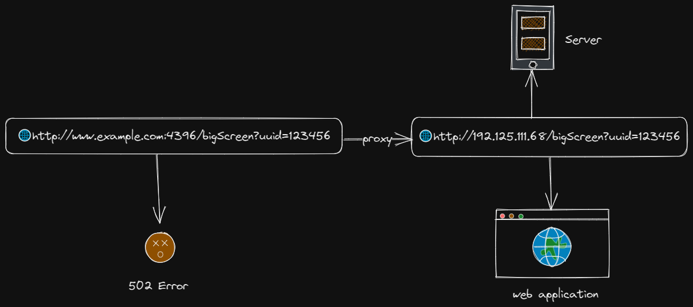
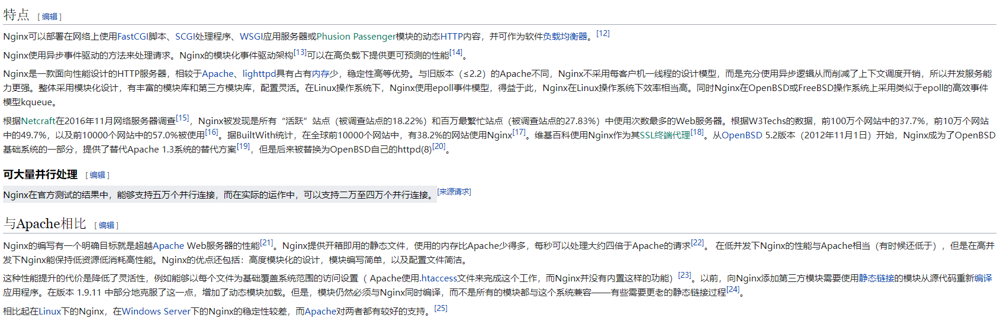

# 一场事故，让我认识了 Nginx！

# 缘起

> 在一个风和日丽的下午，我正痴迷于带薪学习的快乐中而不可自拔，不曾想被一个从天而降的 BUG 打断了我的~~摸鱼~~学习时光。但当我定睛一看，好家伙，这 BUG 它不一般呐！
>
> 下面是 BUG 描述 👇 
>
> WTF！还有这种事？！😨 吓得我赶紧打开 vscode 看是不是哪里写多了跳转逻辑，但是一通排查后并没有发现异常，最后只能使出清空大法使服务器中只保留`index.html`文件，但是 BUG 还是存在 😭
>
> 到这里就已经基本可以确定不是前端的问题了，于是乎我打开服务器的 NGINX 配置正打算用我的~~火眼金睛~~“四只眼睛”将其中的妖魔鬼怪一把揪出时，才发现**我不会 NGINX 配置**😭！
>
> 在折腾一通配置文件又猛翻官方文档，甚至于把`chatgpt老师`都快问红温了之后问题还是没有解决，走投无路之下只得求助于大佬，想不到大佬十几分钟的操作就解决了问题！
>
> 个人理解是由于**服务器的 Nginx 配置中缺少了对`bigScreen`文件路径的匹配规则**，也就是下面的代码 👇 (如果理解有误恳请指出，感激不尽)
>
> ```nginx
> location /bigScreen {
>       
> }
> ```
>
> 于是乎我只需要在前端调用`window.open`时在路径后加上`/`来提示 NGINX 是要到根目录下查询 index.html 文件即可，解决后的访问结果如下 👇 

# 认识`Nginx`

经此一事，我认识到了自己对 Nginx 知识的匮乏，于是乎将我从官方文档和`chatgpt老师`那学习的知识点整理了一下，便有了这篇文章

> PS: 本文主要对 Nginx 的`http_server`配置进行讲述，如果你想找的是从 0 开始在服务器配置`Nginx`的方案，可以查阅[如何使用 Nginx 搭建静态文件服务器](https://tutorials.tinkink.net/zh-hans/nginx/nginx-static-file-server.html)，希望了解更详细的配置，请前往[官方文档](https://nginx.org/en/docs/)查阅

## 到底什么是`Nginx`

下面是来自`chatgpt老师`的回答 👇 

下面是来自`维基百科`的回答 👇 

> 由此可以得出结论：`Nginx`作为轻量级的 Web 服务器，可以胜任绝大部分网站的代理工作，甚至可以用来做`负载均衡服务器`，其内存少、稳定性高、配置简单的优势使其脱颖而出

## 应该如何使用`Nginx`

想要使用`Nginx`，首先最重要的，是需要一个服务器 🐶(废话)。现在假设已经有了一个服务器，已经将打包后的前端文件上传到了服务器上，并且已经在服务器安装了`Nginx`，那该如何编写`Nginx配置`让`Nginx`可以正确返回请求的文件？

下面是一个`Nginx配置文件`的基础配置描述 👇 

下面是一份带注释的基础`Nginx配置`👇

```nginx
    server {
        # 监听 HTTP 和 HTTPS 端口
        listen 80;
        listen 443 ssl http2;

        # 定义 server_name 这里是你的域名或ip，且支持正则匹配以及多规则匹配
        server_name example.com www.example.com;

        # server_name *.example.com www.example.*;
        # 可匹配: 1.所有以example.com为后缀的域名 2.所有以www.example为前缀的域名

        # server_name .example.com;
        # 可匹配所有以example.com为后缀的域名

        # server_name ~^www\d+\.example\.com$;
        # 以 ~ 标记为正则表达式

        # server_name ~^(www\.)?(?<domain>.+)$;
        # 允许将匹配到的 domain 值作为变量用于后面的Nginx配置

        # server_name _;
        # 用于匹配所有域名。需要注意的是，通常作为最后一个server块的匹配规则存在，但不可只使用该配置项匹配

        # 配置 SSL
        ssl_certificate /path/to/cert.crt;
        # SSL证书的路径，必须与 ssl_certificate_key 配合使用
        ssl_certificate_key /path/to/key.key;
        # SSL密钥文件的路径

        # 定义 location 区域
        location / {
        # 不带参数的url匹配规则，将匹配所有的请求url，并使用下面的配置

            # alias /data/w3/images/;
            # url别名，如果url为`/i/img.png`将被转换为`/data/w3/images/img.png`

            root /data/w3/;
            # 直接决定url的根目录，`/i/img.png`将被转换为`/data/w3/i/images/img.png`

            index  index.html index.htm;
            # 默认文档名称，当客户端请求`www.example.com`时，将默认返回`/data/w3/index.html`文件或`/data/w3/index.htm`文件
            # 如果没有文件匹配则根据其他规则处理

            try_files $uri $uri/ /index.html;
            # 在文件系统中查询文件
            # 如果$url对应的文件存在则直接返回该文件；如果不存在则返回$url/下的index.html文件；否则返回根目录下的/index.html文件

            # 开启反向代理
            proxy_pass http://backend;
            # 将请求转发至http://backend服务器处理，并返回代理服务器的响应

            # 定义反向代理头部
            proxy_set_header X-Real-IP $remote_addr;
            proxy_set_header X-Forwarded-For $proxy_add_x_forwarded_for;
            proxy_set_header Host $http_host;
        }

        # 配置 HTTPS 重定向
        if ($scheme != "https") {
            return 301 https://$server_name$request_uri;
        }

        # 定义 error_page 区域
        error_page 404 /404.html;
        location = /404.html {
            internal;
        }
    }

    server {
        # 你可以使用多个server块来匹配多个host
        ...
    }
```
