# 网络基础

## HTTP 和 HTTPS

### 基本概念

:::info HTTP (HyperText Transfer Protocol)
**HTTP** 是一个客户端和服务器端请求和应答的标准（基于TCP），用于从 WWW 服务器传输超文本到本地浏览器的超文本传输协议。
:::

:::tip HTTPS (HTTP Secure)  
**HTTPS** 是以安全为目标的 HTTP 通道，即在 HTTP 下加入 **SSL 层**进行加密。

**主要作用：**
- 建立信息安全通道，确保数据传输安全
- 确保网站的真实性
:::

### HTTP 和 HTTPS 的区别及优缺点

| 特性 | HTTP | HTTPS |
|------|------|-------|
| **安全性** | 明文传输，不安全 | SSL 加密传输，安全 |
| **默认端口** | `80` | `443` |
| **连接方式** | 简单，无状态 | 握手阶段较复杂 |
| **性能影响** | 无额外开销 | 页面加载时间延长 **50%**，耗电增加 **10%~20%** |
| **缓存效率** | 高效 | 相对较低，增加数据开销 |
| **证书要求** | 无需证书 | 需要 **CA 证书**（费用较高） |
| **域名绑定** | 无限制 | SSL 证书需要绑定特定域名 |

### 核心差异

:::warning 安全性差异
- **HTTP**: 信息明文传输，容易被窃取和篡改
- **HTTPS**: 具有安全性的 SSL 加密传输协议，可防止数据在传输过程中被窃取、改变，确保数据的完整性
:::

:::danger 注意
虽然 HTTPS 提供了较好的安全性，但这种安全性并非绝对的。对于更深入的 Web 安全问题，需要采用更多安全措施。
:::

### HTTPS 协议的工作原理

客户端在使用 HTTPS 方式与 Web 服务器通信时的完整流程：

:::details HTTPS 握手过程
**第一步：建立连接**  
客户端使用 `https://` URL 访问服务器，要求 Web 服务器**建立 SSL 连接**

**第二步：证书传输**  
Web 服务器接收到请求后，将**网站证书（包含公钥）**传输给客户端

**第三步：安全协商**  
客户端和服务器开始**协商 SSL 连接的安全等级**（加密等级）

**第四步：密钥交换**  
客户端通过协商一致的安全等级，**建立会话密钥**，然后用网站公钥加密会话密钥并传送给服务器

**第五步：密钥解密**  
Web 服务器**通过私钥解密出会话密钥**

**第六步：加密通信**  
服务器**通过会话密钥加密与客户端之间的通信**
:::

```mermaid
sequenceDiagram
    participant C as 客户端
    participant S as 服务器
    
    C->>S: 1. HTTPS 连接请求
    S->>C: 2. 发送服务器证书（含公钥）
    C->>S: 3. 协商加密算法和安全等级
    C->>S: 4. 用公钥加密会话密钥
    S->>C: 5. 用私钥解密，确认会话密钥
    C<->>S: 6. 使用会话密钥进行加密通信
```

> 📚 **扩展阅读**: [解读 HTTP1/HTTP2/HTTP3](https://juejin.cn/post/6995109407545622542)

## TCP 连接

### TCP 三次握手

:::tip 核心概念
**SYN** = Synchronize Sequence Numbers（同步序列编号）  
**ACK** = Acknowledgment（确认应答）
:::

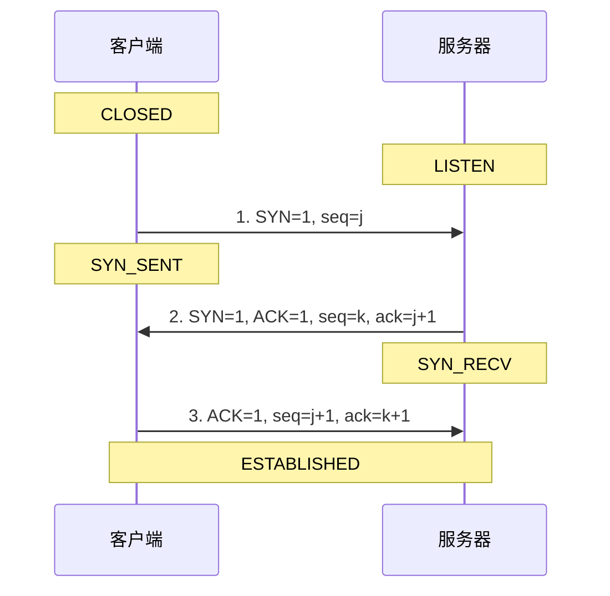
```mermaid
sequenceDiagram
    participant C as 客户端
    participant S as 服务器
    
    Note over C: CLOSED
    Note over S: LISTEN
    
    C->>S: 1. SYN=1, seq=j
    Note over C: SYN_SENT
    
    S->>C: 2. SYN=1, ACK=1, seq=k, ack=j+1
    Note over S: SYN_RECV
    
    C->>S: 3. ACK=1, seq=j+1, ack=k+1
    Note over C,S: ESTABLISHED
```

#### 详细过程

**第一次握手** 🤝  
- 客户端发送 `SYN 包`（seq=j）到服务器
- 客户端进入 **SYN_SENT** 状态，等待服务器确认

**第二次握手** 🤝🤝  
- 服务器收到 SYN 包，确认客户端的 SYN（ack=j+1）
- 同时发送自己的 `SYN 包`（seq=k），即 **SYN+ACK 包**
- 服务器进入 **SYN_RECV** 状态

**第三次握手** 🤝🤝🤝  
- 客户端收到服务器的 SYN+ACK 包
- 向服务器发送确认包 `ACK`（ack=k+1）
- 双方进入 **ESTABLISHED** 状态，连接成功建立

:::warning 重要提醒
- 握手过程中传送的包**不包含数据**
- 三次握手完成后，客户端与服务器才正式开始传送数据
:::
### TCP 四次挥手

:::tip 核心概念
**FIN** = Finish（结束）  
**MSL** = Maximum Segment Lifetime（最长报文段寿命）  
**TCB** = Transmission Control Block（传输控制块）
:::

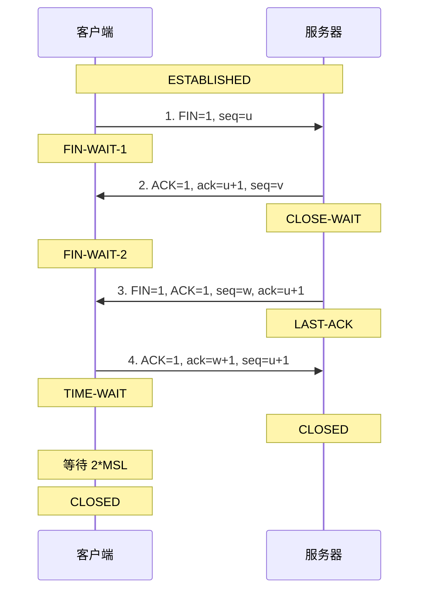
```mermaid
sequenceDiagram
    participant C as 客户端
    participant S as 服务器
    
    Note over C,S: ESTABLISHED
    
    C->>S: 1. FIN=1, seq=u
    Note over C: FIN-WAIT-1
    
    S->>C: 2. ACK=1, ack=u+1, seq=v
    Note over S: CLOSE-WAIT
    Note over C: FIN-WAIT-2
    
    S->>C: 3. FIN=1, ACK=1, seq=w, ack=u+1
    Note over S: LAST-ACK
    
    C->>S: 4. ACK=1, ack=w+1, seq=u+1
    Note over C: TIME-WAIT
    Note over S: CLOSED
    
    Note over C: 等待 2*MSL
    Note over C: CLOSED
```

#### 详细过程

**第一次挥手** 👋  
- 客户端进程发出**连接释放报文**，停止发送数据
- 设置 `FIN=1`，序列号 `seq=u`
- 客户端进入 **FIN-WAIT-1** 状态

**第二次挥手** 👋👋  
- 服务器收到连接释放报文，发出**确认报文**
- 设置 `ACK=1`，`ack=u+1`，序列号 `seq=v`
- 服务器进入 **CLOSE-WAIT** 状态
- 客户端收到确认后进入 **FIN-WAIT-2** 状态

:::info 半关闭状态
此时处于**半关闭状态**：
- 客户端已经没有数据要发送
- 服务器若还有数据，客户端依然要接收
:::

**第三次挥手** 👋👋👋  
- 服务器将最后的数据发送完毕后，向客户端发送**连接释放报文**
- 设置 `FIN=1`，`ack=u+1`，序列号 `seq=w`
- 服务器进入 **LAST-ACK** 状态

**第四次挥手** 👋👋👋👋  
- 客户端收到服务器的连接释放报文，发出**最终确认**
- 设置 `ACK=1`，`ack=w+1`，序列号 `seq=u+1`
- 客户端进入 **TIME-WAIT** 状态

#### 连接关闭时序

:::warning 重要细节
1. **客户端 TIME-WAIT 状态**：必须等待 `2*MSL` 时间后才进入 CLOSED 状态
2. **服务器关闭时间**：服务器收到客户端确认后**立即进入 CLOSED 状态**
3. **时间差异**：服务器结束 TCP 连接的时间要比客户端早一些
:::

| 步骤 | 客户端状态 | 服务器状态 | 说明 |
|------|------------|------------|------|
| 初始 | ESTABLISHED | ESTABLISHED | 正常通信状态 |
| 1 | FIN-WAIT-1 | ESTABLISHED | 客户端发起关闭 |
| 2 | FIN-WAIT-2 | CLOSE-WAIT | 服务器确认，进入半关闭 |
| 3 | FIN-WAIT-2 | LAST-ACK | 服务器发起关闭 |
| 4 | TIME-WAIT | CLOSED | 最终确认，服务器关闭 |
| 最终 | CLOSED | CLOSED | 连接完全关闭 |

### TCP/IP 如何保证数据包传输的有序可靠？

:::tip 核心机制
TCP 通过 **ACK 应答机制** 和 **超时重传机制** 来保证数据包传输的有序可靠
:::

#### 主要保障机制

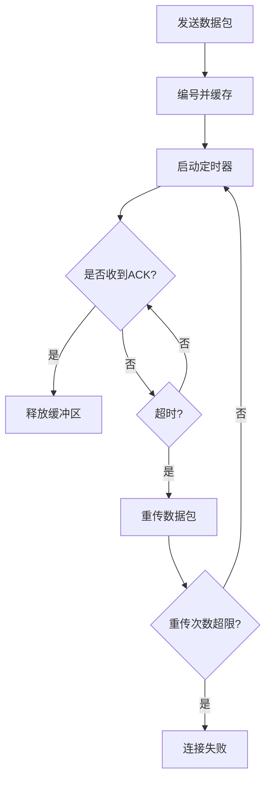
```mermaid
flowchart TD
    A[发送数据包] --> B[编号并缓存]
    B --> C[启动定时器]
    C --> D{是否收到ACK?}
    D -->|是| E[释放缓冲区]
    D -->|否| F{超时?}
    F -->|是| G[重传数据包]
    F -->|否| D
    G --> H{重传次数超限?}
    H -->|否| C
    H -->|是| I[连接失败]
```

#### 发送方机制

1. **数据包缓存** 📦  
   发送方必须把**已发送的数据包保留在缓冲区**中

2. **超时定时器** ⏰  
   为每个已发送的数据包**启动一个超时定时器**

3. **ACK 确认处理** ✅  
   - 在定时器超时前收到应答信息 → **释放该数据包占用的缓冲区**
   - 应答信息包括：对本包的应答 或 对本包后续包的应答

4. **重传机制** 🔄  
   - 未收到应答且定时器超时 → **重传该数据包**
   - 重传直到收到应答或**重传次数超过规定最大次数**

#### 接收方机制

1. **数据完整性检查** 🔍  
   收到数据包后，先进行 **CRC 校验**

2. **数据递交** 📤  
   校验正确 → 把数据交给**上层协议**

3. **应答发送** 📨  
   给发送方发送**累计应答包**，表明数据已收到

4. **捎带应答** 🚀  
   如果接收方也有数据要发送，可将应答包**捎带在数据包中**一起发送

:::info 关键特性
- **有序性**：通过序列号确保数据包的正确顺序
- **可靠性**：通过确认应答和重传机制确保数据不丢失
- **完整性**：通过 CRC 校验确保数据未被篡改
- **效率**：通过捎带应答减少网络开销
:::

### TCP 和 UDP 的区别

#### 核心对比

| 特性 | TCP | UDP |
|------|-----|-----|
| **连接性** | 面向连接（需要三次握手） | 无连接（直接发送数据） |
| **可靠性** | 可靠传输（确认、重传） | 不可靠传输（无确认机制） |
| **传输方式** | 仅支持单播 | 支持单播、多播、广播 |
| **头部开销** | 头部较大（20字节） | 头部较小（8字节） |
| **传输速度** | 相对较慢 | 传输速率更高 |
| **实时性** | 一般 | 实时性更好 |
| **应用场景** | 文件传输、网页浏览、邮件 | 视频直播、游戏、DNS查询 |

#### 详细分析

**1. 连接特性** 🔗
- **TCP**: 面向连接，通信前需要建立连接（三次握手）
- **UDP**: 面向无连接，可以直接发送数据

**2. 传输方式** 📡
- **TCP**: 仅支持**单播传输**（点对点）
- **UDP**: 提供多种传输方式：
  - 单播（一对一）
  - 多播（一对多）
  - 广播（一对所有）

**3. 可靠性保证** ✅
- **TCP**: 
  - 三次握手保证连接可靠性
  - 序列号、确认应答、重传机制
  - 流量控制和拥塞控制
- **UDP**: 
  - 无连接，不可靠传输
  - 不发送确认信号
  - 发送端不知道数据是否正确接收

**4. 性能特点** ⚡
- **UDP 优势**:
  - 头部开销更小（8字节 vs 20字节）
  - 数据传输速率更高
  - 实时性更好
  - 适合对速度要求高、对可靠性要求相对较低的应用

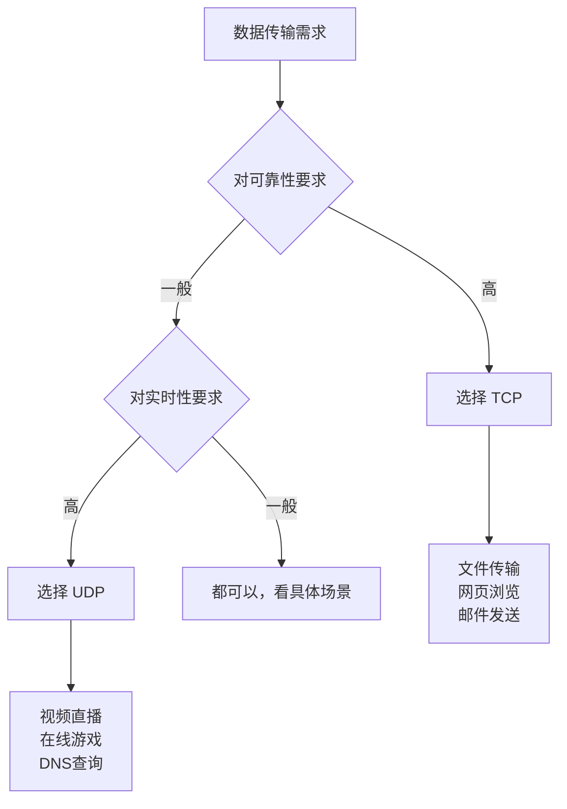
```mermaid
graph TD
    A[数据传输需求] --> B{对可靠性要求}
    B -->|高| C[选择 TCP]
    B -->|一般| D{对实时性要求}
    D -->|高| E[选择 UDP]
    D -->|一般| F[都可以，看具体场景]
    
    C --> G[文件传输<br/>网页浏览<br/>邮件发送]
    E --> H[视频直播<br/>在线游戏<br/>DNS查询]
```

:::tip 选择建议
- **需要可靠传输**：选择 TCP（如文件下载、网页浏览）
- **需要快速传输**：选择 UDP（如实时视频、在线游戏）
- **需要广播/多播**：只能选择 UDP
:::

> 📚 **深入学习**: [深度剖析TCP与UDP的区别](https://juejin.cn/post/6992743999756845087)

## HTTP 请求跨域问题

### 跨域原理

:::danger 同源策略
**跨域**是指浏览器不能执行其他网站的脚本，这是由浏览器的**同源策略**造成的。

**同源策略**是浏览器对 JavaScript 实施的安全限制，只要**协议、域名、端口**有任何一个不同，都被当作是不同的域。
:::

#### 同源判断标准

| 组成部分 | 说明 | 示例 |
|----------|------|------|
| **协议** | http/https | `https://` vs `http://` |
| **域名** | 主机名 | `example.com` vs `test.com` |
| **端口** | 端口号 | `:80` vs `:8080` |

:::tip 跨域本质
**跨域原理**就是通过各种方式**避开浏览器的安全限制**，允许不同源之间的数据交互。
:::

### 跨域解决方案

#### 方案对比

| 方案 | 优点 | 缺点 | 适用场景 |
|------|------|------|----------|
| **JSONP** | 兼容性好，实现简单 | 只支持GET请求，安全性较低 | 简单的跨域GET请求 |
| **CORS** | 支持所有HTTP方法，安全 | 需要服务器配合 | 现代Web应用推荐 |
| **代理** | 开发便利，灵活性高 | 需要配置服务器 | 开发环境和生产环境 |
| **postMessage** | 安全，支持iframe通信 | 只适用于页面间通信 | iframe、窗口间通信 |

#### 1. JSONP（JSON with Padding）

:::info 工作原理
利用 `<script>` 标签不受同源策略限制的特性，服务端返回一段JavaScript代码而非JSON数据。
:::

**实现步骤：**

1. **创建 script 标签**
2. **设置 src 属性为接口地址**
3. **传递回调函数名作为参数**
4. **定义回调函数接收数据**

```js
// 1. 动态创建 script 标签
const script = document.createElement('script');

// 2. 设置回调函数
function getData(data) {
    console.log('接收到数据:', data);
}

// 3. 设置 script 的 src 属性
script.src = 'http://localhost:3000/api?callback=getData';

// 4. 让 script 生效
document.body.appendChild(script);
```

:::warning JSONP 的缺点
- 只支持 **GET 请求**（因为 script 标签只能使用 GET）
- 需要**后端配合**返回指定格式的数据
- **安全性较低**，容易受到 XSS 攻击
- **调试困难**，错误处理不便
:::

#### 2. CORS（跨域资源共享）

:::tip CORS 原理
Cross-Origin Resource Sharing，通过服务器设置 `Access-Control-Allow-Origin` 等响应头，告诉浏览器允许跨域请求。
:::

**服务器端设置：**
```js
// Express.js 示例
app.use((req, res, next) => {
    res.header('Access-Control-Allow-Origin', '*');
    res.header('Access-Control-Allow-Methods', 'GET,PUT,POST,DELETE');
    res.header('Access-Control-Allow-Headers', 'Content-Type');
    next();
});
```

#### 3. 代理服务器

:::tip 推荐方案
目前最常用的方式，通过代理服务器转发请求，避免浏览器的同源策略限制。
:::

:::details webpack 开发环境配置
```js
// webpack 开发环境配置
module.exports =  {
    devServer: {
        proxy: {
            '/api': {
                target: 'http://localhost:3000',
                changeOrigin: true,
                pathRewrite: {
                    '^/api': ''
                }
            }
        }
    }
}
```
:::

:::details Vite 开发环境配置
```js
// Vite 开发环境配置
export default defineConfig({
    server: {
        proxy: {
            '/api': {
                target: 'http://localhost:3000',
                changeOrigin: true,
                pathRewrite: {
                    '^/api': ''
                }
            }
        }
    }
})
```
:::

#### 4. 其他方案

**document.domain** 📝  
适用于**基础域名相同，子域名不同**的情况

**window.name** 🪟  
利用浏览器窗口内所有域名共享同一个 `window.name` 的特性

**window.postMessage()** 💬  
HTML5 新特性，安全的跨窗口通信方式

```javascript
// 发送消息
window.postMessage('Hello', 'http://example.com');

// 接收消息
window.addEventListener('message', (event) => {
    if (event.origin === 'http://example.com') {
        console.log('收到消息:', event.data);
    }
});
```

### 最佳实践

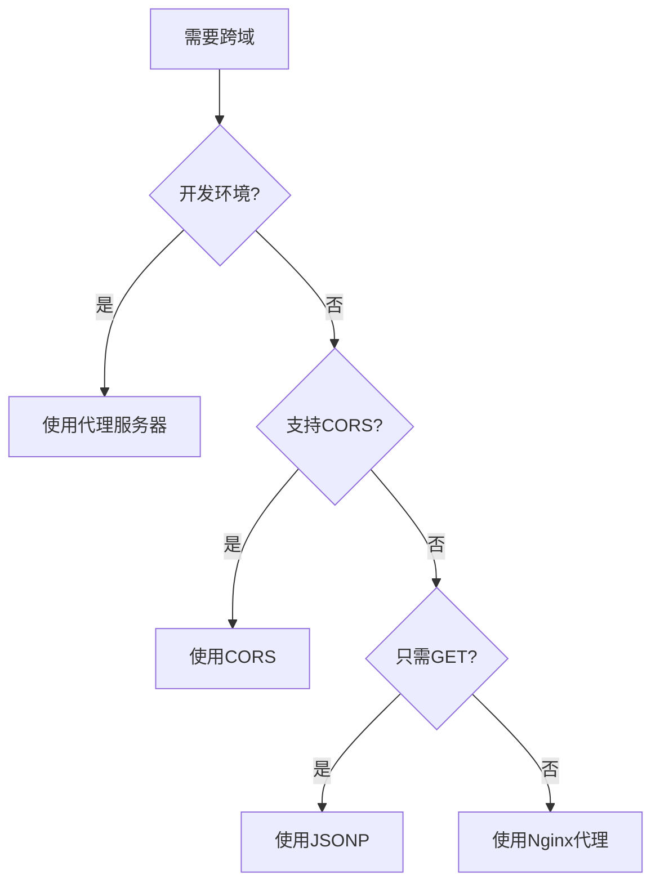
```mermaid
flowchart TD
    A[需要跨域] --> B{开发环境?}
    B -->|是| C[使用代理服务器]
    B -->|否| D{支持CORS?}
    D -->|是| E[使用CORS]
    D -->|否| F{只需GET?}
    F -->|是| G[使用JSONP]
    F -->|否| H[使用Nginx代理]
```

:::tip 选择建议
- **开发环境**：使用 webpack/vite 等构建工具的代理功能
- **生产环境**：优先使用 CORS，其次考虑 Nginx 代理
- **简单场景**：可以考虑 JSONP（仅GET请求）
- **复杂通信**：使用 postMessage（iframe、弹窗通信）
:::

> 📚 **深入学习**: [跨域，不可不知的基础概念](https://juejin.cn/post/7003232769182547998)

## 浏览器存储方案

### Cookie、sessionStorage、localStorage 的区别

#### 核心对比

| 特性 | Cookie | sessionStorage | localStorage |
|------|--------|----------------|--------------|
| **存储大小** | 4KB | 5-10MB | 5-10MB |
| **生命周期** | 可设置过期时间 | 会话结束后删除 | 永久存储（手动删除） |
| **服务器通信** | 自动发送到服务器 | 仅本地存储 | 仅本地存储 |
| **作用域** | 同源下所有窗口 | 当前会话窗口 | 同源下所有窗口 |
| **API易用性** | 复杂（字符串操作） | 简单（API友好） | 简单（API友好） |

#### 相同点 ✅

:::info 共同特征
- 都是**客户端存储**技术
- 都受**同源策略**限制
- 都可以用 JavaScript 操作
- 都是**字符串格式**存储
:::

#### 详细对比

**1. 存储容量** 📦

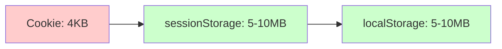
```mermaid
graph LR
    A[Cookie: 4KB] --> B[sessionStorage: 5-10MB]
    B --> C[localStorage: 5-10MB]
    
    style A fill:#ffcccc
    style B fill:#ccffcc
    style C fill:#ccffcc
```

- **Cookie**: 数据大小不能超过 **4KB**
- **sessionStorage** 和 **localStorage**: 存储容量可达 **5-10MB**

**2. 生命周期** ⏰

::: info
###### Cookie
- 可设置 `expires` 或 `max-age`
- 到期时间之前一直有效
- 可设置会话级别（浏览器关闭后删除）

###### sessionStorage
- **会话级别**存储
- 当前浏览器窗口/标签关闭后**自动删除**
- 新打开的标签页无法共享数据

###### localStorage
- **永久存储**（除非手动删除）
- 浏览器关闭后数据**不丢失**
- 需要主动调用 `clear()` 或 `removeItem()` 删除
:::

**3. 服务器通信** 🌐

| 存储方式 | 服务器交互 | 说明 |
|----------|------------|------|
| **Cookie** | ✅ 自动发送 | 每次HTTP请求都会携带 |
| **sessionStorage** | ❌ 不发送 | 仅在客户端存储 |
| **localStorage** | ❌ 不发送 | 仅在客户端存储 |

**4. 使用示例** 💻

```javascript
// Cookie 操作（复杂）
document.cookie = "username=john; expires=Thu, 18 Dec 2024 12:00:00 UTC; path=/";

// sessionStorage 操作（简单）
sessionStorage.setItem('token', 'abc123');
const token = sessionStorage.getItem('token');

// localStorage 操作（简单）
localStorage.setItem('settings', JSON.stringify({theme: 'dark'}));
const settings = JSON.parse(localStorage.getItem('settings'));
```

#### 使用场景推荐

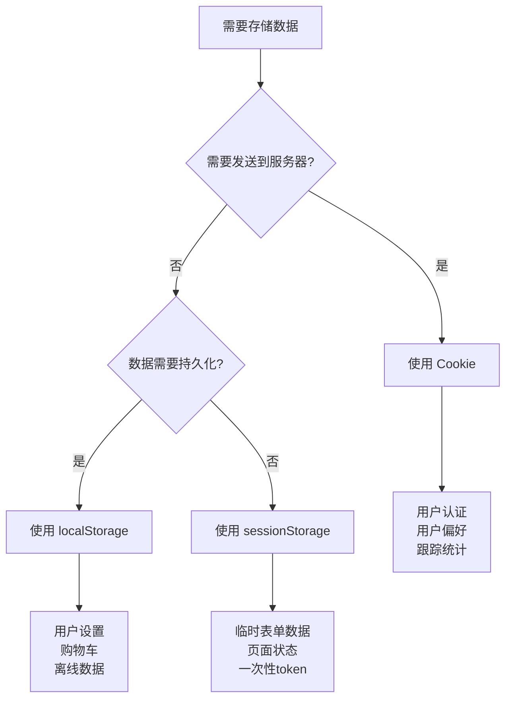
```mermaid
flowchart TD
    A[需要存储数据] --> B{需要发送到服务器?}
    B -->|是| C[使用 Cookie]
    B -->|否| D{数据需要持久化?}
    D -->|是| E[使用 localStorage]
    D -->|否| F[使用 sessionStorage]
    
    C --> G[用户认证<br/>用户偏好<br/>跟踪统计]
    E --> H[用户设置<br/>购物车<br/>离线数据]
    F --> I[临时表单数据<br/>页面状态<br/>一次性token]
```

:::tip 选择建议
- **Cookie**: 需要与服务器交互的小量数据（如用户认证信息）
- **localStorage**: 需要长期保存的较大数据（如用户设置、离线数据）
- **sessionStorage**: 临时性的会话数据（如表单数据、页面状态）
:::

:::warning 注意事项
1. **隐私模式**: 浏览器隐私模式下，localStorage 可能不可用
2. **存储限制**: 不同浏览器的存储限制可能有差异
3. **同步问题**: localStorage 在多个标签页间是同步的，需注意并发问题
4. **性能影响**: Cookie 会影响网络性能，避免存储大量数据
:::

## 网络传输问题

### 粘包问题分析与对策

:::info 粘包定义
**TCP 粘包**是指发送方发送的若干包数据到接收方接收时粘成一包，从接收缓冲区看，后一包数据的头紧接着前一包数据的尾。
:::

#### 粘包出现原因

:::tip 核心原因
粘包问题出现在**流传输**中，**UDP 不会出现粘包**，因为它有**消息边界**的概念。
:::

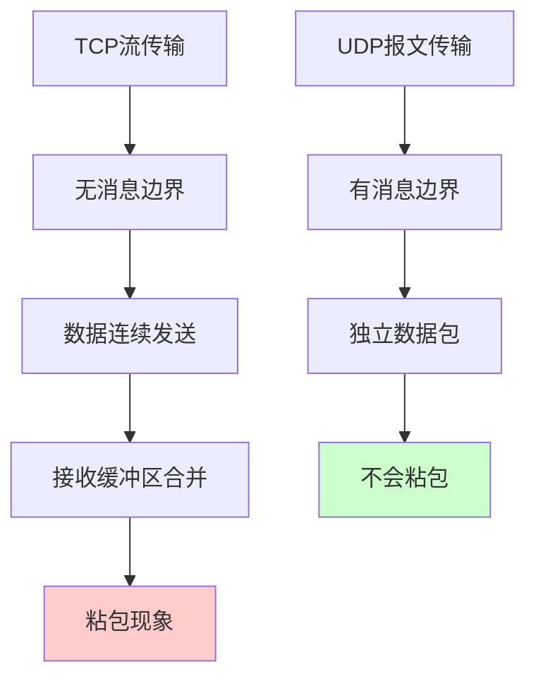
```mermaid
graph TD
    A[TCP流传输] --> B[无消息边界]
    B --> C[数据连续发送]
    C --> D[接收缓冲区合并]
    D --> E[粘包现象]
    
    F[UDP报文传输] --> G[有消息边界]
    G --> H[独立数据包]
    H --> I[不会粘包]
    
    style E fill:#ffcccc
    style I fill:#ccffcc
```

#### 粘包情况分类

| 粘包类型 | 描述 | 示意图 |
|----------|------|---------|
| **完整包粘连** | 粘在一起的包都是完整的数据包 | `[包1][包2][包3]` |
| **不完整包粘连** | 粘在一起的包有不完整的包 | `[包1][包2的一部分]` |

#### 避免粘包的措施

##### 1. 发送方措施 📤

:::details TCP Push 指令
**方法**: 使用 TCP 提供的**强制数据立即传送操作指令 push**

**原理**: TCP 软件收到该操作指令后，立即将数据发送出去，而不等待发送缓冲区满

**缺点**: 
- 关闭了 TCP 优化算法
- 降低网络发送效率
- 影响应用程序性能
- **一般不建议使用**
:::

##### 2. 接收方措施 📥

:::details 优化接收处理
**措施**:
- 优化程序设计
- 精简接收进程工作量  
- **提高接收进程优先级**
- 使其及时接收数据

**局限性**:
- 只能**减少**粘包可能性，不能完全避免
- 高频发送时仍可能出现粘包
- 网络突发情况下效果有限
:::

##### 3. 分包策略 📦

:::details 人为控制分包
**方法**: 由接收方控制，将一包数据按结构字段，人为控制分多次接收，然后合并

**缺点**:
- 应用程序效率较低
- 对实时应用场合不适合
- 增加了处理复杂度
:::

#### 推荐解决方案

:::success 最佳实践
**预处理线程方案**: 接收方创建一个预处理线程，对接收到的数据包进行预处理，将粘连的包分开。

**优势**:
- 高效可行
- 不影响主处理流程
- 适用于各种应用场景
:::

#### 常用解决策略

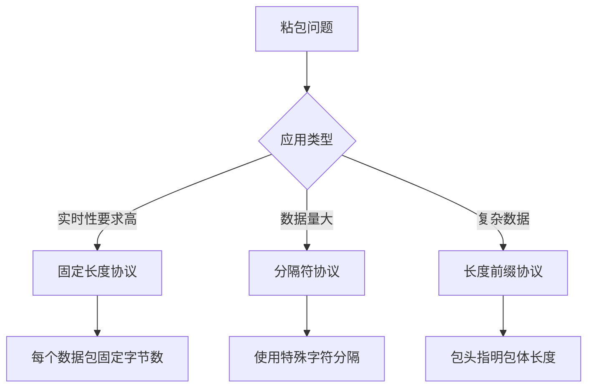
```mermaid
flowchart TD
    A[粘包问题] --> B{应用类型}
    B -->|实时性要求高| C[固定长度协议]
    B -->|数据量大| D[分隔符协议]
    B -->|复杂数据| E[长度前缀协议]
    
    C --> F[每个数据包固定字节数]
    D --> G[使用特殊字符分隔]
    E --> H[包头指明包体长度]
```

##### 实际解决方案

**1. 固定长度协议** 📏
```javascript
// 每个数据包都是固定长度
const PACKET_SIZE = 1024;
// 不足长度的用填充字符补齐
```

**2. 分隔符协议** 🔗
```javascript
// 使用特殊字符作为包分隔符
const DELIMITER = '\n';
// 按分隔符切分数据包
data.split(DELIMITER);
```

**3. 长度前缀协议** 📊
```javascript
// 包头包含包体长度信息
// [4字节长度][数据内容]
const length = buffer.readUInt32BE(0);
const data = buffer.slice(4, 4 + length);
```

:::warning 注意事项
1. **协议设计**: 在应用层协议设计时就应考虑粘包问题
2. **缓冲区管理**: 合理设置接收缓冲区大小
3. **性能平衡**: 在解决粘包和性能之间找到平衡点
4. **测试验证**: 在高并发环境下充分测试解决方案
:::
# 浏览器原理

## 从输入 URL 到页面加载的全过程

### 完整流程概览

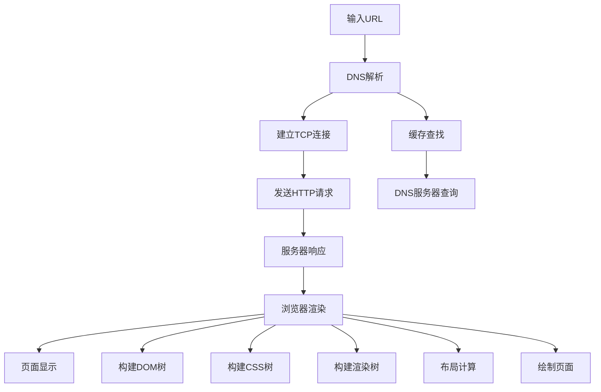
```mermaid
flowchart TD
    A[输入URL] --> B[DNS解析]
    B --> C[建立TCP连接]
    C --> D[发送HTTP请求]
    D --> E[服务器响应]
    E --> F[浏览器渲染]
    F --> G[页面显示]
    
    B --> B1[缓存查找]
    B1 --> B2[DNS服务器查询]
    
    F --> F1[构建DOM树]
    F --> F2[构建CSS树]
    F --> F3[构建渲染树]
    F --> F4[布局计算]
    F --> F5[绘制页面]
```

### 详细步骤解析

#### 1. 输入 URL 🌐
用户在浏览器地址栏输入网址

#### 2. DNS 缓存查找 🔍

:::info 缓存层级
DNS 解析会按以下顺序查找缓存：
:::

| 缓存层级 | 说明 | 位置 |
|----------|------|------|
| **浏览器缓存** | 浏览器记录的 DNS 缓存 | 浏览器内存 |
| **操作系统缓存** | 系统级 DNS 缓存 | 系统内存 |
| **路由器缓存** | 本地网络设备缓存 | 路由器 |
| **ISP 缓存** | 网络服务提供商缓存 | ISP 服务器 |

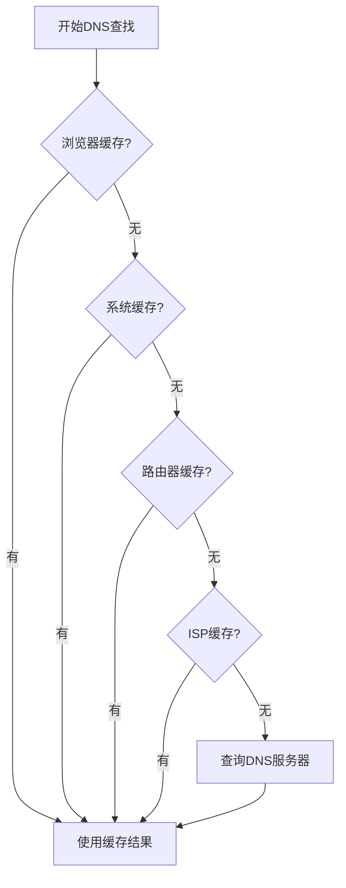
```mermaid
graph TD
    A[开始DNS查找] --> B{浏览器缓存?}
    B -->|有| Z[使用缓存结果]
    B -->|无| C{系统缓存?}
    C -->|有| Z
    C -->|无| D{路由器缓存?}
    D -->|有| Z
    D -->|无| E{ISP缓存?}
    E -->|有| Z
    E -->|无| F[查询DNS服务器]
    F --> Z
```

#### 3. DNS 域名解析 🔄

:::tip DNS 协议
DNS 服务器**基于 UDP 协议**，因此会用到 UDP 协议进行域名解析
:::

**解析过程**：浏览器向 DNS 服务器发起请求，解析 URL 中的域名对应的 IP 地址

#### 4. 建立 TCP 连接 🤝

根据解析出的 IP 地址和默认端口（HTTP:80，HTTPS:443），与服务器建立 TCP 连接

:::details TCP 三次握手
参考前面章节的 TCP 三次握手过程
:::

#### 5. 发起 HTTP 请求 📡

浏览器发起读取文件的 HTTP 请求，该请求报文作为 TCP 三次握手的第三次数据发送给服务器

#### 6. 服务器响应 📥

服务器对浏览器请求做出响应，并把对应的 HTML 文件发送给浏览器

#### 7. 关闭 TCP 连接 👋

通过四次挥手释放 TCP 连接（如果不是 Keep-Alive）

### 浏览器渲染过程

:::info 渲染引擎
客户端（浏览器）解析 HTML 内容并渲染出来
:::

#### 渲染流水线

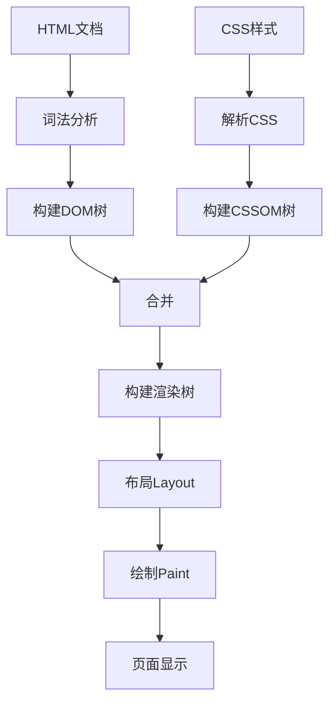
```mermaid
graph TD
    A[HTML文档] --> B[词法分析]
    B --> C[构建DOM树]
    
    D[CSS样式] --> E[解析CSS]
    E --> F[构建CSSOM树]
    
    C --> G[合并]
    F --> G
    G --> H[构建渲染树]
    H --> I[布局Layout]
    I --> J[绘制Paint]
    J --> K[页面显示]
```

##### 1. 构建 DOM 树 🌳
- **词法分析**：解析 HTML 标签和内容
- **语法分析**：构建 DOM 树（DOM Tree）
- **组成**：DOM 元素及属性节点，根节点是 `document` 对象

##### 2. 构建 CSS 规则树 🎨
生成 **CSS 规则树**（CSS Rule Tree / CSSOM）

##### 3. 构建渲染树 🖼️
将 **DOM 树** 和 **CSSOM 树**结合，构建**渲染树**（Render Tree）

##### 4. 布局计算 📐
**Layout**（重排）：计算每个节点在屏幕中的**位置和尺寸**

##### 5. 绘制页面 🎨
**Painting**（重绘）：遍历渲染树，使用 UI 后端层绘制每个节点

### JavaScript 引擎解析过程

#### JS 执行环境

:::warning 重要概念
JS 引擎执行包括：**解释阶段**、**预处理阶段**、**执行阶段**，生成执行上下文、VO、作用域链、垃圾回收机制等
:::

##### 1. 创建 Window 对象 🪟
- **全局执行环境**：页面产生时创建
- **全局容器**：所有全局变量和函数都属于 window 的属性和方法
- **DOM 映射**：DOM Tree 映射在 `window.document` 对象上
- **生命周期**：关闭网页或浏览器时销毁

##### 2. 文件加载 📄
JS 引擎分析**语法与词法**是否合法，合法则进入预编译

##### 3. 预编译阶段 ⚙️

**变量处理**：
- 寻找全局变量声明 → 作为 window 属性 → 赋值 `undefined`
- 寻找全局函数声明 → 作为 window 方法 → 赋值函数体

:::tip 注意
- **匿名函数**不参与预编译（因为它是变量）
- **变量提升**在 ES6 中已解决，函数提升仍存在
:::

##### 4. 解释执行 🔄

**执行机制**：
- 执行到变量就赋值
- 未定义变量直接赋值 → ES5 非严格模式下成为 window 属性
- **基本类型**：值直接存在变量存储空间
- **引用类型**：指针指向变量存储空间
- **函数执行**：环境推入执行栈 → 执行完成后弹出

### 性能优化要点

:::tip 优化建议
1. **DNS 预解析**：`<link rel="dns-prefetch" href="//example.com">`
2. **资源缓存**：合理设置缓存策略
3. **代码分割**：按需加载 JavaScript
4. **关键资源优先**：优化关键渲染路径
5. **减少重排重绘**：优化 CSS 和 JavaScript 操作
:::

> 📚 **扩展阅读**: 
> - [DNS域名解析过程](https://juejin.cn/post/7005468491067162655)
> - [浏览器的工作原理](https://juejin.cn/post/6992597760935460901)

## 浏览器渲染性能

### 浏览器重绘与重排的区别

#### 核心概念

:::info 定义对比
**重排/回流（Reflow）**：当 DOM 的变化影响了元素的几何信息，浏览器需要重新计算元素的几何属性，将其安放在界面中的正确位置。

**重绘（Repaint）**：当元素的外观发生改变，但没有改变布局时，重新把元素外观绘制出来的过程。
:::

#### 直观对比

| 操作类型 | 重排（Reflow） | 重绘（Repaint） |
|----------|----------------|-----------------|
| **触发条件** | 几何属性变化 | 外观属性变化 |
| **影响范围** | 布局 + 外观 | 仅外观 |
| **性能影响** | 高 | 中等 |
| **典型属性** | width, height, margin, padding | color, background, visibility |

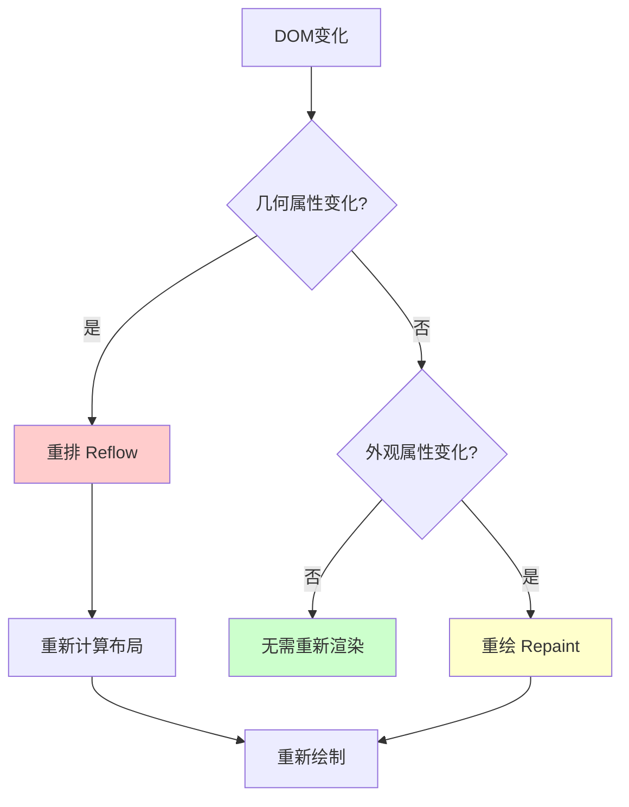
```mermaid
graph TD
    A[DOM变化] --> B{几何属性变化?}
    B -->|是| C[重排 Reflow]
    B -->|否| D{外观属性变化?}
    D -->|是| E[重绘 Repaint]
    D -->|否| F[无需重新渲染]
    
    C --> G[重新计算布局]
    G --> H[重新绘制]
    E --> H
    
    style C fill:#ffcccc
    style E fill:#ffffcc
    style F fill:#ccffcc
```

#### 关系说明

:::warning 重要关系
- **重绘**不一定会出现**重排**
- **重排**必然会出现**重绘**
- 重排的性能影响**更大**，应优先避免
:::

#### 性能影响

:::danger 性能代价
重排和重绘的代价是**高昂的**：
- 破坏用户体验
- 让 UI 展示非常迟缓  
- 重排的性能影响比重绘更大
- 在无法避免的情况下，宁可选择代价更小的重绘
:::

### 如何触发重排和重绘？

:::info 触发原理
任何改变用来构建渲染树的信息都会导致一次重排或重绘
:::

#### 常见触发场景

##### 1. DOM 操作 🔧

| 操作 | 重排 | 重绘 | 说明 |
|------|------|------|------|
| 添加/删除/更新 DOM 节点 | ✅ | ✅ | 改变文档结构 |
| `display: none` | ✅ | ✅ | 元素从渲染树移除 |
| `visibility: hidden` | ❌ | ✅ | 仅改变可见性，无几何变化 |

##### 2. 样式变化 🎨

**触发重排的属性**：
```css
/* 几何属性 */
width, height, margin, padding, border
top, left, right, bottom
position, display, float, clear

/* 布局属性 */
font-size, line-height, text-align
overflow, white-space
```

**仅触发重绘的属性**：
```css
/* 外观属性 */
color, background, background-image
border-color, border-style
box-shadow, outline
visibility
```

##### 3. 其他触发条件 ⚡

- **DOM 节点动画**：移动或添加动画效果
- **样式表操作**：添加样式表，调整样式属性  
- **用户行为**：调整窗口大小，改变字号，滚动页面
- **获取布局信息**：读取 `offsetWidth`、`scrollTop` 等属性

### 如何避免重绘或者重排？

#### 基本优化策略

##### 1. 样式优化 💡

:::tip 集中改变样式
**推荐做法**：批量修改样式，避免逐条修改
:::

```javascript
// ❌ 不好的做法 - 多次重排
element.style.width = '100px';
element.style.height = '100px';
element.style.border = '1px solid red';

// ✅ 好的做法 - 一次重排
element.className = 'new-style';
// 或
element.style.cssText = 'width: 100px; height: 100px; border: 1px solid red;';
```

##### 2. DOM 查询优化 🔍

```javascript
// ❌ 不好的做法 - 在循环中查询 DOM 属性
for (let i = 0; i < 100; i++) {
    element.style.left = element.offsetLeft + 1 + 'px';
}

// ✅ 好的做法 - 缓存 DOM 属性
const left = element.offsetLeft;
for (let i = 0; i < 100; i++) {
    element.style.left = left + i + 'px';
}
```

##### 3. 定位策略 📍

:::success 脱离文档流
为动画元素使用 `position: fixed` 或 `position: absolute`，修改它们的 CSS 不会触发其他元素的 reflow
:::

```css
.animation-element {
    position: absolute;  /* 或 fixed */
    /* 动画属性变化不影响其他元素 */
}
```

##### 4. 布局避免 📐

:::warning 避免 table 布局
table 布局中很小的改动可能造成整个表格的重新布局
:::

##### 5. GPU 加速 🚀

**开启硬件加速**：
```css
.gpu-accelerated {
    transform: translateZ(0);  /* 或 translate3d(0,0,0) */
    will-change: transform;    /* 现代浏览器推荐 */
}
```

#### 高级优化：合成层

:::info 合成层优势
将元素提升为合成层的优点：
1. **GPU 处理**：合成层位图由 GPU 合成，比 CPU 快
2. **独立重绘**：需要 repaint 时，只重绘自身，不影响其他层
3. **特殊属性**：`transform` 和 `opacity` 效果不会触发 layout 和 paint
:::

**提升合成层的方法**：

```css
/* 最佳方式 - will-change */
#target {
    will-change: transform;
}

/* 其他方式 */
.composite-layer {
    transform: translateZ(0);        /* 3D 变换 */
    opacity: 0.99;                   /* 透明度 */
    filter: blur(0);                 /* 滤镜效果 */
    position: fixed;                 /* 固定定位 */
}
```

#### 优化决策树

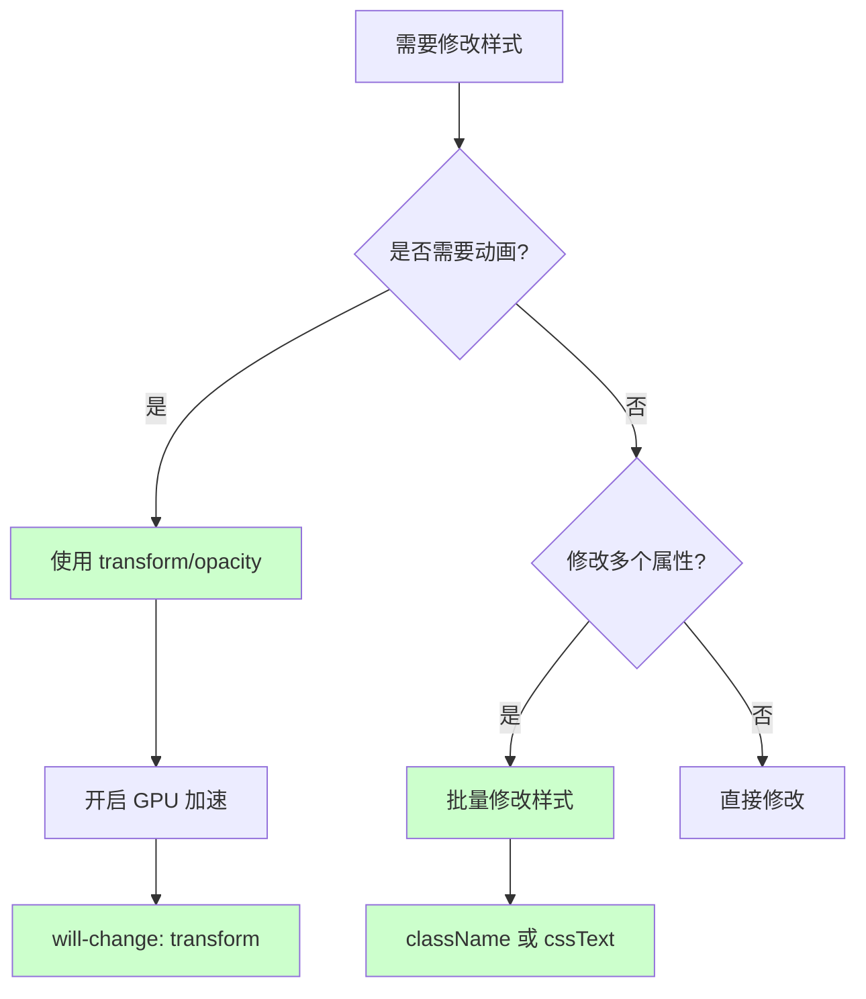
```mermaid
flowchart TD
    A[需要修改样式] --> B{是否需要动画?}
    B -->|是| C[使用 transform/opacity]
    B -->|否| D{修改多个属性?}
    
    C --> E[开启 GPU 加速]
    D -->|是| F[批量修改样式]
    D -->|否| G[直接修改]
    
    E --> H[will-change: transform]
    F --> I[className 或 cssText]
    
    style C fill:#ccffcc
    style F fill:#ccffcc
    style H fill:#ccffcc
    style I fill:#ccffcc
```

#### 性能监控

:::tip 性能检测
使用浏览器开发者工具的 Performance 面板监控重排重绘：
- **Rendering** 标签：显示 paint 和 layout 事件
- **Layers** 面板：查看合成层情况
- **Performance** 记录：分析渲染性能瓶颈
:::

> 📚 **深入学习**: [无线性能优化：Composite](http://taobaofed.org/blog/2016/04/25/performance-composite/)
## 浏览器缓存机制

### HTTP 304 缓存过程详解

:::info 304 状态码
**HTTP 304 Not Modified** 表示资源未修改，可以使用缓存版本，这是浏览器缓存机制的核心体现。
:::

#### 缓存验证流程

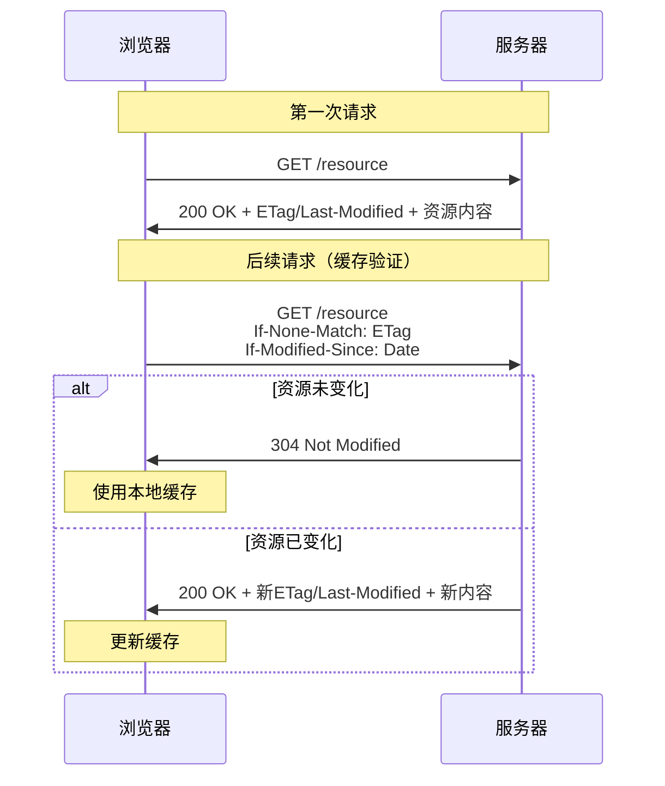
```mermaid
sequenceDiagram
    participant B as 浏览器
    participant S as 服务器
    
    Note over B,S: 第一次请求
    B->>S: GET /resource
    S->>B: 200 OK + ETag/Last-Modified + 资源内容
    
    Note over B,S: 后续请求（缓存验证）
    B->>S: GET /resource<br/>If-None-Match: ETag<br/>If-Modified-Since: Date
    
    alt 资源未变化
        S->>B: 304 Not Modified
        Note over B: 使用本地缓存
    else 资源已变化
        S->>B: 200 OK + 新ETag/Last-Modified + 新内容
        Note over B: 更新缓存
    end
```

#### 详细过程分析

##### 阶段一：强缓存检查 💪

:::tip 强缓存优先
浏览器首先检查**强缓存**，不需要向服务器发送请求
:::

**缓存头字段对比**：

| 字段 | 优先级 | 特点 | 问题 |
|------|--------|------|------|
| **Expires** | 低 | 绝对时间 | 受本地时间影响 |
| **Cache-Control: max-age** | 高 | 相对时间（秒） | 不受本地时间影响 |

```http
# 强缓存命中 - 返回 200（from cache）
Cache-Control: max-age=3600
Expires: Wed, 21 Oct 2024 07:28:00 GMT
```

:::warning 时间问题
**Expires** 受限于本地时间，如果修改了本地时间，可能造成缓存失效。推荐使用 **Cache-Control: max-age**。
:::

##### 阶段二：协商缓存 - ETag验证 🏷️

:::info ETag 机制
**ETag** 可以保证每个资源的唯一性，资源变化都会导致 ETag 变化
:::

**ETag 工作流程**：
1. **首次请求**：服务器返回 `ETag: "abc123"`
2. **再次请求**：浏览器发送 `If-None-Match: "abc123"`
3. **服务器验证**：比较当前资源 ETag 与请求头中的值
4. **返回结果**：相同返回 304，不同返回 200 + 新内容

```http
# 第一次响应
HTTP/1.1 200 OK
ETag: "686897696a7c876b7e"
Content-Type: text/html

# 后续请求
GET /index.html HTTP/1.1
If-None-Match: "686897696a7c876b7e"

# 协商缓存命中
HTTP/1.1 304 Not Modified
```

##### 阶段三：协商缓存 - Last-Modified验证 📅

:::tip Last-Modified 机制
基于文件的**最后修改时间**进行缓存验证
:::

**工作流程**：
1. **首次请求**：服务器返回 `Last-Modified: Wed, 21 Oct 2024 07:28:00 GMT`
2. **再次请求**：浏览器发送 `If-Modified-Since: Wed, 21 Oct 2024 07:28:00 GMT`
3. **服务器验证**：比较资源的实际修改时间
4. **返回结果**：未修改返回 304，已修改返回 200 + 新内容

```http
# 第一次响应
HTTP/1.1 200 OK
Last-Modified: Wed, 21 Oct 2024 07:28:00 GMT
Content-Type: text/css

# 后续请求
GET /style.css HTTP/1.1
If-Modified-Since: Wed, 21 Oct 2024 07:28:00 GMT

# 协商缓存命中
HTTP/1.1 304 Not Modified
```

#### 缓存验证对比

| 验证方式 | 优先级 | 精确度 | 适用场景 |
|----------|--------|--------|----------|
| **ETag** | 高 | 内容级别 | 对内容变化敏感的资源 |
| **Last-Modified** | 低 | 时间级别（秒） | 一般静态资源 |

:::warning ETag vs Last-Modified
- **ETag 优先级更高**：如果同时存在，优先使用 ETag
- **ETag 更精确**：基于内容生成，能检测到秒级内的变化
- **Last-Modified 性能更好**：生成成本较低
:::

#### 完整缓存决策流程

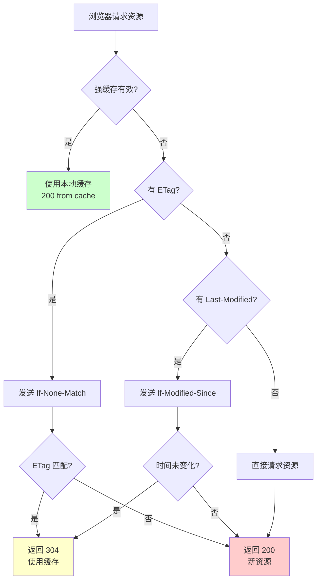
```mermaid
flowchart TD
    A[浏览器请求资源] --> B{强缓存有效?}
    B -->|是| C[使用本地缓存<br/>200 from cache]
    B -->|否| D{有 ETag?}
    
    D -->|是| E[发送 If-None-Match]
    D -->|否| F{有 Last-Modified?}
    
    F -->|是| G[发送 If-Modified-Since]
    F -->|否| H[直接请求资源]
    
    E --> I{ETag 匹配?}
    G --> J{时间未变化?}
    
    I -->|是| K[返回 304<br/>使用缓存]
    I -->|否| L[返回 200<br/>新资源]
    
    J -->|是| K
    J -->|否| L
    
    H --> L
    
    style C fill:#ccffcc
    style K fill:#ffffcc
    style L fill:#ffcccc
```

#### 性能优化建议

:::tip 最佳实践
1. **合理设置缓存时间**：根据资源更新频率设置 max-age
2. **版本控制**：静态资源添加版本号或哈希值
3. **ETag 优先**：对于重要资源，启用 ETag 验证
4. **CDN 配置**：合理配置 CDN 的缓存策略
:::

```nginx
# Nginx 缓存配置示例
location ~* \.(css|js|png|jpg|jpeg|gif|ico|svg)$ {
    expires 1y;
    add_header Cache-Control "public, immutable";
    etag on;
}

location ~* \.(html)$ {
    expires 1h;
    add_header Cache-Control "public, must-revalidate";
    etag on;
}
```

### 强制缓存 vs 协商缓存详解

#### 缓存机制核心原理

:::info 缓存工作模式
浏览器与服务器通信采用**应答模式**：`浏览器发起 HTTP 请求` → `服务器响应该请求`
:::

**缓存机制的两个关键点**：

1. **缓存查找**：浏览器每次发起请求，都会**先在浏览器缓存中查找该请求的结果以及缓存标识**
2. **缓存存储**：浏览器每次拿到返回的请求结果都会**将该结果和缓存标识存入浏览器缓存中**

#### 缓存分类体系

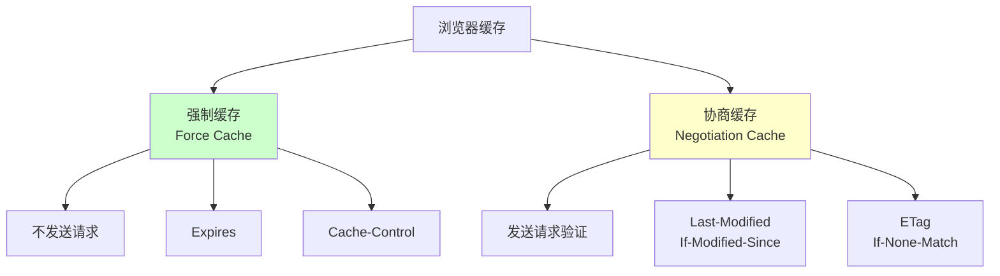
```mermaid
graph TD
    A[浏览器缓存] --> B[强制缓存<br/>Force Cache]
    A --> C[协商缓存<br/>Negotiation Cache]
    
    B --> D[不发送请求]
    B --> E[Expires]
    B --> F[Cache-Control]
    
    C --> G[发送请求验证]
    C --> H[Last-Modified<br/>If-Modified-Since]
    C --> I[ETag<br/>If-None-Match]
    
    style B fill:#ccffcc
    style C fill:#ffffcc
```

#### 强制缓存（Force Cache）

:::tip 强制缓存定义
**强制缓存**是向浏览器缓存查找该请求结果，并根据该结果的缓存规则来决定是否使用该缓存结果的过程。
:::

##### 控制字段

| 字段 | 版本 | 优先级 | 特点 |
|------|------|--------|------|
| **Expires** | HTTP/1.0 | 低 | 绝对时间，受本地时间影响 |
| **Cache-Control** | HTTP/1.1 | 高 | 相对时间，功能更强大 |

##### Cache-Control 指令详解

```http
# 常用指令组合
Cache-Control: public, max-age=31536000, immutable
Cache-Control: private, max-age=3600, must-revalidate
Cache-Control: no-cache, no-store, must-revalidate
```

| 指令 | 说明 | 适用场景 |
|------|------|----------|
| **public** | 可被任何缓存存储 | 静态资源 |
| **private** | 只能被浏览器缓存 | 用户相关数据 |
| **no-cache** | 必须验证后才能使用 | 需要时效性的内容 |
| **no-store** | 不得存储任何缓存 | 敏感信息 |
| **max-age=秒数** | 缓存有效期 | 所有可缓存资源 |
| **immutable** | 内容不会改变 | 版本化的静态资源 |

##### 强制缓存的三种情况

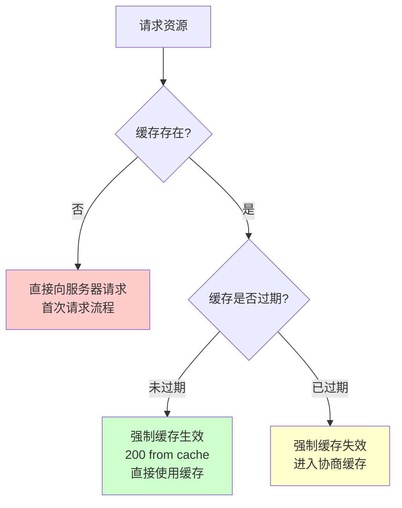
```mermaid
flowchart TD
    A[请求资源] --> B{缓存存在?}
    B -->|否| C[直接向服务器请求<br/>首次请求流程]
    B -->|是| D{缓存是否过期?}
    
    D -->|未过期| E[强制缓存生效<br/>200 from cache<br/>直接使用缓存]
    D -->|已过期| F[强制缓存失效<br/>进入协商缓存]
    
    style E fill:#ccffcc
    style F fill:#ffffcc
    style C fill:#ffcccc
```

#### 协商缓存（Negotiation Cache）

:::info 协商缓存定义
**协商缓存**是强制缓存失效后，浏览器携带缓存标识向服务器发起请求，由服务器根据缓存标识决定是否使用缓存的过程。
:::

##### 控制字段对比

| 字段组合 | 优先级 | 精确度 | 优缺点 |
|----------|--------|--------|--------|
| **ETag / If-None-Match** | 高 | 内容哈希 | 精确但消耗计算资源 |
| **Last-Modified / If-Modified-Since** | 低 | 时间戳 | 性能好但精度有限 |

##### 协商缓存工作流程

**ETag 验证流程**：
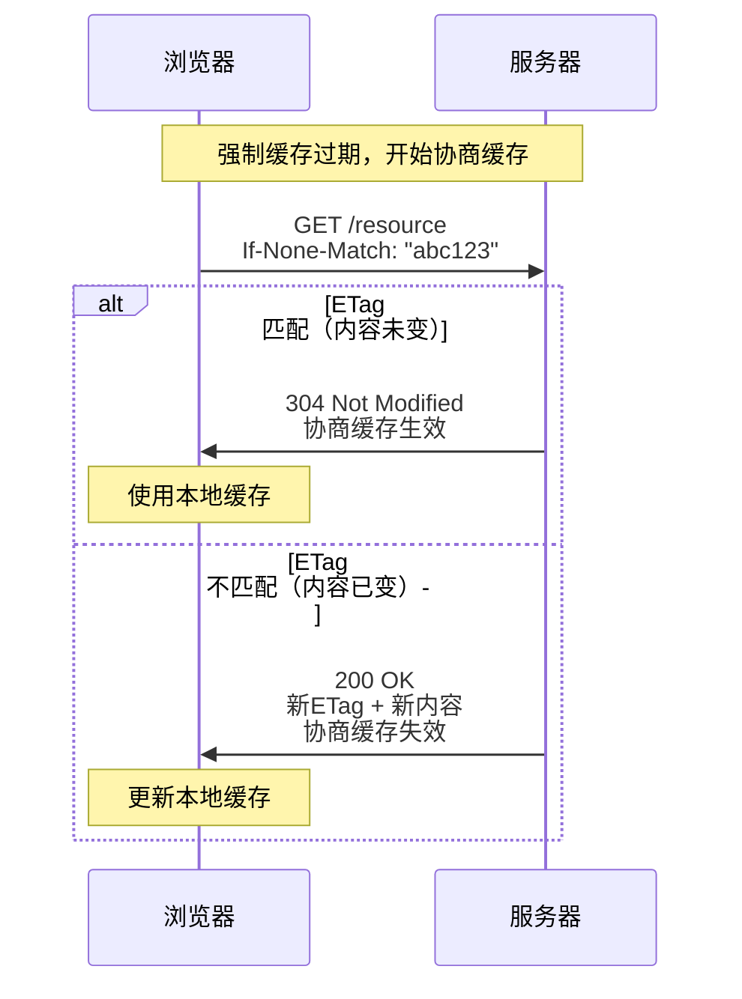
```mermaid
sequenceDiagram
    participant B as 浏览器
    participant S as 服务器
    
    Note over B,S: 强制缓存过期，开始协商缓存
    B->>S: GET /resource<br/>If-None-Match: "abc123"
    
    alt ETag 匹配（内容未变）
        S->>B: 304 Not Modified<br/>协商缓存生效
        Note over B: 使用本地缓存
    else ETag 不匹配（内容已变）
        S->>B: 200 OK<br/>新ETag + 新内容<br/>协商缓存失效
        Note over B: 更新本地缓存
    end
```

**Last-Modified 验证流程**：
```mermaid
sequenceDiagram
    participant B as 浏览器
    participant S as 服务器
    
    B->>S: GET /resource<br/>If-Modified-Since: "Wed, 21 Oct 2024 07:28:00 GMT"
    
    alt 文件未修改
        S->>B: 304 Not Modified<br/>协商缓存生效
    else 文件已修改
        S->>B: 200 OK<br/>新Last-Modified + 新内容<br/>协商缓存失效
    end
```

#### 完整缓存策略决策树

```mermaid
flowchart TD
    A[浏览器请求] --> B{强制缓存<br/>是否有效?}
    
    B -->|有效| C[200 from cache<br/>直接使用强制缓存]
    B -->|失效/不存在| D[发起协商缓存请求]
    
    D --> E{服务器验证<br/>ETag/Last-Modified}
    
    E -->|匹配| F[304 Not Modified<br/>使用协商缓存]
    E -->|不匹配| G[200 OK<br/>返回新资源]
    
    style C fill:#ccffcc
    style F fill:#ffffcc  
    style G fill:#ffcccc
```

#### 缓存策略最佳实践

##### 按资源类型配置

::: info
###### 静态资源（CSS/JS/图片）
```http
# 长期缓存 + 版本控制
Cache-Control: public, max-age=31536000, immutable
ETag: "v1.2.3-abc123"
```

###### HTML 文件
```http
# 短期缓存 + 协商验证
Cache-Control: public, max-age=3600, must-revalidate
ETag: "html-abc123"
Last-Modified: Wed, 21 Oct 2024 07:28:00 GMT
```

###### API 接口
```http
# 私有缓存 + 必须验证
Cache-Control: private, max-age=300, must-revalidate
ETag: "api-response-abc123"
```

== 敏感数据
```http
# 禁止缓存
Cache-Control: no-cache, no-store, must-revalidate
Pragma: no-cache
Expires: 0
```
:::

##### 性能优化建议

:::tip 缓存优化策略
1. **静态资源**：使用长期缓存 + 文件名哈希
2. **HTML 文件**：使用短期缓存 + ETag 验证
3. **API 响应**：根据业务需求设置合适的缓存时间
4. **版本控制**：通过文件名包含版本号避免缓存问题
5. **CDN 配置**：合理配置 CDN 的缓存层级
:::

> 📚 **深入学习**: [彻底理解浏览器的缓存机制](https://juejin.cn/post/6992843117963509791)

## 系统原理

### 进程、线程与协程详解

#### 基本概念对比

```mermaid
graph TD
    A[操作系统] --> B[进程 Process]
    B --> C[线程 Thread]
    C --> D[协程 Coroutine]
    
    B --> B1[资源分配单位]
    C --> C1[CPU调度单位]
    D --> D1[用户态调度单位]
    
    style B fill:#ffcccc
    style C fill:#ffffcc
    style D fill:#ccffcc
```

#### 进程（Process）

:::info 进程定义
**进程**是一个具有一定独立功能的程序在一个数据集上的一次动态执行的过程，是**操作系统进行资源分配和调度的独立单位**，是应用程序运行的载体。
:::

**进程的特征**：
- **独立性**：拥有独立的内存空间
- **动态性**：程序的一次执行过程
- **并发性**：多个进程可以并发执行
- **异步性**：进程按异步方式运行

**进程组成**：
```mermaid
graph LR
    A[进程] --> B[程序代码]
    A --> C[数据段]
    A --> D[进程控制块 PCB]
    A --> E[系统资源]
    
    E --> E1[内存空间]
    E --> E2[文件描述符]
    E --> E3[网络连接]
```

#### 线程（Thread）

:::tip 线程定义
**线程**是程序执行中一个单一的顺序控制流程，是**程序执行流的最小单元**，是处理器调度和分派的基本单位。
:::

**线程的特征**：
- **轻量性**：创建和切换开销小
- **共享性**：共享进程的内存空间
- **并发性**：同一进程内多线程并发执行
- **独立性**：拥有独立的栈空间和程序计数器

**线程组成**：

| 组件 | 说明 | 特点 |
|------|------|------|
| **线程ID** | 唯一标识符 | 系统分配 |
| **程序计数器(PC)** | 当前指令指针 | 独立维护 |
| **寄存器集合** | CPU寄存器状态 | 上下文切换时保存 |
| **栈空间** | 局部变量和函数调用 | 独立分配 |

#### 协程（Coroutine）

:::success 协程定义
**协程**是一种**基于线程之上，但又比线程更加轻量级的存在**，是由程序员自己写程序来管理的『**用户空间线程**』，具有对内核不可见的特性。
:::

**协程的优势**：

```mermaid
graph TD
    A[协程优势] --> B[极轻量级]
    A --> C[用户态调度]
    A --> D[无需锁机制]
    A --> E[高并发支持]
    
    B --> B1[内存占用小<br/>KB级别]
    C --> C1[无内核态切换<br/>开销极小]
    D --> D1[协作式多任务<br/>无竞态条件]
    E --> E1[可创建百万级<br/>协程实例]
```

#### 三者详细对比

##### 资源开销对比

| 维度 | 进程 | 线程 | 协程 |
|------|------|------|------|
| **内存占用** | 数MB | 数KB | 数百字节 |
| **创建时间** | 毫秒级 | 微秒级 | 纳秒级 |
| **切换开销** | 高（上下文切换） | 中（寄存器切换） | 低（用户态切换） |
| **通信方式** | IPC、管道、消息队列 | 共享内存 | 变量共享 |

##### 并发能力对比

```mermaid
graph LR
    A[并发数量] --> B[进程: 数百个]
    A --> C[线程: 数千个]  
    A --> D[协程: 数万-数百万个]
    
    style B fill:#ffcccc
    style C fill:#ffffcc
    style D fill:#ccffcc
```

#### 进程 vs 线程深度对比

##### 区别分析

::: info
== 调度方式
- **进程**：操作系统调度的基本单位，拥有完整的调度信息
- **线程**：CPU调度和分派的基本单位，调度开销较小

== 并发性
- **进程间并发**：不同进程之间可以并发执行
- **线程间并发**：同一进程的多个线程之间也可并发执行

== 资源拥有
- **进程**：拥有资源的独立单位，有独立的内存空间
- **线程**：不拥有系统资源，但可以访问隶属进程的资源

== 系统开销
- **进程**：创建/撤销开销大，需要分配/回收资源
- **线程**：创建/撤销开销小，共享进程资源
:::

##### 稳定性与性能权衡

```mermaid
graph TD
    A[多进程] --> B[高稳定性]
    A --> C[低性能]
    
    D[多线程] --> E[中等稳定性]
    D --> F[高性能]
    
    B --> B1[进程崩溃不影响其他进程]
    C --> C1[进程切换开销大]
    
    E --> E1[线程崩溃影响整个进程]
    F --> F1[线程切换开销小]
```

##### 联系总结

:::info 进程与线程的关系
1. **包含关系**：一个线程只能属于一个进程，一个进程可以有多个线程（但至少有一个主线程）
2. **资源关系**：资源分配给进程，同一进程的所有线程共享该进程的所有资源  
3. **执行关系**：处理机分给线程，即真正在CPU上运行的是线程
4. **同步关系**：线程在执行过程中需要协作同步，不同进程的线程间要利用消息通信实现同步
:::

#### 应用场景选择

```mermaid
flowchart TD
    A[任务类型] --> B{需要隔离性?}
    B -->|是| C[选择多进程]
    B -->|否| D{计算密集?}
    
    D -->|是| E[选择多线程]
    D -->|否| F{I/O密集?}
    
    F -->|是| G[选择协程]
    F -->|否| H[单线程即可]
    
    C --> C1[浏览器标签页<br/>独立服务<br/>关键任务]
    E --> E1[图像处理<br/>数学计算<br/>并行算法]
    G --> G1[网络I/O<br/>文件读写<br/>爬虫程序]
    H --> H1[简单脚本<br/>顺序处理]
```

:::tip 选择建议
- **多进程**：需要高稳定性，进程间隔离的场景
- **多线程**：计算密集型任务，需要并行处理
- **协程**：I/O密集型任务，高并发网络编程
- **单线程**：简单任务，无并发需求
:::

> 📚 **扩展阅读**: 
> - [一文搞懂进程、线程、协程及JS协程的发展](https://juejin.cn/post/7005465381791875109)
> - [深入了解现代 Web 浏览器](https://juejin.cn/post/6993095345576083486)

# 前端技术基础

## HTML && CSS

### HTML5 新特性与语义化

#### 核心概念

:::info 语义化定义
HTML5 的**语义化**指的是**合理正确的使用语义化的标签来创建页面结构**。核心原则：**正确的标签做正确的事**。
:::

#### HTML5 语义化标签体系

```mermaid
graph TD
    A[HTML5语义化标签] --> B[文档结构]
    A --> C[内容分区]
    A --> D[文本内容]
    A --> E[表单控件]
    A --> F[多媒体]
    
    B --> B1[html, head, body]
    C --> C1[header, nav, main, article, section, aside, footer]
    D --> D1[h1-h6, p, blockquote, figure]
    E --> E1[input types, datalist, output]
    F --> F1[audio, video, canvas, svg]
```

#### 主要语义化标签详解

##### 文档结构标签

| 标签 | 语义 | 使用场景 | 示例 |
|------|------|----------|------|
| **`<header>`** | 页面或区域头部 | 网站标题、导航、介绍信息 | 网站 Logo 和主导航 |
| **`<nav>`** | 导航链接区域 | 主导航、面包屑、侧边导航 | 网站主菜单 |
| **`<main>`** | 文档主要内容 | 页面核心内容区域 | 文章正文、产品列表 |
| **`<article>`** | 独立的内容单元 | 博客文章、新闻报道、产品信息 | 一篇完整的博客文章 |
| **`<section>`** | 文档中的节 | 内容分组、章节划分 | 文章的不同章节 |
| **`<aside>`** | 侧边内容 | 边栏、相关链接、广告 | 博客侧边栏 |
| **`<footer>`** | 页面或区域底部 | 版权信息、联系方式、相关链接 | 网站底部信息 |

##### 标签使用示例

```html
<!DOCTYPE html>
<html lang="zh-CN">
<head>
    <meta charset="UTF-8">
    <title>语义化页面示例</title>
</head>
<body>
    <!-- 页面头部 -->
    <header>
        <h1>网站标题</h1>
        <nav>
            <ul>
                <li><a href="#home">首页</a></li>
                <li><a href="#about">关于</a></li>
                <li><a href="#contact">联系</a></li>
            </ul>
        </nav>
    </header>

    <!-- 主要内容 -->
    <main>
        <!-- 文章内容 -->
        <article>
            <header>
                <h2>文章标题</h2>
                <time datetime="2024-01-01">2024年1月1日</time>
            </header>
            
            <section>
                <h3>第一章节</h3>
                <p>章节内容...</p>
            </section>
            
            <section>
                <h3>第二章节</h3>
                <p>章节内容...</p>
            </section>
        </article>
    </main>

    <!-- 侧边栏 -->
    <aside>
        <h3>相关文章</h3>
        <ul>
            <li><a href="#">推荐文章1</a></li>
            <li><a href="#">推荐文章2</a></li>
        </ul>
    </aside>

    <!-- 页面底部 -->
    <footer>
        <p>&copy; 2024 网站名称. 保留所有权利。</p>
    </footer>
</body>
</html>
```

#### HTML5 新增特性

##### 新增表单控件

::: info
== 输入类型
```html
<!-- 新的 input 类型 -->
<input type="email" placeholder="请输入邮箱">
<input type="url" placeholder="请输入网址">
<input type="tel" placeholder="请输入电话">
<input type="number" min="0" max="100" step="1">
<input type="range" min="0" max="100" value="50">
<input type="date">
<input type="time">
<input type="color">
<input type="search" placeholder="搜索...">
```

== 表单元素
```html
<!-- 数据列表 -->
<input list="browsers">
<datalist id="browsers">
    <option value="Chrome">
    <option value="Firefox">
    <option value="Safari">
</datalist>

<!-- 输出元素 -->
<output for="range-input">50</output>

<!-- 进度条 -->
<progress value="70" max="100">70%</progress>

<!-- 仪表盘 -->
<meter value="8" min="0" max="10">8 out of 10</meter>
```
:::

##### 多媒体支持

```html
<!-- 音频 -->
<audio controls>
    <source src="audio.mp3" type="audio/mpeg">
    <source src="audio.ogg" type="audio/ogg">
    您的浏览器不支持音频元素。
</audio>

<!-- 视频 -->
<video width="640" height="480" controls>
    <source src="video.mp4" type="video/mp4">
    <source src="video.webm" type="video/webm">
    您的浏览器不支持视频元素。
</video>

<!-- 画布 -->
<canvas id="myCanvas" width="200" height="100">
    您的浏览器不支持 Canvas。
</canvas>
```

##### 图形和绘图

```html
<!-- SVG 矢量图形 -->
<svg width="100" height="100">
    <circle cx="50" cy="50" r="40" stroke="black" 
            stroke-width="3" fill="red" />
</svg>

<!-- 图形容器 -->
<figure>
    
    <figcaption>图片说明文字</figcaption>
</figure>
```

#### 语义化的优势

```mermaid
graph TD
    A[语义化优势] --> B[开发体验]
    A --> C[用户体验]
    A --> D[SEO优化]
    A --> E[可访问性]
    
    B --> B1[代码结构清晰<br/>易于阅读和维护]
    C --> C1[无CSS时页面<br/>仍有良好结构]
    D --> D1[搜索引擎友好<br/>权重分配合理]
    E --> E1[屏幕阅读器<br/>无障碍访问]
    
    style B1 fill:#ccffcc
    style C1 fill:#ffffcc
    style D1 fill:#ffcccc
    style E1 fill:#ccccff
```

##### 详细优势分析

:::tip 开发与维护
1. **代码结构清晰**：标签名称直观表达内容用途
2. **团队协作**：统一的语义理解，减少沟通成本
3. **代码维护**：语义明确的标签更容易定位和修改
4. **样式编写**：基于语义的 CSS 选择器更稳定
:::

:::info 用户体验
1. **无样式渐进**：在没有 CSS 的情况下，页面仍有良好的结构层次
2. **快速加载**：结构化的内容有助于浏览器优化渲染
3. **移动友好**：语义化标签有助于响应式设计
:::

:::success SEO 优化
1. **搜索引擎理解**：爬虫能更好地理解页面结构和内容重要性
2. **权重分配**：不同标签有不同的SEO权重（h1 > h2 > p）
3. **结构化数据**：有助于生成富文本搜索结果
4. **内容索引**：article、section 等标签帮助内容分类
:::

:::warning 可访问性
1. **屏幕阅读器**：为视障用户提供更好的网页导航
2. **键盘导航**：语义化标签支持更好的键盘操作
3. **语音控制**：便于语音助手理解页面结构
4. **认知障碍**：清晰的结构有助于认知障碍用户理解内容
:::

#### 语义化最佳实践

##### 标签选择指南

```mermaid
flowchart TD
    A[选择标签] --> B{内容性质?}
    B -->|导航链接| C[nav]
    B -->|独立文章| D[article]
    B -->|内容分组| E[section]
    B -->|辅助信息| F[aside]
    B -->|重要性排序| G[h1-h6]
    
    C --> C1[主导航<br/>面包屑<br/>分页]
    D --> D1[博客文章<br/>新闻<br/>产品详情]
    E --> E1[章节<br/>标签页<br/>功能模块]
    F --> F1[侧边栏<br/>广告<br/>相关链接]
    G --> G1[页面标题<br/>章节标题<br/>小节标题]
```

##### 错误示例 vs 正确示例

::: info
== ❌ 错误示例
```html
<!-- 过度使用 div，缺乏语义 -->
<div class="header">
    <div class="logo">网站名称</div>
    <div class="menu">
        <div class="menu-item">首页</div>
        <div class="menu-item">关于</div>
    </div>
</div>

<div class="content">
    <div class="post">
        <div class="title">文章标题</div>
        <div class="text">文章内容...</div>
    </div>
</div>
```

== ✅ 正确示例
```html
<!-- 使用语义化标签 -->
<header>
    <h1>网站名称</h1>
    <nav>
        <ul>
            <li><a href="#home">首页</a></li>
            <li><a href="#about">关于</a></li>
        </ul>
    </nav>
</header>

<main>
    <article>
        <h2>文章标题</h2>
        <p>文章内容...</p>
    </article>
</main>
```
:::

#### 语义化检查清单

:::details 语义化自检清单
**结构检查**：
- [ ] 是否使用了适当的文档结构标签？
- [ ] 标题层级是否合理（h1-h6）？
- [ ] 是否避免了跳级使用标题？

**内容检查**：
- [ ] 独立内容是否使用了 `<article>`？
- [ ] 内容分组是否使用了 `<section>`？
- [ ] 导航链接是否包含在 `<nav>` 中？

**可访问性检查**：
- [ ] 图片是否有合适的 `alt` 属性？
- [ ] 表单控件是否有对应的 `<label>`？
- [ ] 页面是否有合理的标题结构？

**SEO 检查**：
- [ ] 页面是否有唯一的 h1 标签？
- [ ] 重要内容是否使用了合适的标签？
- [ ] 是否避免了过度嵌套？
:::

> 📚 **延伸阅读**：[HTML5 语义化标签完整指南](https://developer.mozilla.org/zh-CN/docs/Web/HTML/Element)


### CSS 选择器及优先级

#### CSS 选择器分类体系

```mermaid
graph TD
    A[CSS选择器] --> B[基础选择器]
    A --> C[组合选择器]
    A --> D[伪类选择器]
    A --> E[伪元素选择器]
    A --> F[属性选择器]
    
    B --> B1[通配符 *]
    B --> B2[元素选择器 div]
    B --> B3[类选择器 .class]
    B --> B4[ID选择器 #id]
    
    C --> C1[后代选择器 ' ']
    C --> C2[子选择器 >]
    C --> C3[相邻兄弟 +]
    C --> C4[通用兄弟 ~]
    
    D --> D1[:hover, :focus]
    D --> D2[:nth-child()]
    D --> D3[:first-child]
    
    E --> E1[::before, ::after]
    E --> E2[::first-line]
    
    F --> F1[[attr]]
    F --> F2[[attr=value]]
```

#### 基础选择器详解

##### 选择器类型对比

| 选择器类型 | 语法 | 优先级 | 使用场景 | 示例 |
|------------|------|--------|----------|------|
| **通配符选择器** | `*` | 0 | 全局样式重置 | `* { margin: 0; }` |
| **元素选择器** | `div` | 1 | 基础样式定义 | `p { color: blue; }` |
| **类选择器** | `.class` | 10 | 可复用样式 | `.btn { padding: 10px; }` |
| **ID选择器** | `#id` | 100 | 唯一元素样式 | `#header { height: 80px; }` |
| **内联样式** | `style=""` | 1000 | 临时样式（不推荐） | `<div style="color: red;">` |
| **!important** | `!important` | 10000 | 强制优先级（慎用） | `color: red !important;` |

#### 组合选择器详解

##### 选择器关系图解

```mermaid
graph TD
    A[父元素] --> B[子元素]
    A --> C[子元素]
    B --> D[孙元素]
    B --> E[孙元素]
    C --> F[孙元素]
    
    style A fill:#ffcccc
    style B fill:#ccffcc
    style C fill:#ccffcc
    style D fill:#ffffcc
    style E fill:#ffffcc
    style F fill:#ffffcc
```

##### 组合选择器对比

::: info
== 后代选择器（空格）
```css
/* 选择 div 内所有 p 元素（包括嵌套） */
div p {
    color: blue;
}
```
**特点**：选择所有后代元素，包括子、孙及更深层级

== 子选择器（>）
```css
/* 只选择 div 的直接子 p 元素 */
div > p {
    color: red;
}
```
**特点**：只选择直接子元素，不包括孙级

== 相邻兄弟选择器（+）
```css
/* 选择紧跟在 h1 后的第一个 p 元素 */
h1 + p {
    margin-top: 0;
}
```
**特点**：选择紧邻的下一个兄弟元素

== 通用兄弟选择器（~）
```css
/* 选择 h1 后所有同级的 p 元素 */
h1 ~ p {
    color: gray;
}
```
**特点**：选择所有后续的兄弟元素
:::

#### 伪类选择器实用指南

##### 状态伪类

| 伪类 | 触发条件 | 常用场景 | 示例 |
|------|----------|----------|------|
| `:hover` | 鼠标悬停 | 交互效果 | `a:hover { color: red; }` |
| `:focus` | 获得焦点 | 表单可访问性 | `input:focus { border-color: blue; }` |
| `:active` | 激活状态 | 按钮按下效果 | `button:active { transform: scale(0.95); }` |
| `:visited` | 已访问链接 | 链接状态区分 | `a:visited { color: purple; }` |

##### 结构伪类

```css
/* 选择第一个子元素 */
li:first-child {
    font-weight: bold;
}

/* 选择最后一个子元素 */
li:last-child {
    border-bottom: none;
}

/* 选择第n个子元素 */
li:nth-child(odd) {    /* 奇数行 */
    background: #f0f0f0;
}

li:nth-child(even) {   /* 偶数行 */
    background: white;
}

li:nth-child(3n+1) {   /* 1, 4, 7, 10... */
    color: red;
}
```

##### 表单伪类

```css
/* 必填字段 */
input:required {
    border-left: 3px solid red;
}

/* 可选字段 */
input:optional {
    border-left: 3px solid green;
}

/* 有效输入 */
input:valid {
    border-color: green;
}

/* 无效输入 */
input:invalid {
    border-color: red;
}

/* 禁用状态 */
input:disabled {
    opacity: 0.5;
    cursor: not-allowed;
}
```

#### 伪元素选择器

:::info 伪元素特点
伪元素用 `::` 双冒号语法，用于创建虚拟元素或选择元素的特定部分
:::

```css
/* 在元素前插入内容 */
.quote::before {
    content: """;
    font-size: 2em;
    color: #ccc;
}

/* 在元素后插入内容 */
.quote::after {
    content: """;
    font-size: 2em;
    color: #ccc;
}

/* 选择第一行 */
p::first-line {
    font-weight: bold;
    font-size: 1.2em;
}

/* 选择第一个字母 */
p::first-letter {
    float: left;
    font-size: 3em;
    line-height: 0.8;
}

/* 选中文本的样式 */
::selection {
    background: #b3d4fc;
    text-shadow: none;
}
```

#### 属性选择器

##### 属性匹配类型

| 选择器 | 匹配规则 | 示例 | 说明 |
|--------|----------|------|------|
| `[attr]` | 有该属性 | `[title]` | 有title属性的元素 |
| `[attr=value]` | 属性值完全匹配 | `[type="text"]` | type属性值为text |
| `[attr^=value]` | 属性值以指定值开头 | `[href^="https"]` | href以https开头 |
| `[attr$=value]` | 属性值以指定值结尾 | `[href$=".pdf"]` | href以.pdf结尾 |
| `[attr*=value]` | 属性值包含指定值 | `[class*="btn"]` | class包含btn |
| `[attr~=value]` | 属性值包含指定单词 | `[class~="primary"]` | class包含primary单词 |

```css
/* 实用示例 */

/* 选择所有外部链接 */
a[href^="http"] {
    color: blue;
}

/* 选择所有PDF链接 */
a[href$=".pdf"]::after {
    content: " (PDF)";
    color: red;
}

/* 选择所有邮箱链接 */
a[href^="mailto"] {
    text-decoration: underline;
}

/* 多属性组合 */
input[type="text"][required] {
    border: 2px solid red;
}
```

#### 优先级计算详解

##### 优先级计算规则

:::tip 计算公式
优先级 = **内联样式权重** + **ID选择器权重** + **类/属性/伪类权重** + **元素/伪元素权重**
:::

```mermaid
graph TD
    A[优先级计算] --> B[!important: 10000]
    A --> C[内联样式: 1000]
    A --> D[ID选择器: 100]
    A --> E[类/属性/伪类: 10]
    A --> F[元素/伪元素: 1]
    A --> G[通配符: 0]
    
    style B fill:#ff9999
    style C fill:#ffcc99
    style D fill:#ffff99
    style E fill:#ccffcc
    style F fill:#ccccff
    style G fill:#e6e6e6
```

##### 优先级计算实例

```css
/* 示例选择器优先级计算 */

/* 优先级: 0001 */
div { color: blue; }

/* 优先级: 0010 */
.header { color: green; }

/* 优先级: 0100 */
#main { color: red; }

/* 优先级: 0011 */
div.header { color: orange; }

/* 优先级: 0101 */
#main div { color: purple; }

/* 优先级: 0111 */
#main div.content { color: pink; }

/* 优先级: 0021 */
.header .nav a { color: yellow; }

/* 优先级: 1000 */
style="color: black;"

/* 优先级: 10000 */
div { color: white !important; }
```

#### 优先级最佳实践

##### 编写建议

:::warning 避免优先级问题
1. **减少使用 ID 选择器**：优先级过高，难以覆盖
2. **谨慎使用 !important**：破坏样式层级，难以维护
3. **使用语义化类名**：提高代码可读性
4. **遵循 BEM 命名规范**：减少选择器嵌套
:::

```css
/* ❌ 不推荐：优先级过高 */
#header .nav ul li a {
    color: blue;
}

/* ✅ 推荐：使用类选择器 */
.nav-link {
    color: blue;
}

/* ❌ 不推荐：滥用 !important */
.button {
    background: red !important;
}

/* ✅ 推荐：合理的优先级 */
.button-primary {
    background: red;
}
```

##### BEM 命名示例

```css
/* BEM (Block Element Modifier) 命名规范 */

/* 块 */
.card {
    border: 1px solid #ddd;
    border-radius: 4px;
}

/* 元素 */
.card__header {
    padding: 1rem;
    border-bottom: 1px solid #eee;
}

.card__body {
    padding: 1rem;
}

.card__footer {
    padding: 1rem;
    background: #f8f9fa;
}

/* 修饰符 */
.card--featured {
    border-color: #007bff;
    box-shadow: 0 2px 4px rgba(0,123,255,0.1);
}

.card--large {
    padding: 2rem;
}
```

#### 选择器性能优化

##### 性能排序（从快到慢）

1. **ID选择器** `#header` - 最快
2. **类选择器** `.navigation` - 快
3. **元素选择器** `div` - 中等
4. **相邻兄弟选择器** `h1 + p` - 较慢
5. **子选择器** `ul > li` - 较慢
6. **后代选择器** `div p` - 慢
7. **通配符选择器** `*` - 最慢
8. **属性选择器** `[type="text"]` - 慢

##### 优化建议

```css
/* ❌ 性能较差 */
* { margin: 0; }
div div div p { color: red; }
[class*="col-"] { float: left; }

/* ✅ 性能更好 */
.reset { margin: 0; }
.article-text { color: red; }
.column { float: left; }
```

> 📚 **深入学习**: [CSS选择器完整参考手册](https://developer.mozilla.org/zh-CN/docs/Web/CSS/CSS_Selectors)

### position 属性的值有哪些及其区别

#### position 属性类型对比

```mermaid
graph TD
    A[CSS Position] --> B[static<br/>默认定位]
    A --> C[relative<br/>相对定位]
    A --> D[absolute<br/>绝对定位]
    A --> E[fixed<br/>固定定位]
    A --> F[sticky<br/>粘性定位]
    
    B --> B1[正常文档流<br/>忽略偏移属性]
    C --> C1[相对原位置偏移<br/>保留原空间]
    D --> D1[相对定位祖先<br/>脱离文档流]
    E --> E1[相对视口<br/>脱离文档流]
    F --> F1[滚动阈值切换<br/>relative→fixed]
    
    style B1 fill:#e6f3ff
    style C1 fill:#fff2cc
    style D1 fill:#ffe6cc
    style E1 fill:#ffcccc
    style F1 fill:#e6ffe6
```

#### 各类定位详解

| 定位类型 | 参考点 | 文档流 | 偏移属性 | 使用场景 |
|----------|--------|--------|----------|----------|
| **static** | 无 | ✅ 保持 | ❌ 忽略 | 默认布局 |
| **relative** | 原位置 | ✅ 占据原空间 | ✅ 可用 | 微调位置、定位上下文 |
| **absolute** | 定位祖先 | ❌ 脱离 | ✅ 可用 | 弹窗、工具提示 |
| **fixed** | 视口 | ❌ 脱离 | ✅ 可用 | 固定导航、回到顶部 |
| **sticky** | 滚动容器 | ✅ 混合模式 | ✅ 可用 | 粘性标题、侧边栏 |

#### 详细说明

**默认定位 Static**
- **特点**：默认值，元素出现在正常的文档流中
- **行为**：忽略 `top`、`bottom`、`left`、`right` 或者 `z-index` 声明
- **使用**：普通页面布局元素，重置其他定位回到默认状态

**相对定位 relative**  
- **特点**：相对于元素的原始位置进行定位
- **行为**：元素仍然占据原来的空间，移动元素会导致它覆盖其它框
- **使用**：微调元素位置，作为绝对定位子元素的参考点

**绝对定位 absolute**
- **特点**：相对于最近的已定位父元素（非static）进行定位
- **行为**：完全脱离文档流，不占据空间，如果没有已定位的父元素，则相对于 `<html>` 元素
- **使用**：弹出框、工具提示、遮罩层、浮动按钮

**固定定位 fixed**
- **特点**：相对于浏览器窗口是固定位置，即使窗口滚动也不会移动
- **行为**：脱离文档流，不占据空间，与其他元素重叠
- **使用**：固定导航栏、页脚、回到顶部按钮、固定侧边栏

**粘性定位 sticky**
- **特点**：先按照普通文档流定位，滚动到特定阈值后变为固定定位
- **行为**：相对于最近的块级祖先元素定位，在跨越特定阈值前为相对定位，之后为固定定位
- **使用**：滚动时固定的导航菜单、表格标题行、侧边栏跟随滚动

#### 实际应用示例

```css
/* 居中定位技巧 */
.center-absolute {
    position: absolute;
    top: 50%;
    left: 50%;
    transform: translate(-50%, -50%);
}

/* 固定工具栏 */
.toolbar {
    position: sticky;
    top: 0;
    background: white;
    z-index: 100;
}

/* 全屏遮罩 */
.overlay {
    position: fixed;
    top: 0;
    left: 0;
    width: 100%;
    height: 100%;
    background: rgba(0, 0, 0, 0.5);
}

/* 角标定位 */
.badge-container {
    position: relative;
}

.badge {
    position: absolute;
    top: -8px;
    right: -8px;
    min-width: 16px;
    height: 16px;
}
```

### box-sizing 属性

#### 核心概念

:::info box-sizing 定义
`box-sizing` 属性定义了用户代理应当如何计算一个元素的总宽度和总高度。它决定了元素的宽度和高度是否包含内边距（padding）和边框（border）。
:::

#### 属性值对比

```mermaid
graph TD
    A[box-sizing属性] --> B[content-box<br/>标准盒模型]
    A --> C[border-box<br/>IE盒模型]
    A --> D[inherit<br/>继承父元素]
    
    B --> B1[width = 内容宽度<br/>总宽度 = width + padding + border + margin]
    C --> C1[width = 内容 + padding + border<br/>总宽度 = width + margin]
    D --> D1[使用父元素的box-sizing值]
    
    style B1 fill:#e6f3ff
    style C1 fill:#ffe6f3
    style D1 fill:#f0f0f0
```

#### 详细对比

| 值 | 宽度计算方式 | 兼容性 | 推荐场景 |
|----|--------------|--------|----------|
| **`content-box`** | width = 内容宽度 | 所有浏览器 | 默认行为，传统布局 |
| **`border-box`** | width = 内容 + padding + border | IE8+ | 现代布局，响应式设计 |
| **`inherit`** | 继承父元素值 | IE8+ | 特殊继承需求 |

#### 可视化示例

::: info
== content-box（标准）
```css
.content-box {
    box-sizing: content-box; /* 默认值 */
    width: 200px;
    padding: 20px;
    border: 10px solid #ccc;
    /* 实际占用宽度：200 + 40 + 20 = 260px */
    /* 内容宽度：200px */
}
```

== border-box（IE模型）
```css
.border-box {
    box-sizing: border-box;
    width: 200px;
    padding: 20px;
    border: 10px solid #ccc;
    /* 实际占用宽度：200px */
    /* 内容宽度：200 - 40 - 20 = 140px */
}
```
:::

#### 计算公式对比

**content-box 计算**：
- 元素总宽度 = `width` + `padding-left` + `padding-right` + `border-left` + `border-right` + `margin-left` + `margin-right`
- 内容宽度 = `width`

**border-box 计算**：
- 元素总宽度 = `width` + `margin-left` + `margin-right`
- 内容宽度 = `width` - `padding-left` - `padding-right` - `border-left` - `border-right`

#### 实际应用

##### 全局设置推荐

```css
/* 方法1：全局 border-box（推荐） */
*, *::before, *::after {
    box-sizing: border-box;
}

/* 方法2：继承方式（更灵活） */
html {
    box-sizing: border-box;
}

*, *::before, *::after {
    box-sizing: inherit;
}
```

##### 响应式布局优势

```css
/* 使用 border-box 的响应式布局 */
.container {
    box-sizing: border-box;
    width: 100%;
    padding: 0 20px; /* 不会超出容器宽度 */
}

.grid-item {
    box-sizing: border-box;
    width: 33.333%;
    padding: 10px;
    border: 1px solid #ddd;
    /* 三列布局，padding 和 border 不会导致换行 */
}
```

##### 表单元素应用

```css
/* 统一表单元素的盒模型 */
input, textarea, select {
    box-sizing: border-box;
    width: 100%;
    padding: 8px 12px;
    border: 1px solid #ddd;
    /* 所有表单元素宽度一致，不受 padding 和 border 影响 */
}
```

#### 与 Flexbox 的配合

```css
.flex-container {
    display: flex;
}

.flex-item {
    box-sizing: border-box;
    flex: 1;
    padding: 20px;
    border: 2px solid #ccc;
    /* border-box 确保所有项目大小一致 */
}
```

#### 常见问题解决

##### 问题：百分比宽度 + padding 导致换行

```css
/* ❌ 问题代码 */
.item {
    width: 50%;
    padding: 20px; /* 会导致总宽度超过 50% */
    float: left;
}

/* ✅ 解决方案 */
.item {
    box-sizing: border-box;
    width: 50%;
    padding: 20px; /* 现在 padding 包含在 50% 内 */
    float: left;
}
```

##### 调试技巧

```css
/* 开发时可视化盒模型 */
.debug {
    outline: 1px solid red;
    /* 或者使用不影响布局的 box-shadow */
    box-shadow: 0 0 0 1px red inset;
}

/* 显示不同盒模型的差异 */
.content-box-demo {
    box-sizing: content-box;
    background: rgba(255, 0, 0, 0.3);
}

.border-box-demo {
    box-sizing: border-box;
    background: rgba(0, 255, 0, 0.3);
}
```

#### 最佳实践

:::tip 使用建议
1. **推荐使用 `border-box`**：布局计算更直观，特别是响应式设计
2. **全局设置**：避免在每个元素上重复设置
3. **继承方式**：为特殊组件提供覆盖的灵活性
4. **表单元素**：统一设置 border-box 以确保一致的宽度
:::

:::warning 注意事项
1. **IE 兼容性**：IE8+ 才支持 border-box
2. **第三方组件**：可能需要重置某些组件的 box-sizing
3. **单位混用**：避免同时使用百分比和固定单位时的计算复杂性
4. **调试工具**：使用浏览器开发者工具查看盒模型
:::

> 语法：`box-sizing: content-box | border-box | inherit`

### CSS 盒子模型

CSS 盒子模型本质上是一个盒子，它包括：边距，边框，填充和实际内容。CSS 中的盒子模型包括 IE 盒子模型和标准的 W3C 盒子模型。

在标准的盒子模型中，`width 指 content 部分的宽度`。

在 IE 盒子模型中，`width 表示 content+padding+border 这三个部分的宽度`。

故在计算盒子的宽度时存在差异：

**标准盒模型：** 一个块的总宽度 = width+margin(左右)+padding(左右)+border(左右)

**怪异盒模型：** 一个块的总宽度 = width+margin（左右）（既 width 已经包含了 padding 和 border 值）

### BFC（块级格式上下文）详解

#### 核心概念

:::info BFC 定义
**BFC（Block Formatting Context）** 是 Web 页面的可视化 CSS 渲染的一部分，是块盒子的布局过程发生的区域，也是浮动元素与其他元素交互的区域。简单说，BFC 是一个独立的渲染区域，内部元素的布局不会影响外部元素。
:::

#### BFC 布局规则

```mermaid
graph TD
    A[BFC布局规则] --> B[内部Box垂直排列]
    A --> C[相邻margin会重叠]
    A --> D[每个元素左边缘接触容器左边缘]
    A --> E[BFC区域不与float重叠]
    A --> F[独立容器，内外不互相影响]
    A --> G[计算高度时包含浮动元素]
    
    style B fill:#e6f3ff
    style C fill:#fff2cc
    style D fill:#ffe6cc
    style E fill:#ffcccc
    style F fill:#e6ffe6
    style G fill:#f0e6ff
```

##### 详细规则解析

1. **垂直排列**：内部的 Box 会在垂直方向一个接一个地放置
2. **margin 重叠**：属于同一个 BFC 的两个相邻 Box 的 margin 会发生重叠
3. **左边缘接触**：每个元素的 margin box 的左边与包含块 border box 的左边相接触
4. **不与浮动重叠**：BFC 的区域不会与 float box 重叠
5. **独立容器**：BFC 是一个独立容器，内部子元素不会影响外面的元素
6. **包含浮动**：计算 BFC 的高度时，浮动元素也参与计算

#### 创建 BFC 的方法

##### 常用触发条件

| 属性 | 值 | 使用场景 | 副作用 |
|------|----|---------|----|
| **`overflow`** | `hidden`, `auto`, `scroll` | 清除浮动 | 可能隐藏内容 |
| **`display`** | `inline-block`, `table-cell`, `flex`, `grid` | 布局容器 | 改变显示类型 |
| **`position`** | `absolute`, `fixed` | 定位元素 | 脱离文档流 |
| **`float`** | `left`, `right` | 浮动布局 | 脱离文档流 |
| **根元素** | `html` | 文档根 | 无副作用 |

##### 创建示例

```css
/* 方法1：overflow（最常用） */
.bfc-overflow {
    overflow: hidden; /* 或 auto, scroll */
}

/* 方法2：display */
.bfc-flex {
    display: flex;
}

.bfc-grid {
    display: grid;
}

.bfc-table-cell {
    display: table-cell;
}

/* 方法3：position */
.bfc-absolute {
    position: absolute;
}

.bfc-fixed {
    position: fixed;
}

/* 方法4：float */
.bfc-float {
    float: left;
}
```

#### BFC 应用场景

##### 1. 清除浮动

::: info
== 问题现象
```html
<div class="container">
    <div class="float-child">浮动元素</div>
    <div class="float-child">浮动元素</div>
</div>
```

```css
.container {
    border: 2px solid red;
    /* 父容器高度塌陷 */
}

.float-child {
    float: left;
    width: 100px;
    height: 100px;
    background: blue;
    margin: 10px;
}
```

== BFC 解决方案
```css
.container {
    border: 2px solid red;
    overflow: hidden; /* 创建 BFC，包含浮动子元素 */
}

/* 或者使用 display: flow-root（现代浏览器） */
.container-modern {
    display: flow-root; /* 专门为创建 BFC 设计 */
}
```
:::

##### 2. 防止 margin 重叠

::: info
== 问题现象
```html
<div class="box1">Box 1</div>
<div class="box2">Box 2</div>
```

```css
.box1 {
    margin-bottom: 20px;
    background: red;
}

.box2 {
    margin-top: 30px;
    background: blue;
}
/* 实际间距只有 30px，不是 50px */
```

== BFC 解决方案
```html
<div class="box1">Box 1</div>
<div class="bfc-wrapper">
    <div class="box2">Box 2</div>
</div>
```

```css
.bfc-wrapper {
    overflow: hidden; /* 创建新的 BFC */
}
/* 现在 margin 不会重叠，间距为 50px */
```
:::

##### 3. 阻止元素被浮动元素覆盖

::: info
== 问题现象
```html
<div class="float-element">浮动元素</div>
<div class="normal-element">普通元素被覆盖</div>
```

```css
.float-element {
    float: left;
    width: 200px;
    height: 100px;
    background: red;
}

.normal-element {
    background: blue;
    /* 被浮动元素覆盖 */
}
```

== BFC 解决方案
```css
.normal-element {
    background: blue;
    overflow: hidden; /* 创建 BFC，不被浮动元素覆盖 */
    /* 形成两列布局 */
}
```
:::

##### 4. 自适应两列布局

```css
.layout-container {
    overflow: hidden; /* 清除浮动 */
}

.sidebar {
    float: left;
    width: 200px;
    background: #f0f0f0;
    height: 300px;
}

.main-content {
    overflow: hidden; /* 创建 BFC，不被侧边栏覆盖 */
    background: #fff;
    height: 300px;
    /* 自动填充剩余宽度 */
}
```

#### BFC 与现代布局

##### Flexbox 中的 BFC

```css
.flex-container {
    display: flex; /* flex 容器自动创建 BFC */
}

.flex-item {
    flex: 1;
    /* flex 项目也会创建独立的格式化上下文 */
}
```

##### Grid 中的 BFC

```css
.grid-container {
    display: grid; /* grid 容器创建 BFC */
    grid-template-columns: 1fr 2fr;
}

.grid-item {
    /* grid 项目也有独立的格式化上下文 */
}
```

#### BFC 调试技巧

##### 可视化 BFC 边界

```css
/* 开发时显示 BFC 边界 */
.bfc-debug {
    outline: 2px dashed red;
    background: rgba(255, 0, 0, 0.1);
}

/* 显示浮动元素 */
.float-debug {
    outline: 2px solid blue;
    background: rgba(0, 0, 255, 0.1);
}
```

##### 检测 BFC 的方法

```javascript
// JavaScript 检测元素是否创建了 BFC
function createsBFC(element) {
    const style = getComputedStyle(element);
    
    return (
        style.overflow !== 'visible' ||
        style.display === 'inline-block' ||
        style.display === 'table-cell' ||
        style.display === 'flex' ||
        style.display === 'grid' ||
        style.position === 'absolute' ||
        style.position === 'fixed' ||
        style.float !== 'none'
    );
}
```

#### 常见问题与解决方案

##### 问题1：overflow:hidden 隐藏内容

```css
/* 问题：使用 overflow:hidden 清除浮动时可能隐藏重要内容 */
.container-problem {
    overflow: hidden; /* 可能隐藏溢出的工具提示 */
}

/* 解决：使用现代方法 */
.container-solution {
    display: flow-root; /* 专为创建 BFC 设计，无副作用 */
}
```

##### 问题2：margin 重叠的复杂情况

```css
/* 复杂的 margin 重叠情况 */
.parent {
    margin-top: 20px;
    /* 如果父元素没有边框/内边距，子元素的 margin 会与父元素重叠 */
}

.child {
    margin-top: 30px;
}

/* 解决方案 */
.parent-fixed {
    margin-top: 20px;
    padding-top: 1px; /* 或者 border-top: 1px solid transparent; */
    /* 或者创建 BFC */
    overflow: hidden;
}
```

#### BFC 最佳实践

:::tip 使用建议
1. **清除浮动**：优先使用 `display: flow-root`，兼容性考虑用 `overflow: hidden`
2. **两列布局**：现代项目推荐使用 Flexbox 或 Grid
3. **margin 重叠**：理解重叠规则，合理使用 BFC 或改变元素结构
4. **调试工具**：使用浏览器开发者工具查看元素的格式化上下文
:::

:::warning 注意事项
1. **副作用**：每种创建 BFC 的方法都有副作用，选择时要权衡
2. **性能**：过度使用 BFC 可能影响页面性能
3. **可维护性**：优先使用语义化的解决方案（如 Flexbox）
4. **兼容性**：`display: flow-root` 在旧浏览器中不支持
:::

#### 实战练习

```html
<!-- 练习：创建一个包含浮动元素的卡片组件 -->
<div class="card">
    
    <div class="card-content">
        <h3>Card Title</h3>
        <p>Card description content...</p>
    </div>
</div>
```

```css
.card {
    border: 1px solid #ddd;
    border-radius: 8px;
    overflow: hidden; /* 创建 BFC，包含浮动图片 */
}

.card-image {
    float: left;
    width: 100px;
    height: 100px;
    margin: 10px;
}

.card-content {
    overflow: hidden; /* 创建 BFC，防止被图片覆盖 */
    padding: 10px;
}
```

> 📚 **延伸阅读**: [MDN - Block Formatting Context](https://developer.mozilla.org/zh-CN/docs/Web/Guide/CSS/Block_formatting_context)

### CSS 定位属性详解

#### position 属性全面解析

:::info 定位概念
CSS `position` 属性用于指定元素在文档中的定位方式，它决定了元素如何脱离或保持在正常的文档流中。
:::

#### 定位类型对比

```mermaid
graph TD
    A[CSS Position] --> B[static<br/>默认定位]
    A --> C[relative<br/>相对定位]
    A --> D[absolute<br/>绝对定位]
    A --> E[fixed<br/>固定定位]
    A --> F[sticky<br/>粘性定位]
    
    B --> B1[正常文档流<br/>忽略偏移属性]
    C --> C1[相对原位置偏移<br/>保留原空间]
    D --> D1[相对定位祖先<br/>脱离文档流]
    E --> E1[相对视口<br/>脱离文档流]
    F --> F1[滚动阈值切换<br/>relative→fixed]
    
    style B1 fill:#e6f3ff
    style C1 fill:#fff2cc
    style D1 fill:#ffe6cc
    style E1 fill:#ffcccc
    style F1 fill:#e6ffe6
```

#### 各种定位详解

##### 1. Static（默认定位）

::: info
== 特性
- **默认值**：所有元素的初始 position 值
- **文档流**：元素保持在正常的文档流中
- **偏移属性**：忽略 `top`、`right`、`bottom`、`left` 和 `z-index`
- **空间占用**：正常占据文档流空间

== 代码示例
```css
.static-element {
    position: static; /* 默认值，可省略 */
    /* top, left 等属性无效 */
}
```

== 使用场景
- 普通的页面布局元素
- 重置其他定位回到默认状态
- 大部分块级和内联元素
:::

##### 2. Relative（相对定位）

::: info
== 特性
- **参考点**：元素的原始位置
- **文档流**：元素仍占据原来的空间
- **偏移属性**：`top`、`right`、`bottom`、`left` 生效
- **层级**：可使用 `z-index` 控制层级

== 代码示例
```css
.relative-element {
    position: relative;
    top: 20px;    /* 向下偏移20px */
    left: 10px;   /* 向右偏移10px */
    z-index: 1;
}
```

== 使用场景
- 微调元素位置
- 作为绝对定位子元素的参考点
- 需要使用 z-index 的普通元素
:::

##### 3. Absolute（绝对定位）

::: info
###### 特性
- **参考点**：最近的非 static 定位祖先元素
- **文档流**：完全脱离文档流，不占据空间
- **偏移属性**：相对于参考点进行定位
- **默认参考**：如无定位祖先，则相对于 `<html>` 元素

- 代码示例
```css
.parent {
    position: relative; /* 建立定位上下文 */
}

.absolute-element {
    position: absolute;
    top: 0;
    right: 0;    /* 定位到父元素右上角 */
    width: 100px;
    height: 100px;
}
```

###### 使用场景
- 弹出框、工具提示
- 遮罩层、浮动按钮
- 复杂布局中的精确定位
:::

##### 4. Fixed（固定定位）

::: info
###### 特性
- **参考点**：浏览器视口（viewport）
- **文档流**：完全脱离文档流
- **滚动行为**：页面滚动时位置不变
- **移动端注意**：某些移动浏览器中可能有兼容性问题

== 代码示例
```css
.fixed-header {
    position: fixed;
    top: 0;
    left: 0;
    width: 100%;
    height: 60px;
    z-index: 1000;
}

.back-to-top {
    position: fixed;
    bottom: 20px;
    right: 20px;
}
```

###### 使用场景
- 固定导航栏、页脚
- 回到顶部按钮
- 固定侧边栏、工具条
:::

##### 5. Sticky（粘性定位）

::: info
###### 特性
- **混合行为**：相对定位 + 固定定位的结合
- **阈值切换**：滚动到指定位置时从 relative 变为 fixed
- **容器限制**：不会超出父容器范围
- **兼容性**：现代浏览器支持良好

###### 代码示例
```css
.sticky-nav {
    position: sticky;
    top: 0;        /* 距离顶部0px时变为固定定位 */
    background: white;
    z-index: 100;
}

.sidebar {
    position: sticky;
    top: 20px;     /* 距离顶部20px时开始粘性 */
}
```

###### 使用场景
- 滚动时固定的导航菜单
- 表格标题行
- 侧边栏跟随滚动
:::

#### 定位上下文与层叠

##### 定位上下文建立

```css
/* 这些属性会建立新的定位上下文 */
.positioning-context {
    position: relative;  /* 最常用 */
    /* 或者 */
    position: absolute;
    /* 或者 */
    position: fixed;
    /* 或者 */
    position: sticky;
}
```

##### z-index 层叠规则

```mermaid
graph TD
    A[层叠顺序<br/>从低到高] --> B[负z-index]
    B --> C[block块级盒子]
    C --> D[float浮动盒子]
    D --> E[inline内联盒子]
    E --> F[z-index:0或auto]
    F --> G[正z-index]
    
    style B fill:#ffeeee
    style C fill:#fff5ee
    style D fill:#ffffee
    style E fill:#f5ffee
    style F fill:#eeffee
    style G fill:#eeeeff
```

```css
/* z-index 层级示例 */
.layer-1 { z-index: 1; }
.layer-2 { z-index: 2; }
.layer-3 { z-index: 999; }

/* 只有定位元素才能使用 z-index */
.positioned {
    position: relative; /* 或 absolute, fixed, sticky */
    z-index: 10;
}
```

#### 定位实战案例

##### 居中定位技巧

```css
/* 方法1：使用 transform */
.center-absolute {
    position: absolute;
    top: 50%;
    left: 50%;
    transform: translate(-50%, -50%);
    /* 适用于未知宽高的元素 */
}
```

== 负边距方法
```css
.absolute-margin {
    position: absolute;
    top: 50%;
    left: 50%;
    width: 200px;
    height: 100px;
    margin-left: -100px; /* 宽度的一半 */
    margin-top: -50px;   /* 高度的一半 */
}
```

== inset 方法
```css
.absolute-inset {
    position: absolute;
    inset: 0; /* top: 0; right: 0; bottom: 0; left: 0; */
    margin: auto;
    width: 200px;
    height: 100px;
}
```
:::

#### 居中方案选择指南

```mermaid
flowchart TD
    A[选择居中方案] --> B{支持现代浏览器?}
    B -->|是| C[推荐 Flexbox]
    B -->|否| D{已知元素尺寸?}
    
    C --> C1[justify-content: center<br/>align-items: center]
    
    D -->|是| E[绝对定位 + 负边距]
    D -->|否| F[绝对定位 + transform]
    
    E --> E1[position: absolute<br/>margin负值]
    F --> F1[position: absolute<br/>transform: translate]
```

#### 实战案例

##### 模态框居中

:::details 模态框居中
```css
.modal-overlay {
    position: fixed;
    top: 0;
    left: 0;
    width: 100%;
    height: 100%;
    background: rgba(0, 0, 0, 0.5);
    display: flex;
    justify-content: center;
    align-items: center;
    z-index: 1000;
}

.modal-content {
    background: white;
    border-radius: 8px;
    padding: 20px;
    max-width: 90%;
    max-height: 90%;
    overflow: auto;
}
```
:::

##### 卡片居中布局
:::details 卡片居中布局
```css
.card-container {
    display: grid;
    place-items: center;
    min-height: 100vh;
    padding: 20px;
}

.card {
    width: 100%;
    max-width: 400px;
    background: white;
    border-radius: 12px;
    box-shadow: 0 4px 6px rgba(0, 0, 0, 0.1);
    padding: 24px;
}
```
:::

#### 最佳实践

:::tip 选择建议
**居中方案选择**：
1. **现代项目**：优先使用 Flexbox 或 Grid
2. **兼容性要求**：使用绝对定位 + transform
3. **简单场景**：text-align 和 margin auto
:::

传送门 ☞ [# 图解CSS水平垂直居中常见面试方法](https://juejin.cn/post/7008348524530106381)
### 隐藏页面中某个元素的方法

#### 隐藏方式对比

| 方法 | 占据空间 | 可点击 | 可聚焦 | 读屏器读取 | 动画过渡 | 使用场景 |
|------|----------|--------|--------|------------|----------|----------|
| `display: none` | ❌ | ❌ | ❌ | ❌ | ❌ | 完全移除 |
| `visibility: hidden` | ✅ | ❌ | ❌ | ❌ | ✅ | 保留布局 |
| `opacity: 0` | ✅ | ✅ | ✅ | ✅ | ✅ | 透明效果 |
| `position: absolute` + 移出 | ❌ | ❌ | ❌ | ❌ | ✅ | 动画隐藏 |
| `clip-path` | ✅ | ❌ | ❌ | ❌ | ✅ | 裁剪隐藏 |
| `height: 0` + `overflow: hidden` | ❌ | ❌ | ❌ | ❌ | ✅ | 折叠动画 |

#### 详细实现方法

##### 1. display: none

`display：none`，把元素隐藏起来，并且会改变页面布局，可以理解成在页面中把该元素完全移除。不显示对应的元素，在文档布局中不再分配空间（回流+重绘）

```css
.hide-display {
    display: none;
}

/* 完全从文档流中移除，常用于：*/
/* - 响应式隐藏 */
/* - 条件显示组件 */
/* - 不需要动画的场景 */

/* 响应式示例 */
@media (max-width: 768px) {
    .hide-mobile {
        display: none;
    }
}
```

##### 2. visibility: hidden

`visibility：hidden`，该元素隐藏起来了，但不会改变页面布局，但是不会触发该元素已经绑定的事件，隐藏对应元素，在文档布局中仍保留原来的空间（重绘）

```css
.hide-visibility {
    visibility: hidden;
}

/* 元素不可见但保留空间，适用于：*/
/* - 需要保持布局的隐藏 */
/* - 可以有过渡动画 */

/* 过渡动画示例 */
.fade-transition {
    visibility: visible;
    opacity: 1;
    transition: opacity 0.3s, visibility 0.3s;
}

.fade-transition.hidden {
    visibility: hidden;
    opacity: 0;
}
```

##### 3. opacity: 0

`opacity：0`，该元素隐藏起来了，但不会改变页面布局，并且，如果该元素已经绑定一些事件，如 click 事件，那么点击该区域，也能触发点击事件的

```css
.hide-opacity {
    opacity: 0;
}

/* 透明但仍可交互，适用于：*/
/* - 淡入淡出动画 */
/* - 需要保持交互性的场景 */

/* 动画示例 */
.fade-element {
    opacity: 1;
    transition: opacity 0.3s ease;
}

.fade-element.transparent {
    opacity: 0;
}
```

##### 4. 定位隐藏

```css
/* 移出视口 */
.hide-position {
    position: absolute;
    left: -9999px;
    top: -9999px;
}

/* 或者 */
.hide-transform {
    transform: translateX(-100%);
}

/* 适用于屏幕阅读器仍需读取的内容 */
```

##### 5. 裁剪隐藏

```css
/* 使用 clip-path */
.hide-clip {
    clip-path: polygon(0 0, 0 0, 0 0, 0 0);
}

/* 使用 clip（已废弃，但兼容性好） */
.hide-clip-legacy {
    position: absolute;
    clip: rect(0, 0, 0, 0);
}

/* 现代方法 */
.hide-clip-modern {
    clip-path: inset(100%);
}
```

##### 6. 尺寸隐藏

```css
/* 高度折叠 */
.hide-height {
    height: 0;
    overflow: hidden;
    padding: 0;
    margin: 0;
    border: none;
}

/* 宽度折叠 */
.hide-width {
    width: 0;
    overflow: hidden;
    padding: 0;
    margin: 0;
    border: none;
}

/* 完全折叠 */
.hide-size {
    width: 0;
    height: 0;
    overflow: hidden;
    opacity: 0;
}
```

#### 高级隐藏技巧

##### 可访问性友好的隐藏

```css
/* 视觉隐藏但对屏幕阅读器可见 */
.sr-only {
    position: absolute;
    width: 1px;
    height: 1px;
    padding: 0;
    margin: -1px;
    overflow: hidden;
    clip: rect(0, 0, 0, 0);
    white-space: nowrap;
    border: 0;
}

/* 聚焦时显示（跳转链接） */
.sr-only-focusable:focus {
    position: static;
    width: auto;
    height: auto;
    overflow: visible;
    clip: auto;
    white-space: normal;
}
```

##### 动画隐藏组合

```css
/* 淡出并折叠 */
.fade-collapse {
    max-height: 1000px; /* 足够大的值 */
    opacity: 1;
    transition: max-height 0.3s ease, opacity 0.3s ease;
}

.fade-collapse.hidden {
    max-height: 0;
    opacity: 0;
    overflow: hidden;
    padding: 0;
    margin: 0;
}
```

#### 性能影响分析

```mermaid
graph TD
    A[隐藏方法性能影响] --> B[display: none<br/>回流+重绘]
    A --> C[visibility: hidden<br/>重绘]
    A --> D[opacity: 0<br/>重绘]
    A --> E[transform<br/>合成层]
    
    B --> B1[性能影响：高<br/>触发布局重计算]
    C --> C1[性能影响：中<br/>只触发重绘]
    D --> D1[性能影响：低<br/>GPU加速]
    E --> E1[性能影响：最低<br/>独立合成层]
    
    style B1 fill:#ffcccc
    style C1 fill:#ffffcc
    style D1 fill:#ccffcc
    style E1 fill:#ccffff
```

#### 应用场景指导

:::tip 选择建议
**隐藏方案选择**：
1. **完全隐藏**：display: none
2. **保持布局**：visibility: hidden
3. **动画过渡**：opacity + visibility
4. **可访问性**：使用 .sr-only 类
5. **高性能动画**：transform + opacity
:::

:::warning 注意事项
1. **事件处理**：opacity: 0 的元素仍可交互，需要额外处理事件
2. **可访问性**：考虑屏幕阅读器用户的体验
3. **性能**：频繁切换显示状态时选择性能更好的方法
4. **动画**：某些隐藏方法不支持 CSS 过渡动画
:::

>该问题会引出 回流和重绘
### 用 CSS 实现三角符号

#### 三角形原理

:::info 核心原理
CSS 三角形利用 border 的特性实现：当元素宽度和高度为0时，边框会呈现三角形状。通过控制不同方向边框的颜色和大小，可以创建各种三角形。
:::

```mermaid
graph TD
    A[CSS三角形实现方法] --> B[Border方法<br/>兼容性最好]
    A --> C[clip-path方法<br/>现代浏览器]
    A --> D[伪元素方法<br/>灵活性强]
    
    B --> B1[等腰三角形<br/>等边三角形<br/>直角三角形]
    C --> C1[任意形状<br/>动画友好]
    D --> D1[工具提示<br/>箭头指示器]
```

#### Border 实现方法

##### 基础三角形

**记忆口诀：盒子宽高均为零，三面边框皆透明。**

:::details 基础三角形
```css
/* 向上的三角形 */
.triangle-up {
    width: 0;
    height: 0;
    border-left: 50px solid transparent;
    border-right: 50px solid transparent;
    border-bottom: 100px solid #ff0;
}

/* 向下的三角形 */
.triangle-down {
    width: 0;
    height: 0;
    border-left: 50px solid transparent;
    border-right: 50px solid transparent;
    border-top: 100px solid #ff0;
}

/* 向左的三角形 */
.triangle-left {
    width: 0;
    height: 0;
    border-top: 50px solid transparent;
    border-bottom: 50px solid transparent;
    border-right: 100px solid #ff0;
}

/* 向右的三角形 */
.triangle-right {
    width: 0;
    height: 0;
    border-top: 50px solid transparent;
    border-bottom: 50px solid transparent;
    border-left: 100px solid #ff0;
}
```
:::

##### 使用伪元素实现

:::details 使用伪元素实现
```css
/*记忆口诀：盒子宽高均为零，三面边框皆透明。 */
div:after{
    position: absolute;
    width: 0px;
    height: 0px;
    content: " ";
    border-right: 100px solid transparent;
    border-top: 100px solid #ff0;
    border-left: 100px solid transparent;
    border-bottom: 100px solid transparent;
}
```
:::

#### 不同类型的三角形

##### 等腰三角形

:::details 等腰三角形
```css
.isosceles-triangle {
    width: 0;
    height: 0;
    border-left: 50px solid transparent;
    border-right: 50px solid transparent;
    border-bottom: 80px solid #007bff;
}
```
:::

##### 直角三角形

:::details 直角三角形
```css
/* 左上角直角三角形 */
.right-triangle-topleft {
    width: 0;
    height: 0;
    border-top: 100px solid #28a745;
    border-right: 100px solid transparent;
}

/* 右下角直角三角形 */
.right-triangle-bottomright {
    width: 0;
    height: 0;
    border-bottom: 100px solid #dc3545;
    border-left: 100px solid transparent;
}
```
:::

##### 等边三角形

:::details 等边三角形
```css
.equilateral-triangle {
    width: 0;
    height: 0;
    border-left: 50px solid transparent;
    border-right: 50px solid transparent;
    border-bottom: 86.6px solid #ffc107; /* 50 * √3 ≈ 86.6 */
}
```
:::

#### 现代 clip-path 方法

:::details 现代 clip-path 方法
```css
/* 使用 clip-path 创建三角形 */
.triangle-clip {
    width: 100px;
    height: 100px;
    background: #17a2b8;
    clip-path: polygon(50% 0%, 0% 100%, 100% 100%);
}

/* 向右的箭头 */
.arrow-right-clip {
    width: 100px;
    height: 60px;
    background: #6f42c1;
    clip-path: polygon(0% 20%, 60% 20%, 60% 0%, 100% 50%, 60% 100%, 60% 80%, 0% 80%);
}

/* 对话框尖角 */
.speech-bubble-clip {
    width: 120px;
    height: 80px;
    background: #fd7e14;
    clip-path: polygon(0% 0%, 100% 0%, 100% 75%, 75% 75%, 75% 100%, 50% 75%, 0% 75%);
}
```
:::
#### 实用组件示例

##### 工具提示（Tooltip）

:::details 工具提示（Tooltip）
```css
.tooltip {
    position: relative;
    display: inline-block;
    background: #333;
    color: white;
    padding: 8px 12px;
    border-radius: 4px;
}

/* 下方箭头 */
.tooltip::after {
    content: '';
    position: absolute;
    top: 100%;
    left: 50%;
    margin-left: -5px;
    width: 0;
    height: 0;
    border-left: 5px solid transparent;
    border-right: 5px solid transparent;
    border-top: 5px solid #333;
}

/* 上方箭头 */
.tooltip-top::before {
    content: '';
    position: absolute;
    bottom: 100%;
    left: 50%;
    margin-left: -5px;
    width: 0;
    height: 0;
    border-left: 5px solid transparent;
    border-right: 5px solid transparent;
    border-bottom: 5px solid #333;
}
```
:::
##### 面包屑导航箭头

:::details 面包屑导航箭头
```css
.breadcrumb-item {
    display: inline-block;
    padding: 8px 16px;
    background: #e9ecef;
    position: relative;
    margin-right: 20px;
}

.breadcrumb-item::after {
    content: '';
    position: absolute;
    top: 0;
    right: -10px;
    width: 0;
    height: 0;
    border-top: 20px solid transparent;
    border-bottom: 20px solid transparent;
    border-left: 10px solid #e9ecef;
}

.breadcrumb-item.active {
    background: #007bff;
    color: white;
}

.breadcrumb-item.active::after {
    border-left-color: #007bff;
}
```
:::
##### 下拉菜单箭头

:::details 下拉菜单箭头
```css
.dropdown {
    position: relative;
    display: inline-block;
}

.dropdown-menu {
    display: none;
    position: absolute;
    top: 100%;
    left: 0;
    background: white;
    border: 1px solid #ddd;
    border-radius: 4px;
    box-shadow: 0 2px 8px rgba(0,0,0,0.1);
    min-width: 160px;
    z-index: 1000;
}

.dropdown-menu::before {
    content: '';
    position: absolute;
    bottom: 100%;
    left: 20px;
    width: 0;
    height: 0;
    border-left: 6px solid transparent;
    border-right: 6px solid transparent;
    border-bottom: 6px solid white;
}

.dropdown-menu::after {
    content: '';
    position: absolute;
    bottom: 100%;
    left: 19px;
    width: 0;
    height: 0;
    border-left: 7px solid transparent;
    border-right: 7px solid transparent;
    border-bottom: 7px solid #ddd;
    z-index: -1;
}

.dropdown:hover .dropdown-menu {
    display: block;
}
```
:::
#### 三角形动画效果

:::details 三角形动画效果
```css
/* 旋转动画 */
.triangle-rotate {
    width: 0;
    height: 0;
    border-left: 25px solid transparent;
    border-right: 25px solid transparent;
    border-bottom: 50px solid #28a745;
    animation: rotate 2s linear infinite;
    transform-origin: 50% 67%; /* 调整旋转中心 */
}

@keyframes rotate {
    from { transform: rotate(0deg); }
    to { transform: rotate(360deg); }
}

/* 悬停变换 */
.triangle-hover {
    width: 0;
    height: 0;
    border-left: 30px solid transparent;
    border-right: 30px solid transparent;
    border-bottom: 60px solid #007bff;
    transition: all 0.3s ease;
    cursor: pointer;
}

.triangle-hover:hover {
    border-bottom-color: #0056b3;
    transform: scale(1.1);
}
```
:::
#### 方法选择指南

```mermaid
flowchart TD
    A[选择三角形实现方法] --> B{需要兼容老浏览器?}
    B -->|是| C[使用 Border 方法]
    B -->|否| D{需要复杂形状?}
    
    C --> C1[简单可靠<br/>兼容性好]
    
    D -->|是| E[使用 clip-path]
    D -->|否| F[优先 Border]
    
    E --> E1[灵活强大<br/>支持动画]
    F --> F1[性能更好<br/>代码简洁]
```

#### 最佳实践

:::tip 使用建议
1. **简单三角形**：优先使用 border 方法
2. **复杂形状**：使用 clip-path 方法
3. **工具提示**：结合伪元素使用
4. **响应式**：使用相对单位（em、%）
:::

:::warning 注意事项
1. **兼容性**：clip-path 在老版本 IE 中不支持
2. **性能**：border 方法性能更好
3. **可访问性**：装饰性三角形使用伪元素
4. **维护性**：复杂形状考虑使用 SVG
:::

> 📚 **深入学习**: [CSS Shapes - clip-path](https://developer.mozilla.org/zh-CN/docs/Web/CSS/clip-path)
### 页面布局

:::info 布局方案概览
现代CSS提供了多种页面布局方案，每种都有其适用场景和特点。了解它们的特性有助于选择最适合的布局方案。
:::

```mermaid
graph TB
    A[页面布局方案] --> B[Flexbox弹性布局]
    A --> C[Grid网格布局]
    A --> D[浮动布局]
    A --> E[定位布局]
    A --> F[响应式布局]
    
    B --> B1[一维布局]
    B --> B2[主轴/交叉轴]
    B --> B3[弹性容器和项目]
    
    C --> C1[二维布局]
    C --> C2[行列网格]
    C --> C3[网格区域]
    
    D --> D1[文档流脱离]
    D --> D2[图文混排]
    D --> D3[高度塌陷]
    
    E --> E1[绝对定位]
    E --> E2[相对定位]
    E --> E3[固定定位]
    
    F --> F1[rem单位]
    F --> F2[viewport视口]
    F --> F3[百分比单位]
    F --> F4[媒体查询]
```

#### 1. Flexbox 弹性布局

:::tabs

== 基础概念

**Flexbox** 是 CSS3 引入的一维布局方法，主要解决传统布局方案的痛点，如垂直居中、等高列等问题。

**核心概念：**
- **主轴(Main Axis)**：flex容器的主要方向
- **交叉轴(Cross Axis)**：垂直于主轴的方向
- **弹性容器(Flex Container)**：设置了 `display: flex` 的父元素
- **弹性项目(Flex Item)**：弹性容器的直接子元素

== 容器属性

| 属性 | 值 | 作用 |
|------|---|------|
| `flex-direction` | `row` \| `row-reverse` \| `column` \| `column-reverse` | 决定主轴方向 |
| `flex-wrap` | `nowrap` \| `wrap` \| `wrap-reverse` | 决定换行规则 |
| `flex-flow` | `<flex-direction>` `<flex-wrap>` | 上述两个属性的简写 |
| `justify-content` | `flex-start` \| `flex-end` \| `center` \| `space-between` \| `space-around` \| `space-evenly` | 主轴对齐方式 |
| `align-items` | `stretch` \| `flex-start` \| `flex-end` \| `center` \| `baseline` | 交叉轴对齐方式 |
| `align-content` | 同上 | 多行在交叉轴上的对齐方式 |

== 项目属性

| 属性 | 默认值 | 作用 |
|------|-------|------|
| `order` | 0 | 定义项目排列顺序，数值越小越靠前 |
| `flex-grow` | 0 | 定义项目的放大比例 |
| `flex-shrink` | 1 | 定义项目的缩小比例 |
| `flex-basis` | `auto` | 定义在分配多余空间前项目占据的主轴空间 |
| `flex` | `0 1 auto` | 上述三个属性的简写 |
| `align-self` | `auto` | 单个项目的对齐方式，可覆盖 `align-items` |

== 实战案例

:::details 圣杯布局实现
**圣杯布局实现：**

```css
.container {
  display: flex;
  min-height: 100vh;
}

.header, .footer {
  flex: 0 0 auto; /* 不放大不缩小，尺寸为内容大小 */
  width: 100%;
}

.main {
  display: flex;
  flex: 1; /* 占据剩余空间 */
}

.sidebar {
  flex: 0 0 200px; /* 固定宽度 */
  background: #f0f0f0;
}

.content {
  flex: 1; /* 占据剩余空间 */
  padding: 20px;
}
```
:::

:::details 响应式导航栏
**响应式导航栏：**

```css
.nav {
  display: flex;
  justify-content: space-between;
  align-items: center;
  padding: 0 20px;
}

.nav-menu {
  display: flex;
  gap: 20px;
}

@media (max-width: 768px) {
  .nav {
    flex-direction: column;
  }
  
  .nav-menu {
    flex-direction: column;
    width: 100%;
  }
}
```
:::

#### 2. CSS Grid 网格布局

:::tip 现代布局首选
Grid 是最强大的 CSS 布局系统，适合复杂的二维布局。与 Flexbox 配合使用可以解决几乎所有布局需求。
:::

:::details 基础网格布局
```css
/* 基础网格布局 */
.grid-container {
  display: grid;
  grid-template-columns: repeat(3, 1fr);
  grid-template-rows: auto 1fr auto;
  grid-gap: 20px;
  min-height: 100vh;
}

/* 网格区域命名 */
.grid-layout {
  display: grid;
  grid-template-areas: 
    "header header header"
    "sidebar main aside"
    "footer footer footer";
  grid-template-columns: 200px 1fr 150px;
  grid-template-rows: auto 1fr auto;
}

.header { grid-area: header; }
.sidebar { grid-area: sidebar; }
.main { grid-area: main; }
.aside { grid-area: aside; }
.footer { grid-area: footer; }
```
:::

#### 3. 浮动布局

:::warning 传统方案
浮动布局主要用于图文混排，现代布局建议使用 Flexbox 或 Grid。
:::

**特点分析：**

| 优点 | 缺点 |
|------|------|
| 图文混排效果好 | 脱离文档流 |
| 兼容性好 | 父元素高度塌陷 |
| 简单易懂 | 需要清除浮动 |
|  | 布局复杂度高 |


:::details 传统三栏布局
```css
/* 传统三栏布局 */
.float-layout {
  width: 100%;
}

.left {
  float: left;
  width: 200px;
  background: #f0f0f0;
}

.right {
  float: right;
  width: 150px;
  background: #e0e0e0;
}

.center {
  margin: 0 150px 0 200px;
  background: #fff;
}

/* 清除浮动 */
.clearfix::after {
  content: "";
  display: table;
  clear: both;
}
```
:::

#### 4. 响应式单位对比

:::tabs

== Rem 布局

**原理：** 相对于根元素 `html` 的 `font-size` 计算

```css
/* 设置根元素字体大小 */
html {
  font-size: 16px; /* 1rem = 16px */
}

/* 响应式设置 */
@media (max-width: 768px) {
  html {
    font-size: 14px; /* 1rem = 14px */
  }
}

.container {
  width: 20rem; /* 320px -> 280px */
  padding: 1rem; /* 16px -> 14px */
}
```

**动态设置 font-size：**

```javascript
function setRem() {
  const baseSize = 16;
  const scale = document.documentElement.clientWidth / 375;
  document.documentElement.style.fontSize = baseSize * scale + 'px';
}

window.addEventListener('resize', setRem);
setRem();
```

== Viewport 单位

**单位说明：**
- `vw`：视口宽度的 1%
- `vh`：视口高度的 1%
- `vmin`：vw 和 vh 中较小的值
- `vmax`：vw 和 vh 中较大的值

```css
/* 全屏容器 */
.full-container {
  width: 100vw;
  height: 100vh;
}

/* 响应式字体 */
.responsive-text {
  font-size: calc(16px + 1vw);
}

/* 响应式间距 */
.responsive-padding {
  padding: 2vw 4vw;
}
```

== 百分比布局

```css
/* 流式布局 */
.fluid-container {
  width: 100%;
  max-width: 1200px;
  margin: 0 auto;
}

.column {
  float: left;
  padding: 0 1%;
}

.col-3 { width: 23%; }
.col-4 { width: 31.33%; }
.col-6 { width: 48%; }
.col-12 { width: 98%; }
```

:::

#### 5. 布局方案选择指南

```mermaid
flowchart TD
    A[选择布局方案] --> B{布局复杂度?}
    B -->|简单一维| C[使用 Flexbox]
    B -->|复杂二维| D[使用 Grid]
    B -->|传统兼容| E[考虑浮动布局]
    
    C --> C1[导航栏]
    C --> C2[卡片排列]
    C --> C3[垂直居中]
    
    D --> D1[页面整体布局]
    D --> D2[复杂表格布局]
    D --> D3[不规则网格]
    
    E --> E1[图文混排]
    E --> E2[老旧浏览器]
    
    A --> F{需要响应式?}
    F -->|是| G[考虑单位选择]
    F -->|否| H[使用固定单位]
    
    G --> G1[rem - 整体缩放]
    G --> G2[vw/vh - 视口相对]
    G --> G3[% - 父元素相对]
    G --> G4[媒体查询]
```

**最佳实践：**

1. **现代项目**：优先使用 Flexbox + Grid
2. **移动端**：结合 viewport 单位和媒体查询
3. **兼容性要求高**：渐进增强，浮动作为后备方案
4. **性能优先**：避免复杂的嵌套布局
5. **维护性**：使用语义化的 CSS 类名和注释

### 如何使用 rem 或 viewport 进行移动端适配

**rem 适配的优缺点**

* 优点：没有破坏完美视口

* 缺点：px 值转换 rem 太过于复杂(下面我们使用 less 来解决这个问题)

**viewport 适配的原理**

viewport 适配方案中，每一个元素在不同设备上占据的 css 像素的个数是一样的。但是 css 像素和物理像素的比例是不一样的，等比的

viewport 适配的优缺点

* 在我们设计图上所量取的大小即为我们可以设置的像素大小，即所量即所设

* 缺点破坏完美视口

### 清除浮动的方式

* 添加额外标签

```html
<html>

<div class="parent">
    //添加额外标签并且添加 clear 属性
    <div style="clear:both"></div>
    //也可以加一个 br 标签
</div>
</html>
```

* 父级添加 overflow 属性，或者设置高度

* 建立伪类选择器清除浮动

```js

//在 css 中添加:after 伪元素
.parent:after{
    /* 设置添加子元素的内容是空 */
    content: '';
    /* 设置添加子元素为块级元素 */
    display: block;
    /* 设置添加的子元素的高度 0 */
    height: 0;
    /* 设置添加子元素看不见 */
    visibility: hidden;
    /* 设置 clear：both */
    clear: both;
}
```

## JS、TS、ES6

### JS 中的 8 种数据类型及区别

包括值类型(基本对象类型)和引用类型(复杂对象类型)

**基本类型(值类型)：**Number(数字),String(字符串),Boolean(布尔),Symbol(符号),null(空),undefined(未定义)在内存中占据固定大小，保存在栈内存中

**引用类型(复杂数据类型)：**Object(对象)、Function(函数)。其他还有 Array(数组)、Date(日期)、RegExp(正则表达式)、特殊的基本包装类型(String、Number、Boolean) 以及单体内置对象(Global、Math)等 引用类型的值是对象 保存在堆内存中，栈内存存储的是对象的变量标识符以及对象在堆内存中的存储地址。

传送门 ☞ [# JavaScript 数据类型之 Symbol、BigInt](https://juejin.cn/post/7000754813801775111)

### JS 中的数据类型检测方案

#### 1.typeof

```js

console.log(typeof 1);               // number
console.log(typeof true);            // boolean
console.log(typeof 'mc');            // string
console.log(typeof Symbol)           // function
console.log(typeof Symbol());        // symbol
console.log(typeof function(){});    // function
console.log(typeof console.log());   // undefined
console.log(typeof []);              // object 
console.log(typeof {});              // object
console.log(typeof null);            // object
console.log(typeof undefined);       // undefined
```
优点：能够快速区分基本数据类型
缺点：不能将 Object、Array 和 Null 区分，都返回 object

#### 2.instanceof

```js

console.log(1 instanceof Number);                    // false
console.log(true instanceof Boolean);                // false 
console.log('str' instanceof String);                // false  
console.log([] instanceof Array);                    // true
console.log(function(){} instanceof Function);       // true
console.log({} instanceof Object);                   // true
```
优点：能够区分 Array、Object 和 Function，适合用于判断自定义的类实例对象
缺点：Number，Boolean，String 基本数据类型不能判断

#### 3.Object.prototype.toString.call()

```js

var toString = Object.prototype.toString;
console.log(toString.call(1));                      //[object Number]
console.log(toString.call(true));                   //[object Boolean]
console.log(toString.call('mc'));                   //[object String]
console.log(toString.call([]));                     //[object Array]
console.log(toString.call({}));                     //[object Object]
console.log(toString.call(function(){}));           //[object Function]
console.log(toString.call(undefined));              //[object Undefined]
console.log(toString.call(null));                   //[object Null]
```
优点：精准判断数据类型
缺点：写法繁琐不容易记，推荐进行封装后使用

### var && let && const

ES6 之前创建变量用的是 var,之后创建变量用的是 let/const

**三者区别**：

1. var 定义的变量，`没有块的概念，可以跨块访问`, 不能跨函数访问。let 定义的变量，只能在块作用域里访问，不能跨块访问，也不能跨函数访问。const 用来定义常量，使用时必须初始化(即必须赋值)，只能在块作用域里访问，且不能修改。

2. var 可以`先使用，后声明`，因为存在变量提升；let 必须先声明后使用。

3. var 是允许在相同作用域内`重复声明同一个变量`的，而 let 与 const 不允许这一现象。

4. 在全局上下文中，基于 let 声明的全局变量和全局对象 GO（window）没有任何关系 ;var 声明的变量会和 GO 有映射关系；

5. `会产生暂时性死区`：

>暂时性死区是浏览器的 bug：检测一个未被声明的变量类型时，不会报错，会返回 undefined
>如：console.log(typeof a) //undefined
>而：console.log(typeof a)//未声明之前不能使用
>let a
1. let /const/function 会把当前所在的大括号(除函数之外)作为一个全新的块级上下文，应用这个机制，在开发项目的时候，遇到循环事件绑定等类似的需求，无需再自己构建闭包来存储，只要基于 let 的块作用特征即可解决

### JS 垃圾回收机制

1. 项目中，如果存在大量不被释放的内存（堆/栈/上下文），页面性能会变得很慢。当某些代码操作不能被合理释放，就会造成内存泄漏。我们尽可能减少使用闭包，因为它会消耗内存。

浏览器垃圾回收机制/内存回收机制:

>浏览器的 `Javascript`具有自动垃圾回收机制(`GC:Garbage Collecation`)，垃圾收集器会定期（周期性）找出那些不在继续使用的变量，然后释放其内存。
1. **标记清除**:在 `js`中，最常用的垃圾回收机制是标记清除：当变量进入执行环境时，被标记为"进入环境"，当变量离开执行环境时，会被标记为"离开环境"。垃圾回收器会销毁那些带标记的值并回收它们所占用的内存空间。**谷歌浏览器**："查找引用"，浏览器不定时去查找当前内存的引用，如果没有被占用了，浏览器会回收它；如果被占用，就不能回收。**IE 浏览器**："引用计数法"，当前内存被占用一次，计数累加 1 次，移除占用就减 1，减到 0 时，浏览器就回收它。

优化手段：内存优化 ; 手动释放：取消内存的占用即可。

（1）堆内存：fn = null【null：空指针对象】

1. （2）栈内存：把上下文中，被外部占用的堆的占用取消即可。

内存泄漏

1. 在 JS 中，常见的内存泄露主要有 4 种,全局变量、闭包、DOM 元素的引用、定时器

### 作用域和作用域链

创建函数的时候，已经声明了当前函数的作用域==>`当前创建函数所处的上下文`。如果是在全局下创建的函数就是`[[scope]]:EC(G)`，函数执行的时候，形成一个全新的私有上下文 `EC(FN)`，供字符串代码执行(进栈执行)

定义：简单来说作用域就是变量与函数的可访问范围，`由当前环境与上层环境的一系列变量对象组成`

1.全局作用域：代码在程序的任何地方都能被访问，window 对象的内置属性都拥有全局作用域。

2.函数作用域：在固定的代码片段才能被访问

作用：作用域最大的用处就是`隔离变量`，不同作用域下同名变量不会有冲突。

**作用域链参考链接**一般情况下，变量到 创建该变量 的函数的作用域中取值。但是如果在当前作用域中没有查到，就会向上级作用域去查，直到查到全局作用域，这么一个查找过程形成的链条就叫做作用域链。

### 闭包的两大作用：保存/保护

**闭包的概念**

* 函数执行时形成的私有上下文 EC(FN)，正常情况下，代码执行完会出栈后释放;但是特殊情况下，如果当前私有上下文中的某个东西被上下文以外的事物占用了，则上下文不会出栈释放，从而形成不销毁的上下文。 函数执行函数执行过程中，会形成一个全新的私有上下文，可能会被释放，可能不会被释放，不论释放与否，他的作用是：

（1）保护：划分一个独立的代码执行区域，在这个区域中有自己私有变量存储的空间，保护自己的私有变量不受外界干扰（操作自己的私有变量和外界没有关系）；

（2）保存：如果当前上下文不被释放【只要上下文中的某个东西被外部占用即可】，则存储的这些私有变量也不会被释放，可以供其下级上下文中调取使用，相当于把一些值保存起来了；

我们把函数执行形成私有上下文，来保护和保存私有变量机制称为`闭包`。

>闭包是指有权访问另一个函数作用域中的变量的函数--《JavaScript 高级程序设计》
**稍全面的回答**： 在 js 中变量的作用域属于函数作用域, 在函数执行完后,作用域就会被清理,内存也会随之被回收,但是由于闭包函数是建立在函数内部的子函数, 由于其可访问上级作用域,即使上级函数执行完, 作用域不会随之销毁, 这时的子函数(也就是闭包),便拥有了访问上级作用域中变量的权限,即使上级函数执行完后作用域内的值也不会被销毁。

* **闭包的特性**：

1、内部函数可以访问定义他们外部函数的参数和变量。(作用域链的向上查找，把外围的作用域中的变量值存储在内存中而不是在函数调用完毕后销毁)设计私有的方法和变量，避免全局变量的污染。

1.1.闭包是密闭的容器，，类似于 set、map 容器，存储数据的

   * 1.2.闭包是一个对象，存放数据的格式为 key-value 形式

   * 2、函数嵌套函数

   * 3、本质是将函数内部和外部连接起来。优点是可以读取函数内部的变量，让这些变量的值始终保存在内存中，不会在函数被调用之后自动清除

* **闭包形成的条件**：

   * 函数的嵌套

   * 内部函数引用外部函数的局部变量，延长外部函数的变量生命周期

* **闭包的用途**：

   * 模仿块级作用域

   * 保护外部函数的变量 能够访问函数定义时所在的词法作用域(阻止其被回收)

   * 封装私有化变量

   * 创建模块

**闭包应用场景**

* 闭包的两个场景，闭包的两大作用：`保存/保护`。 在开发中, 其实我们随处可见闭包的身影, 大部分前端 JavaScript 代码都是"事件驱动"的,即一个事件绑定的回调方法; 发送 ajax 请求成功|失败的回调;setTimeout 的延时回调;或者一个函数内部返回另一个匿名函数,这些都是闭包的应用。

* **闭包的优点**：延长局部变量的生命周期

* **闭包缺点**：会导致函数的变量一直保存在内存中，过多的闭包可能会导致内存泄漏

### JS 中 this 的五种情况

1. 作为普通函数执行时，`this`指向 `window`。

2. 当函数作为对象的方法被调用时，`this`就会指向`该对象`。

3. 构造器调用，`this`指向`返回的这个对象`。

4. 箭头函数 箭头函数的 `this`绑定看的是 `this 所在函数定义在哪个对象下`，就绑定哪个对象。如果有嵌套的情况，则 this 绑定到最近的一层对象上。

5. 基于 Function.prototype 上的 `apply、call 和 bind`调用模式，这三个方法都可以显示的指定调用函数的 this 指向。`apply`接收参数的是数组，`call`接受参数列表，`` bind `方法通过传入一个对象，返回一个` this `绑定了传入对象的新函数。这个函数的`this `指向除了使用`new `时会被改变，其他情况下都不会改变。若为空默认是指向全局对象 window。

### 原型 && 原型链

**原型关系：**

* 每个 class 都有显示原型 prototype

* 每个实例都有隐式原型 _ proto_

* 实例的_ proto_指向对应 class 的 prototype

‌ **原型:** 在 JS 中，每当定义一个对象（函数也是对象）时，对象中都会包含一些预定义的属性。其中每个`函数对象`都有一个`prototype` 属性，这个属性指向函数的`原型对象`。

原型链：函数的原型链对象 constructor 默认指向函数本身，原型对象除了有原型属性外，为了实现继承，还有一个原型链指针__proto__,该指针是指向上一层的原型对象，而上一层的原型对象的结构依然类似。因此可以利用__proto__一直指向 Object 的原型对象上，而 Object 原型对象用 Object.prototype.__ proto__ = null 表示原型链顶端。如此形成了 js 的原型链继承。同时所有的 js 对象都有 Object 的基本防范

**特点:**  `JavaScript`对象是通过引用来传递的，我们创建的每个新对象实体中并没有一份属于自己的原型副本。当我们修改原型时，与之相关的对象也会继承这一改变。

### new 运算符的实现机制

1. 首先创建了一个新的`空对象`

2. `设置原型`，将对象的原型设置为函数的 `prototype`对象。

3. 让函数的 `this`指向这个对象，执行构造函数的代码（为这个新对象添加属性）

4. 判断函数的返回值类型，如果是值类型，返回创建的对象。如果是引用类型，就返回这个引用类型的对象。

### EventLoop 事件循环

`JS`是单线程的，为了防止一个函数执行时间过长阻塞后面的代码，所以会先将同步代码压入执行栈中，依次执行，将异步代码推入异步队列，异步队列又分为宏任务队列和微任务队列，因为宏任务队列的执行时间较长，所以微任务队列要优先于宏任务队列。微任务队列的代表就是，`Promise.then`，`MutationObserver`，宏任务的话就是 `setImmediate setTimeout setInterval`

JS 运行的环境。一般为浏览器或者 Node。 在浏览器环境中，有 JS 引擎线程和渲染线程，且两个线程互斥。Node 环境中，只有 JS 线程。 不同环境执行机制有差异，不同任务进入不同 Event Queue 队列。 当主程结束，先执行准备好微任务，然后再执行准备好的宏任务，一个轮询结束。

#### 浏览器中的事件环（Event Loop)

事件环的运行机制是，先会执行栈中的内容，栈中的内容执行后执行微任务，微任务清空后再执行宏任务，先取出一个宏任务，再去执行微任务，然后在取宏任务清微任务这样不停的循环。

* eventLoop 是由 JS 的宿主环境（浏览器）来实现的；

事件循环可以简单的描述为以下四个步骤:

   * 函数入栈，当 Stack 中执行到异步任务的时候，就将他丢给 WebAPIs,接着执行同步任务,直到 Stack 为空；

   * 此期间 WebAPIs 完成这个事件，把回调函数放入队列中等待执行（微任务放到微任务队列，宏任务放到宏任务队列）

   * 执行栈为空时，Event Loop 把微任务队列执行清空；

   * 微任务队列清空后，进入宏任务队列，取队列的第一项任务放入 Stack(栈）中执行，执行完成后，查看微任务队列是否有任务，有的话，清空微任务队列。重复 4，继续从宏任务中取任务执行，执行完成之后，继续清空微任务，如此反复循环，直至清空所有的任务。


* 浏览器中的任务源(task):

   * `宏任务(macrotask)`：宿主环境提供的，比如浏览器 ajax、setTimeout、setInterval、setTmmediate(只兼容 ie)、script、requestAnimationFrame、messageChannel、UI 渲染、一些浏览器 api

   * `微任务(microtask)`：语言本身提供的，比如 promise.thenthen、queueMicrotask(基于 then)、mutationObserver(浏览器提供)、messageChannel、mutationObersve


传送门 ☞ [# 宏任务和微任务](https://juejin.cn/post/7001881781125251086)

#### Node 环境中的事件环（Event Loop)

`Node`是基于 V8 引擎的运行在服务端的 `JavaScript`运行环境，在处理高并发、I/O 密集(文件操作、网络操作、数据库操作等)场景有明显的优势。虽然用到也是 V8 引擎，但由于服务目的和环境不同，导致了它的 API 与原生 JS 有些区别，其 Event Loop(事件环机制)与浏览器的是不太一样。

执行顺序如下：

* `timers`: 计时器，执行 setTimeout 和 setInterval 的回调

* `pending callbacks`: 执行延迟到下一个循环迭代的 I/O 回调

* `idle, prepare`: 队列的移动，仅系统内部使用

* `poll 轮询`: 检索新的 I/O 事件;执行与 I/O 相关的回调。事实上除了其他几个阶段处理的事情，其他几乎所有的异步都在这个阶段处理。

* `check`: 执行 `setImmediate`回调，setImmediate 在这里执行

* `close callbacks`: 执行 `close`事件的 `callback`，一些关闭的回调函数，如：socket.on('close', ...)

### setTimeout、Promise、Async/Await 的区别

setTimeout

1. settimeout 的回调函数放到宏任务队列里，等到执行栈清空以后执行。

Promise

Promise 本身是**同步的立即执行函数**， 当函数执行的时候，一旦遇到 await 就会先返回，等到触发的异步操作完成，再执行函数体内后面的语句。可以理解为，是让出了线程，跳出了 async 函数体。

```js

console.log('script start')
let promise1 = new Promise(function (resolve) {
    console.log('promise1')
    resolve()
    console.log('promise1 end')
}).then(function () {
    console.log('promise2')
})
setTimeout(function(){
    console.log('settimeout')
})
console.log('script end')
// 输出顺序: script start->promise1->promise1 end->script end->promise2->settimeout
```
async/await
async 函数返回一个 Promise 对象，当函数执行的时候，一旦遇到 await 就会先返回，等到触发的异步操作完成，再执行函数体内后面的语句。可以理解为，是让出了线程，跳出了 async 函数体。

```js

async function async1(){
   console.log('async1 start');
    await async2();
    console.log('async1 end')
}
async function async2(){
    console.log('async2')
}

console.log('script start');
async1();
console.log('script end')

// 输出顺序：script start->async1 start->async2->script end->async1 end
```
传送门 ☞ [# JavaScript Promise 专题](https://juejin.cn/post/6999651011304357925)
### Async/Await 如何通过同步的方式实现异步

Async/Await 就是一个**自执行**的 generate 函数。利用 generate 函数的特性把异步的代码写成"同步"的形式,第一个请求的返回值作为后面一个请求的参数,其中每一个参数都是一个 promise 对象.

### 介绍节流防抖原理、区别以及应用

`节流`：事件触发后，规定时间内，事件处理函数不能再次被调用。也就是说在规定的时间内，函数只能被调用一次，且是最先被触发调用的那次。

`防抖`：多次触发事件，事件处理函数只能执行一次，并且是在触发操作结束时执行。也就是说，当一个事件被触发准备执行事件函数前，会等待一定的时间（这时间是码农自己去定义的，比如 1 秒），如果没有再次被触发，那么就执行，如果被触发了，那就本次作废，重新从新触发的时间开始计算，并再次等待 1 秒，直到能最终执行！

`使用场景`：

节流：滚动加载更多、搜索框搜的索联想功能、高频点击、表单重复提交……

防抖：搜索框搜索输入，并在输入完以后自动搜索、手机号，邮箱验证输入检测、窗口大小 resize 变化后，再重新渲染。

:::details **节流函数**
```js
/**
 * 节流函数 一个函数执行一次后，只有大于设定的执行周期才会执行第二次。有个需要频繁触发的函数，出于优化性能的角度，在规定时间内，只让函数触发的第一次生效，后面的不生效。
 * @param fn 要被节流的函数
 * @param delay 规定的时间
 */
function throttle(fn, delay) {
    //记录上一次函数触发的时间
    var lastTime = 0;
    return function(){
        //记录当前函数触发的时间
        var nowTime = Date.now();
        if(nowTime - lastTime > delay){
            //修正 this 指向问题
            fn.call(this);
            //同步执行结束时间
            lastTime = nowTime;
        }
    }
}

document.onscroll = throttle(function () {
    console.log('scllor 事件被触发了' + Date.now());
}, 200); 
```
:::

:::details **防抖函数** 
```js
/**
 * 防抖函数  一个需要频繁触发的函数，在规定时间内，只让最后一次生效，前面的不生效
 * @param fn 要被节流的函数
 * @param delay 规定的时间
 */
function debounce(fn, delay) {
    //记录上一次的延时器
    var timer = null;
    return function () {
       //清除上一次的演示器
        clearTimeout(timer);
        //重新设置新的延时器
        timer = setTimeout(()=>{
            //修正 this 指向问题
            fn.apply(this);
        }, delay); 
    }
}
document.getElementById('btn').onclick = debounce(function () {
    console.log('按钮被点击了' + Date.now());
}, 1000);
```
:::

## Vue

### 简述 MVVM

:::info **什么是 MVVM？**

`视图模型双向绑定`，是 `Model-View-ViewModel`的缩写，也就是把 `MVC`中的 `Controller`演变成 `ViewModel。Model`层代表数据模型，`View`代表 UI 组件，`ViewModel`是 `View`和 `Model`层的桥梁，数据会绑定到 `viewModel`层并自动将数据渲染到页面中，视图变化的时候会通知 `viewModel`层更新数据。以前是操作 DOM 结构更新视图，现在是`数据驱动视图`。

:::

:::info **MVVM 的优点：**

1.`低耦合`。视图（View）可以独立于 Model 变化和修改，一个 Model 可以绑定到不同的 View 上，当 View 变化的时候 Model 可以不变化，当 Model 变化的时候 View 也可以不变；

2.`可重用性`。你可以把一些视图逻辑放在一个 Model 里面，让很多 View 重用这段视图逻辑。

3.`独立开发`。开发人员可以专注于业务逻辑和数据的开发(ViewModel)，设计人员可以专注于页面设计。

4.`可测试`。
:::

### Vue 底层实现原理

vue.js 是采用**数据劫持**结合**发布者-订阅者模式**的方式，通过 *Object.defineProperty()* 来劫持各个属性的 setter 和 getter，在数据变动时发布消息给订阅者，触发相应的监听回调

Vue 是一个典型的 MVVM 框架，模型（Model）只是普通的 javascript 对象，修改它则试图（View）会自动更新。这种设计让状态管理变得非常简单而直观

- **Observer（数据监听器）** : Observer 的核心是通过 Object.defineProprtty()来监听数据的变动，这个函数内部可以定义 setter 和 getter，每当数据发生变化，就会触发 setter。这时候 Observer 就要通知订阅者，订阅者就是 Watcher

- **Watcher（订阅者）** : Watcher 订阅者作为 Observer 和 Compile 之间通信的桥梁，主要做的事情是：

1. 在自身实例化时往属性订阅器(dep)里面添加自己

2. 自身必须有一个 update()方法

3. 待属性变动 dep.notice()通知时，能调用自身的 update()方法，并触发 Compile 中绑定的回调

**Compile（指令解析器）** : Compile 主要做的事情是解析模板指令，将模板中变量替换成数据，然后初始化渲染页面视图，并将每个指令对应的节点绑定更新函数，添加鉴定数据的订阅者，一旦数据有变动，收到通知，更新试图

### 谈谈对 vue 生命周期的理解？

每个 `Vue`实例在创建时都会经过一系列的初始化过程，`vue`的生命周期钩子，就是说在达到某一阶段或条件时去触发的函数，目的就是为了完成一些动作或者事件

* `create 阶段`：vue 实例被创建`beforeCreate`: 创建前，此时 data 和 methods 中的数据都还没有初始化`created`： 创建完毕，data 中有值，未挂载

* `mount 阶段`：vue 实例被挂载到真实 DOM 节点`beforeMount`：可以发起服务端请求，去数据`mounted`: 此时可以操作 DOM

* `update 阶段`：当 vue 实例里面的 data 数据变化时，触发组件的重新渲染`beforeUpdate` :更新前`updated`：更新后

* `destroy 阶段`：vue 实例被销毁`beforeDestroy`：实例被销毁前，此时可以手动销毁一些方法`destroyed`:销毁后

#### 组件生命周期

生命周期（父子组件） 父组件 beforeCreate --> 父组件 created --> 父组件 beforeMount --> 子组件 beforeCreate --> 子组件 created --> 子组件 beforeMount --> 子组件 mounted --> 父组件 mounted -->父组件 beforeUpdate -->子组件 beforeDestroy--> 子组件 destroyed --> 父组件 updated

**加载渲染过程** 父 beforeCreate->父 created->父 beforeMount->子 beforeCreate->子 created->子 beforeMount->子 mounted->父 mounted

**挂载阶段** 父 created->子 created->子 mounted->父 mounted

**父组件更新阶段** 父 beforeUpdate->父 updated

**子组件更新阶段** 父 beforeUpdate->子 beforeUpdate->子 updated->父 updated

**销毁阶段** 父 beforeDestroy->子 beforeDestroy->子 destroyed->父 destroyed

### `computed 与 watch`

通俗来讲，既能用 computed 实现又可以用 watch 监听来实现的功能，推荐用 computed， 重点在于 computed 的缓存功能 computed 计算属性是用来声明式的描述一个值依赖了其它的值，当所依赖的值或者变量 改变时，计算属性也会跟着改变；watch 监听的是已经在 data 中定义的变量，当该变量变化时，会触发 watch 中的方法。

**watch 属性监听** 是一个对象，键是需要观察的属性，值是对应回调函数，主要用来监听某些特定数据的变化，从而进行某些具体的业务逻辑操作,监听属性的变化，需要在数据变化时执行异步或开销较大的操作时使用

**computed 计算属性** 属性的结果会被`缓存`，当 `computed`中的函数所依赖的属性没有发生改变的时候，那么调用当前函数的时候结果会从缓存中读取。除非依赖的响应式属性变化时才会重新计算，主要当做属性来使用 `computed`中的函数必须用 `return`返回最终的结果 `computed`更高效，优先使用。`data 不改变，computed 不更新。`

**使用场景** `computed`：当一个属性受多个属性影响的时候使用，例：购物车商品结算功能 `watch`：当一条数据影响多条数据的时候使用，例：搜索数据

#### `computed 和 watch 实现原理`

##### **computed 实现原理**

computed 的核心是通过 `Watcher` 类来实现依赖收集和缓存机制。每个 computed 属性都会创建一个 `computed watcher`，具有 `lazy` 属性，只有在被访问时才会计算。

::: details **Vue2 computed 核心源码：**

```js
// src/core/instance/state.js
function initComputed(vm, computed) {
  const watchers = vm._computedWatchers = Object.create(null)
  
  for (const key in computed) {
    const userDef = computed[key]
    const getter = typeof userDef === 'function' ? userDef : userDef.get
    
    // 创建computed watcher，注意lazy: true
    watchers[key] = new Watcher(
      vm,
      getter || noop,
      noop,
      { lazy: true } // 关键：lazy为true，不会立即计算
    )
    
    // 定义computed属性的getter
    defineComputed(vm, key, userDef)
  }
}

function defineComputed(target, key, userDef) {
  const sharedPropertyDefinition = {
    enumerable: true,
    configurable: true,
    get: createComputedGetter(key), // 创建getter
    set: noop
  }
  
  Object.defineProperty(target, key, sharedPropertyDefinition)
}

// computed属性的getter函数
function createComputedGetter(key) {
  return function computedGetter() {
    const watcher = this._computedWatchers && this._computedWatchers[key]
    if (watcher) {
      // 如果dirty为true，说明依赖的数据发生了变化，需要重新计算
      if (watcher.dirty) {
        watcher.evaluate() // 重新计算并缓存结果
      }
      // 收集依赖
      if (Dep.target) {
        watcher.depend()
      }
      return watcher.value // 返回缓存的值
    }
  }
}

// Watcher类中的关键方法
class Watcher {
  constructor(vm, expOrFn, cb, options) {
    this.vm = vm
    this.lazy = !!options.lazy // computed watcher的lazy为true
    this.dirty = this.lazy     // 初始时dirty为true
    this.value = this.lazy ? undefined : this.get()
  }
  
  // 计算值并缓存
  evaluate() {
    this.value = this.get()
    this.dirty = false // 计算完成后，设置dirty为false
  }
  
  // 当依赖的数据发生变化时调用
  update() {
    if (this.lazy) {
      this.dirty = true // 标记为脏数据，下次访问时重新计算
    } else {
      queueWatcher(this)
    }
  }
}
```
:::

**缓存机制关键点：**
1. `dirty` 标志位：当依赖数据变化时，`dirty` 设为 `true`
2. 只有在 `dirty` 为 `true` 时才重新计算
3. 计算完成后将 `dirty` 设为 `false`，实现缓存

##### **watch 实现原理**

watch 通过创建 `user watcher` 来监听数据变化，每当监听的数据发生变化时，就会触发回调函数。

::: details **Vue2 watch 核心源码：**

```js
// src/core/instance/state.js
function initWatch(vm, watch) {
  for (const key in watch) {
    const handler = watch[key]
    if (Array.isArray(handler)) {
      // 支持数组形式的多个回调
      for (let i = 0; i < handler.length; i++) {
        createWatcher(vm, key, handler[i])
      }
    } else {
      createWatcher(vm, key, handler)
    }
  }
}

function createWatcher(vm, expOrFn, handler, options) {
  if (isPlainObject(handler)) {
    options = handler
    handler = handler.handler
  }
  if (typeof handler === 'string') {
    handler = vm[handler] // 支持字符串方法名
  }
  return vm.$watch(expOrFn, handler, options)
}

// $watch API实现
Vue.prototype.$watch = function(expOrFn, cb, options) {
  const vm = this
  if (isPlainObject(cb)) {
    return createWatcher(vm, expOrFn, cb, options)
  }
  options = options || {}
  options.user = true // 标记为user watcher
  
  // 创建watcher实例
  const watcher = new Watcher(vm, expOrFn, cb, options)
  
  // 如果设置了immediate，立即执行一次回调
  if (options.immediate) {
    cb.call(vm, watcher.value)
  }
  
  // 返回取消监听的函数
  return function unwatchFn() {
    watcher.teardown()
  }
}

// Watcher类中user watcher的处理
class Watcher {
  constructor(vm, expOrFn, cb, options) {
    this.vm = vm
    this.cb = cb
    this.user = !!options.user // 标记为user watcher
    this.deep = !!options.deep // 是否深度监听
    this.immediate = !!options.immediate
    
    // 解析表达式，支持'a.b.c'这样的路径
    if (typeof expOrFn === 'function') {
      this.getter = expOrFn
    } else {
      this.getter = parsePath(expOrFn) // 解析路径表达式
    }
    
    this.value = this.get()
  }
  
  // 数据变化时的更新逻辑
  update() {
    if (this.lazy) {
      this.dirty = true
    } else if (this.sync) {
      this.run()
    } else {
      queueWatcher(this) // 异步更新
    }
  }
  
  // 执行回调
  run() {
    if (this.active) {
      const value = this.get()
      if (
        value !== this.value ||
        isObject(value) ||
        this.deep
      ) {
        const oldValue = this.value
        this.value = value
        
        if (this.user) {
          try {
            this.cb.call(this.vm, value, oldValue) // 执行用户回调
          } catch (e) {
            handleError(e, this.vm, `callback for watcher "${this.expression}"`)
          }
        } else {
          this.cb.call(this.vm, value, oldValue)
        }
      }
    }
  }
}

// 路径解析函数，支持'a.b.c'形式的监听
function parsePath(path) {
  const bailRE = /[^\w.$]/ // 只允许字母、数字、下划线、点、$
  if (bailRE.test(path)) {
    return
  }
  const segments = path.split('.')
  return function(obj) {
    for (let i = 0; i < segments.length; i++) {
      if (!obj) return
      obj = obj[segments[i]]
    }
    return obj
  }
}
```
:::

::: details **深度监听实现：**

```js
// 深度监听的实现
function traverse(val) {
  _traverse(val, seenObjects)
  seenObjects.clear()
}

function _traverse(val, seen) {
  let i, keys
  const isA = Array.isArray(val)
  
  if ((!isA && !isObject(val)) || Object.isFrozen(val) || val instanceof VNode) {
    return
  }
  
  if (val.__ob__) {
    const depId = val.__ob__.dep.id
    if (seen.has(depId)) {
      return // 避免循环引用
    }
    seen.add(depId)
  }
  
  if (isA) {
    i = val.length
    while (i--) _traverse(val[i], seen) // 递归遍历数组
  } else {
    keys = Object.keys(val)
    i = keys.length
    while (i--) _traverse(val[keys[i]], seen) // 递归遍历对象属性
  }
}
```
:::

::: details **Vue3 中的改进**

##### **computed API：**

```js
// packages/reactivity/src/computed.ts
export function computed(getterOrOptions) {
  const onlyGetter = isFunction(getterOrOptions)
  const getter = onlyGetter ? getterOrOptions : getterOrOptions.get
  const setter = onlyGetter ? NOOP : getterOrOptions.set
  
  const cRef = new ComputedRefImpl(getter, setter, onlyGetter || !setter)
  return cRef
}

class ComputedRefImpl {
  private _value: T
  private _dirty = true // 缓存标志
  private _effect: ReactiveEffect
  
  constructor(getter, setter, isReadonly) {
    // 使用ReactiveEffect替代Watcher
    this._effect = new ReactiveEffect(getter, () => {
      if (!this._dirty) {
        this._dirty = true
        trigger(this, TriggerOpTypes.SET, 'value') // 触发依赖更新
      }
    })
    this._effect.computed = this
  }
  
  get value() {
    // 收集依赖
    track(this, TrackOpTypes.GET, 'value')
    
    if (this._dirty) {
      this._dirty = false
      this._value = this._effect.run() // 重新计算
    }
    return this._value
  }
  
  set value(newValue) {
    this._setter(newValue)
  }
}
```
:::

::: details **watch API：**

```js
// packages/runtime-core/src/apiWatch.ts
export function watch(source, cb, options) {
  return doWatch(source, cb, options)
}

function doWatch(source, cb, { immediate, deep, flush, onTrack, onTrigger }) {
  let getter: () => any
  let forceTrigger = false
  
  if (isRef(source)) {
    getter = () => source.value
    forceTrigger = isShallow(source)
  } else if (isReactive(source)) {
    getter = () => source
    deep = true // 响应式对象默认深度监听
  } else if (isArray(source)) {
    getter = () => source.map(s => /* 处理每个源 */)
  } else if (isFunction(source)) {
    getter = source
  }
  
  // 深度监听的处理
  if (cb && deep) {
    const baseGetter = getter
    getter = () => traverse(baseGetter())
  }
  
  let oldValue = isMultiSource ? [] : INITIAL_WATCHER_VALUE
  
  // 创建响应式副作用
  const job: SchedulerJob = () => {
    if (!effect.active) {
      return
    }
    if (cb) {
      const newValue = effect.run()
      if (
        deep ||
        forceTrigger ||
        (isMultiSource
          ? (newValue as any[]).some((v, i) => hasChanged(v, (oldValue as any[])[i]))
          : hasChanged(newValue, oldValue))
      ) {
        cleanup()
        callWithAsyncErrorHandling(cb, instance, ErrorCodes.WATCH_CALLBACK, [
          newValue,
          oldValue === INITIAL_WATCHER_VALUE ? undefined : oldValue,
          onCleanup
        ])
        oldValue = newValue
      }
    } else {
      effect.run()
    }
  }
  
  const effect = new ReactiveEffect(getter, job)
  
  // 立即执行
  if (immediate) {
    job()
  } else {
    oldValue = effect.run()
  }
  
  return () => {
    effect.stop()
  }
}
```
:::

::: details **Effect 数据劫持原理**

Effect 是 Vue 3 响应式系统的核心，它通过 `Proxy` 劫持数据访问，实现自动的依赖收集和更新触发。computed 和 watch 都是基于 ReactiveEffect 实现的。

**ReactiveEffect 核心实现：**

```js
// packages/reactivity/src/effect.ts
export class ReactiveEffect<T = any> {
  active = true
  deps: Dep[] = [] // 存储依赖的集合
  parent: ReactiveEffect | undefined = undefined
  
  constructor(
    public fn: () => T,              // 副作用函数
    public trigger: () => void = NOOP, // 触发器函数
    public scheduler?: EffectScheduler, // 调度器
    scope?: EffectScope
  ) {
    recordEffectScope(this, scope)
  }
  
  run() {
    if (!this.active) {
      return this.fn()
    }
    
    let parent: ReactiveEffect | undefined = activeEffect
    let lastShouldTrack = shouldTrack
    
    try {
      // 设置当前 effect 为活跃状态
      this.parent = activeEffect
      activeEffect = this
      shouldTrack = true
      
      // 清理之前的依赖
      trackOpBit = 1 << ++effectTrackDepth
      
      if (effectTrackDepth <= maxMarkerBits) {
        initDepMarkers(this)
      } else {
        cleanupEffect(this)
      }
      
      // 执行副作用函数，期间会触发 getter，进行依赖收集
      return this.fn()
    } finally {
      // 恢复之前的状态
      if (effectTrackDepth <= maxMarkerBits) {
        finalizeDepMarkers(this)
      }
      
      trackOpBit = 1 << --effectTrackDepth
      activeEffect = this.parent
      shouldTrack = lastShouldTrack
      this.parent = undefined
    }
  }
  
  stop() {
    if (this.active) {
      cleanupEffect(this)
      if (this.onStop) {
        this.onStop()
      }
      this.active = false
    }
  }
}
```
:::

::: details **依赖收集 track 函数：**

```js
// packages/reactivity/src/effect.ts
export function track(target: object, type: TrackOpTypes, key: unknown) {
  if (shouldTrack && activeEffect) {
    // 获取或创建 target 对应的 depsMap
    let depsMap = targetMap.get(target)
    if (!depsMap) {
      targetMap.set(target, (depsMap = new Map()))
    }
    
    // 获取或创建 key 对应的 dep 集合
    let dep = depsMap.get(key)
    if (!dep) {
      depsMap.set(key, (dep = createDep()))
    }
    
    // 建立双向依赖关系
    trackEffects(dep, debuggerEventExtraInfo ? { effect: activeEffect, target, type, key } : void 0)
  }
}

export function trackEffects(
  dep: Dep,
  debuggerEventExtraInfo?: DebuggerEventExtraInfo
) {
  let shouldTrack = false
  
  if (effectTrackDepth <= maxMarkerBits) {
    if (!newTracked(dep)) {
      dep.n |= trackOpBit // 标记为新依赖
      shouldTrack = !wasTracked(dep)
    }
  } else {
    shouldTrack = !dep.has(activeEffect!)
  }
  
  if (shouldTrack) {
    dep.add(activeEffect!) // 将当前 effect 添加到依赖集合
    activeEffect!.deps.push(dep) // 将依赖集合添加到 effect
    if (__DEV__ && activeEffect!.onTrack) {
      activeEffect!.onTrack({ effect: activeEffect!, ...debuggerEventExtraInfo! })
    }
  }
}
```
:::

::: details **触发更新 trigger 函数：**

```js
// packages/reactivity/src/effect.ts
export function trigger(
  target: object,
  type: TriggerOpTypes,
  key?: unknown,
  newValue?: unknown,
  oldValue?: unknown,
  oldTarget?: Map<unknown, unknown> | Set<unknown>
) {
  const depsMap = targetMap.get(target)
  if (!depsMap) {
    return // 没有被追踪过
  }
  
  let deps: (Dep | undefined)[] = []
  
  // 处理不同类型的操作
  if (type === TriggerOpTypes.CLEAR) {
    // 清空操作，触发所有依赖
    deps = [...depsMap.values()]
  } else if (key === 'length' && isArray(target)) {
    // 数组长度变化的特殊处理
    const newLength = Number(newValue)
    depsMap.forEach((dep, key) => {
      if (key === 'length' || key >= newLength) {
        deps.push(dep)
      }
    })
  } else {
    // 处理具体key的变化
    if (key !== void 0) {
      deps.push(depsMap.get(key))
    }
    
    // 处理新增/删除操作
    switch (type) {
      case TriggerOpTypes.ADD:
        if (!isArray(target)) {
          deps.push(depsMap.get(ITERATE_KEY))
          if (isMap(target)) {
            deps.push(depsMap.get(MAP_KEY_ITERATE_KEY))
          }
        } else if (isIntegerKey(key)) {
          deps.push(depsMap.get('length'))
        }
        break
      case TriggerOpTypes.DELETE:
        if (!isArray(target)) {
          deps.push(depsMap.get(ITERATE_KEY))
          if (isMap(target)) {
            deps.push(depsMap.get(MAP_KEY_ITERATE_KEY))
          }
        }
        break
      case TriggerOpTypes.SET:
        if (isMap(target)) {
          deps.push(depsMap.get(ITERATE_KEY))
        }
        break
    }
  }
  
  // 触发所有相关的 effect
  const eventInfo = __DEV__ ? { target, type, key, newValue, oldValue, oldTarget } : undefined
  
  if (deps.length === 1) {
    if (deps[0]) {
      if (__DEV__) {
        triggerEffects(deps[0], eventInfo)
      } else {
        triggerEffects(deps[0])
      }
    }
  } else {
    const effects: ReactiveEffect[] = []
    for (const dep of deps) {
      if (dep) {
        effects.push(...dep)
      }
    }
    if (__DEV__) {
      triggerEffects(createDep(effects), eventInfo)
    } else {
      triggerEffects(createDep(effects))
    }
  }
}

export function triggerEffects(
  dep: Dep | ReactiveEffect[],
  debuggerEventExtraInfo?: DebuggerEventExtraInfo
) {
  const effects = isArray(dep) ? dep : [...dep]
  
  // 先触发 computed effects，再触发普通 effects
  for (const effect of effects) {
    if (effect.computed) {
      triggerEffect(effect, debuggerEventExtraInfo)
    }
  }
  for (const effect of effects) {
    if (!effect.computed) {
      triggerEffect(effect, debuggerEventExtraInfo)
    }
  }
}

function triggerEffect(
  effect: ReactiveEffect,
  debuggerEventExtraInfo?: DebuggerEventExtraInfo
) {
  if (effect !== activeEffect || effect.allowRecurse) {
    if (__DEV__ && effect.onTrigger) {
      effect.onTrigger(extend({ effect }, debuggerEventExtraInfo))
    }
    
    if (effect.scheduler) {
      effect.scheduler() // 使用调度器
    } else {
      effect.run() // 直接执行
    }
  }
}
```
:::

::: details **Proxy 劫持实现：**

```js
// packages/reactivity/src/reactive.ts
export function reactive<T extends object>(target: T): UnwrapNestedRefs<T>
export function reactive(target: object) {
  if (isReadonly(target)) {
    return target
  }
  return createReactiveObject(
    target,
    false,
    mutableHandlers,      // 普通对象的处理器
    mutableCollectionHandlers, // 集合对象的处理器
    reactiveMap
  )
}

function createReactiveObject(
  target: Target,
  isReadonly: boolean,
  baseHandlers: ProxyHandler<any>,
  collectionHandlers: ProxyHandler<any>,
  proxyMap: WeakMap<Target, any>
) {
  if (!isObject(target)) {
    return target
  }
  
  // 避免重复代理
  const existingProxy = proxyMap.get(target)
  if (existingProxy) {
    return existingProxy
  }
  
  // 创建 Proxy
  const proxy = new Proxy(
    target,
    targetType === TargetType.COLLECTION ? collectionHandlers : baseHandlers
  )
  proxyMap.set(target, proxy)
  return proxy
}
```
:::

::: details **基础对象的 Proxy 处理器：**

```js
// packages/reactivity/src/baseHandlers.ts
export const mutableHandlers: ProxyHandler<object> = {
  get,      // 拦截属性读取
  set,      // 拦截属性设置
  deleteProperty, // 拦截属性删除
  has,      // 拦截 in 操作符
  ownKeys   // 拦截 Object.getOwnPropertyNames 等
}

const get = createGetter()
const set = createSetter()

function createGetter(isReadonly = false, shallow = false) {
  return function get(target: Target, key: string | symbol, receiver: object) {
    // 处理特殊key
    if (key === ReactiveFlags.IS_REACTIVE) {
      return !isReadonly
    } else if (key === ReactiveFlags.IS_READONLY) {
      return isReadonly
    } else if (key === ReactiveFlags.IS_SHALLOW) {
      return shallow
    } else if (
      key === ReactiveFlags.RAW &&
      receiver === (isReadonly ? shallow ? shallowReadonlyMap : readonlyMap : shallow ? shallowReactiveMap : reactiveMap).get(target)
    ) {
      return target
    }
    
    const targetIsArray = isArray(target)
    
    // 处理数组的特殊方法
    if (!isReadonly) {
      if (targetIsArray && hasOwn(arrayInstrumentations, key)) {
        return Reflect.get(arrayInstrumentations, key, receiver)
      }
      if (key === 'hasOwnProperty') {
        return hasOwnProperty
      }
    }
    
    // 获取属性值
    const res = Reflect.get(target, key, receiver)
    
    if (isSymbol(key) ? builtInSymbols.has(key) : isNonTrackableKeys(key)) {
      return res
    }
    
    // 收集依赖
    if (!isReadonly) {
      track(target, TrackOpTypes.GET, key)
    }
    
    if (shallow) {
      return res
    }
    
    // 递归响应式化
    if (isRef(res)) {
      return targetIsArray && isIntegerKey(key) ? res : res.value
    }
    
    if (isObject(res)) {
      return isReadonly ? readonly(res) : reactive(res)
    }
    
    return res
  }
}

function createSetter(shallow = false) {
  return function set(
    target: object,
    key: string | symbol,
    value: unknown,
    receiver: object
  ): boolean {
    let oldValue = (target as any)[key]
    
    if (isReadonly(oldValue) && isRef(oldValue) && !isRef(value)) {
      return false
    }
    
    if (!shallow) {
      if (!isShallow(value) && !isReadonly(value)) {
        oldValue = toRaw(oldValue)
        value = toRaw(value)
      }
      if (!isArray(target) && isRef(oldValue) && !isRef(value)) {
        oldValue.value = value
        return true
      }
    }
    
    const hadKey = isArray(target) && isIntegerKey(key)
      ? Number(key) < target.length
      : hasOwn(target, key)
    
    // 设置属性值
    const result = Reflect.set(target, key, value, receiver)
    
    // 如果是原始对象的操作，才触发更新
    if (target === toRaw(receiver)) {
      if (!hadKey) {
        trigger(target, TriggerOpTypes.ADD, key, value) // 新增属性
      } else if (hasChanged(value, oldValue)) {
        trigger(target, TriggerOpTypes.SET, key, value, oldValue) // 修改属性
      }
    }
    
    return result
  }
}
```
:::

**数据流转流程图：**

```
1. 创建响应式对象
   reactive(obj) → new Proxy(obj, handlers)
                      ↓
2. 访问属性触发 get
   proxy.key → get handler → track(target, 'get', key)
                      ↓
3. 依赖收集
   track → targetMap.get(target).get(key).add(activeEffect)
                      ↓
4. 修改属性触发 set  
   proxy.key = newValue → set handler → trigger(target, 'set', key)
                      ↓
5. 触发更新
   trigger → 遍历 deps → effect.run() → 重新执行副作用函数
```


**与 Vue 2 的对比：**

| 特性 | Vue 2 (Object.defineProperty) | Vue 3 (Proxy) |
|------|-------------------------------|-----------------|
| **劫持方式** | 属性劫持，需要遍历每个属性 | 对象劫持，可以监听整个对象 |
| **新增属性** | 无法监听，需要 $set | 可以直接监听 |
| **数组监听** | 需要重写数组方法 | 可以直接监听数组变化 |
| **性能** | 初始化时需要递归遍历 | 惰性响应式，访问时才处理 |
| **兼容性** | 支持 IE9+ | 不支持 IE，需要 ES6 Proxy |

#### **核心差异总结**

| 特性 | computed | watch |
|------|----------|--------|
| **缓存机制** | 有缓存，依赖不变时不重新计算 | 无缓存，每次数据变化都触发回调 |
| **返回值** | 必须有返回值 | 无返回值，执行副作用 |
| **使用场景** | 同步计算，模板渲染 | 异步操作，副作用处理 |
| **依赖收集** | 自动收集getter中访问的响应式数据 | 明确指定要监听的数据源 |
| **执行时机** | 惰性计算，访问时才执行 | 数据变化时立即/异步执行 |

### 组件中的 data 为什么是一个函数？

1. 一个组件被复用多次的话，也就会创建多个实例。本质上，这些实例用的都是同一个构造函数。
2. 如果 data 是对象的话，对象属于引用类型，会影响到所有的实例。所以为了保证组件不同的实例之间 data 不冲突，data 必须是一个函数。

### 为什么 v-for 和 v-if 不建议用在一起

1. 当 v-for 和 v-if 处于同一个节点时，v-for 的优先级比 v-if 更高，这意味着 v-if 将分别重复运行于每个 v-for 循环中。如果要遍历的数组很大，而真正要展示的数据很少时，这将造成很大的性能浪费（Vue2.x）

2. 这种场景建议使用 computed，先对数据进行过滤

注意：3.x 版本中 `v-if` 总是优先于 `v-for` 生效。由于语法上存在歧义，建议避免在同一元素上同时使用两者。比起在模板层面管理相关逻辑，更好的办法是通过创建计算属性筛选出列表，并以此创建可见元素。

解惑传送门 ☞ [# v-if 与 v-for 的优先级对比非兼容](https://link.juejin.cn/?target=https%3A%2F%2Fv3.cn.vuejs.org%2Fguide%2Fmigration%2Fv-if-v-for.html%23%25E6%25A6%2582%25E8%25A7%2588)

### Vue 项目中 key 的作用

key 的作用是为了在 diff 算法执行时更快的找到对应的节点，`提高 diff 速度，更高效的更新虚拟 DOM`;

* vue 和 react 都是采用 diff 算法来对比新旧虚拟节点，从而更新节点。在 vue 的 diff 函数中，会根据新节点的 key 去对比旧节点数组中的 key，从而找到相应旧节点。如果没找到就认为是一个新增节点。而如果没有 key，那么就会采用遍历查找的方式去找到对应的旧节点。一种一个 map 映射，另一种是遍历查找。相比而言。map 映射的速度更快。

为了在数据变化时强制更新组件，以避免"就地复用"带来的副作用。

* 当 Vue.js 用 `v-for` 更新已渲染过的元素列表时，它默认用"就地复用"策略。如果数据项的顺序被改变，Vue 将不会移动 DOM 元素来匹配数据项的顺序，而是简单复用此处每个元素，并且确保它在特定索引下显示已被渲染过的每个元素。重复的 key 会造成渲染错误。

### Vue 的 diff 算法

vue2 的 diff 算法是双端比较，从新旧两端开始比较，如果两端相同，则继续比较，如果两端不同，则比较中间的节点，如果中间的节点相同，则继续比较，如果中间的节点不同，则比较两端的节点，直到找到相同的节点为止。

vue3 的 diff 算法是快速 diff 算法，是基于 vue2 的 diff 算法改进的，主要优化了以下几点：

#### 1. 静态提升和 PatchFlag 优化

Vue3 在编译时会标记静态节点和动态节点，只对有变化的节点进行 diff：

```js
// 编译时生成的 PatchFlag
export const enum PatchFlags {
  TEXT = 1,           // 动态文本节点
  CLASS = 1 << 1,     // 动态 class
  STYLE = 1 << 2,     // 动态 style  
  PROPS = 1 << 3,     // 动态属性
  FULL_PROPS = 1 << 4, // 具有动态键的 props
  HYDRATE_EVENTS = 1 << 5, // 具有事件监听器的元素
  STABLE_FRAGMENT = 1 << 6, // 稳定片段
  KEYED_FRAGMENT = 1 << 7,  // 带 key 的片段
  UNKEYED_FRAGMENT = 1 << 8, // 无 key 的片段
  NEED_PATCH = 1 << 9,      // 只需要非 props 补丁的元素
  DYNAMIC_SLOTS = 1 << 10,  // 具有动态插槽的元素
  HOISTED = -1,             // 静态提升的节点
  BAIL = -2                 // 表示 diff 算法应该退出优化模式
}
```

#### 2. 最长递增子序列算法

::: details **Vue3 使用最长递增子序列(LIS)算法来优化列表 diff，减少节点移动：**

```js
// 简化版的最长递增子序列算法
function getSequence(arr) {
  const p = arr.slice()  // 保存前驱节点索引
  const result = [0]     // 存储递增子序列的索引
  
  for (let i = 0; i < arr.length; i++) {
    const arrI = arr[i]
    if (arrI !== 0) {
      const j = result[result.length - 1]
      if (arr[j] < arrI) {
        p[i] = j
        result.push(i)
        continue
      }
      
      // 二分查找
      let start = 0, end = result.length - 1
      while (start < end) {
        const mid = (start + end) >> 1
        if (arr[result[mid]] < arrI) {
          start = mid + 1
        } else {
          end = mid
        }
      }
      
      if (arrI < arr[result[start]]) {
        if (start > 0) {
          p[i] = result[start - 1]
        }
        result[start] = i
      }
    }
  }
  
  // 回溯构建最长递增子序列
  let i = result.length
  let last = result[i - 1]
  while (i-- > 0) {
    result[i] = last
    last = p[last]
  }
  
  return result
}
```
:::

#### 3. 快速 Diff 核心流程

::: details **Vue3 快速 diff 算法核心逻辑：**

```js
// Vue3 快速 diff 算法核心逻辑
function patchKeyedChildren(
  c1, // 旧子节点数组  
  c2, // 新子节点数组
  container,
  parentAnchor,
  parentComponent,
  parentSuspense,
  isSVG,
  optimized
) {
  let i = 0
  const l2 = c2.length
  let e1 = c1.length - 1 // 旧子节点的末尾索引
  let e2 = l2 - 1        // 新子节点的末尾索引

  // 1. 从头部开始同步
  while (i <= e1 && i <= e2) {
    const n1 = c1[i]
    const n2 = c2[i]
    if (isSameVNodeType(n1, n2)) {
      patch(n1, n2, container, null, parentComponent, parentSuspense, isSVG, optimized)
    } else {
      break
    }
    i++
  }

  // 2. 从尾部开始同步  
  while (i <= e1 && i <= e2) {
    const n1 = c1[e1]
    const n2 = c2[e2]
    if (isSameVNodeType(n1, n2)) {
      patch(n1, n2, container, anchor, parentComponent, parentSuspense, isSVG, optimized)
    } else {
      break
    }
    e1--
    e2--
  }

  // 3. 如果旧节点遍历完毕，新节点还有剩余，则挂载新节点
  if (i > e1) {
    if (i <= e2) {
      const nextPos = e2 + 1
      const anchor = nextPos < l2 ? c2[nextPos].el : parentAnchor
      while (i <= e2) {
        patch(null, c2[i], container, anchor, parentComponent, parentSuspense, isSVG)
        i++
      }
    }
  }
  // 4. 如果新节点遍历完毕，旧节点还有剩余，则卸载旧节点
  else if (i > e2) {
    while (i <= e1) {
      unmount(c1[i], parentComponent, parentSuspense, true)
      i++
    }
  }
  // 5. 处理乱序情况，使用最长递增子序列优化
  else {
    // 构建新节点的 key -> index 映射
    const keyToNewIndexMap = new Map()
    for (i = s2; i <= e2; i++) {
      const nextChild = c2[i]
      if (nextChild.key != null) {
        keyToNewIndexMap.set(nextChild.key, i)
      }
    }

    // 遍历旧节点，尝试复用
    const newIndexToOldIndexMap = new Array(toBePatched)
    for (i = 0; i < toBePatched; i++) newIndexToOldIndexMap[i] = 0

    let patched = 0
    for (i = s1; i <= e1; i++) {
      const prevChild = c1[i]
      if (patched >= toBePatched) {
        unmount(prevChild, parentComponent, parentSuspense, true)
        continue
      }
      
      let newIndex = keyToNewIndexMap.get(prevChild.key)
      if (newIndex === undefined) {
        unmount(prevChild, parentComponent, parentSuspense, true)
      } else {
        newIndexToOldIndexMap[newIndex - s2] = i + 1
        patch(prevChild, c2[newIndex], container, null, parentComponent, parentSuspense, isSVG, optimized)
        patched++
      }
    }

    // 生成最长递增子序列，优化移动操作
    const increasingNewIndexSequence = moved ? getSequence(newIndexToOldIndexMap) : []
    
    // 移动和挂载新节点
    // ... 具体的移动逻辑
  }
}
```
:::

**Vue3 diff 算法的主要优势：**

1. **编译时优化**：通过 PatchFlag 标记，只对动态内容进行比较
2. **静态提升**：静态节点在编译时被提升，避免重复创建
3. **最长递增子序列**：减少DOM移动操作，提升性能
4. **头尾双端预处理**：快速处理常见的列表操作场景

**Feature branches**：这种分支和咱们程序员平常开发最为密切，称做功能分支。必须从 develop 分支建立，完成后合并回 develop 分支。

**Release branches**：这个分支用来分布新版本。从 develop 分支建立，完成后合并回 develop 与 master 分支。这个分支上能够作一些很是小的 bug 修复，固然，你也能够禁止在这个分支作任何 bug 的修复工做，而只作版本发布的相关操做，例如设置版本号等操做，那样的话那些发现的小 bug 就必须放到下一个版本修复了。若是在这个分支上发现了大 bug，那么也绝对不能在这个分支上改，须要 Featrue 分支上改，走正常的流程。

**Hotfix branches**：这个分支主要为修复线上特别紧急的 bug 准备的。必须从 master 分支建立，完成后合并回 develop 与 master 分支。这个分支主要是解决线上版本的紧急 bug 修复的，例如忽然版本 V0.1 上有一个致命 bug，必须修复。那么咱们就能够从 master 分支上发布这个版本那个时间点 例如 tag v0.1（通常代码发布后会及时在 master 上打 tag），来建立一个 hotfix-v0.1.1 的分支，而后在这个分支上改 bug，而后发布新的版本。最后将代码合并回 develop 与 master 分支。

[更多请参考](https://link.juejin.cn/?target=https%3A%2F%2Fnvie.com%2Fposts%2Fa-successful-git-branching-model%2F)

* `Event Bus` 实现跨组件通信 `Vue.prototype.$bus = new Vue()` 自定义事件

vuex 跨级组件通信

* Vuex、`$attrs、$listeners` `Provide、inject`

### nextTick 的实现

1. `nextTick`是 `Vue`提供的一个全局 `API`,是在下次 `DOM`更新循环结束之后执行延迟回调，在修改数据之后使用`$nextTick`，则可以在回调中获取更新后的 `DOM`；

2. Vue 在更新 DOM 时是异步执行的。只要侦听到数据变化，`Vue`将开启 1 个队列，并缓冲在同一事件循环中发生的所有数据变更。如果同一个 `watcher`被多次触发，只会被推入到队列中-次。这种在缓冲时去除重复数据对于避免不必要的计算和 `DOM`操作是非常重要的。`nextTick`方法会在队列中加入一个回调函数，确保该函数在前面的 dom 操作完成后才调用；

3. 比如，我在干什么的时候就会使用 nextTick，传一个回调函数进去，在里面执行 dom 操作即可；

4. 我也有简单了解 `nextTick`实现，它会在 `callbacks`里面加入我们传入的函数，然后用 `timerFunc`异步方式调用它们，首选的异步方式会是 `Promise`。这让我明白了为什么可以在 `nextTick`中看到 `dom`操作结果。

### nextTick 的实现原理是什么？

在下次 DOM 更新循环结束之后执行延迟回调，在修改数据之后立即使用 nextTick 来获取更新后的 DOM。nextTick 主要使用了宏任务和微任务。 根据执行环境分别尝试采用 Promise、MutationObserver、setImmediate，如果以上都不行则采用 setTimeout 定义了一个异步方法，多次调用 nextTick 会将方法存入队列中，通过这个异步方法清空当前队列。

### 使用过插槽么？用的是具名插槽还是匿名插槽或作用域插槽

vue 中的插槽是一个非常好用的东西 slot 说白了就是一个占位的 在 vue 当中插槽包含三种一种是默认插槽（匿名）一种是具名插槽还有一种就是作用域插槽 匿名插槽就是没有名字的只要默认的都填到这里具名插槽指的是具有名字的

### keep-alive 的实现

作用：实现组件缓存，保持这些组件的状态，以避免反复渲染导致的性能问题。 需要缓存组件 频繁切换，不需要重复渲染

场景：tabs 标签页 后台导航，vue 性能优化

原理：`Vue.js`内部将 `DOM`节点抽象成了一个个的 `VNode`节点，`keep-alive`组件的缓存也是基于 `VNode`节点的而不是直接存储 `DOM`结构。它将满足条件`（pruneCache 与 pruneCache）`的组件在 `cache`对象中缓存起来，在需要重新渲染的时候再将 `vnode`节点从 `cache`对象中取出并渲染。

### mixin

mixin 项目变得复杂的时候，多个组件间有重复的逻辑就会用到 mixin

多个组件有相同的逻辑，抽离出来

mixin 并不是完美的解决方案，会有一些问题

vue3 提出的 Composition API 旨在解决这些问题【追求完美是要消耗一定的成本的，如开发成本】

场景：PC 端新闻列表和详情页一样的右侧栏目，可以使用 mixin 进行混合

劣势：1.变量来源不明确，不利于阅读

2.多 mixin 可能会造成命名冲突 3.mixin 和组件可能出现多对多的关系，使得项目复杂度变高

### Vuex 的理解及使用场景

Vuex 是一个专为 Vue 应用程序开发的状态管理模式。每一个 Vuex 应用的核心就是 store（仓库）。

1. Vuex 的状态存储是响应式的；当 Vue 组件从 store 中读取状态的时候，

若 store 中的状态发生变化，那么相应的组件也会相应地得到高效更新 2. 改变 store 中的状态的唯一途径就是显式地提交 (commit) mutation， 这样使得我们可以方便地跟踪每一个状态的变化 Vuex 主要包括以下几个核心模块：

1. State：定义了应用的状态数据

2. Getter：在 store 中定义"getter"（可以认为是 store 的计算属性），

就像计算属性一样，getter 的返回值会根据它的依赖被缓存起来， 且只有当它的依赖值发生了改变才会被重新计算 3. Mutation：是唯一更改 store 中状态的方法，且必须是同步函数 4. Action：用于提交 mutation，而不是直接变更状态，可以包含任意异步操作 5. Module：允许将单一的 Store 拆分为多个 store 且同时保存在单一的状态树中


## webpack

### webpack 做过哪些优化，开发效率方面、打包策略方面等等

**1）优化 Webpack 的构建速度**

* 使用高版本的 Webpack （使用 webpack4）

* 多线程/多实例构建：HappyPack(不维护了)、thread-loader

* 缩小打包作用域：

   * exclude/include (确定 loader 规则范围)

   * resolve.modules 指明第三方模块的绝对路径 (减少不必要的查找)

   * resolve.extensions 尽可能减少后缀尝试的可能性

   * noParse 对完全不需要解析的库进行忽略 (不去解析但仍会打包到 bundle 中，注意被忽略掉的文件里不应该包含 import、require、define 等模块化语句)

   * IgnorePlugin (完全排除模块)

   * 合理使用 alias

* 充分利用缓存提升二次构建速度：

   * babel-loader 开启缓存

   * terser-webpack-plugin 开启缓存

   * 使用 cache-loader 或者 hard-source-webpack-plugin 注意：thread-loader 和 cache-loader 兩個要一起使用的話，請先放 cache-loader 接著是 thread-loader 最後才是 heavy-loader

* DLL：

   * 使用 DllPlugin 进行分包，使用 DllReferencePlugin(索引链接) 对 manifest.json 引用，让一些基本不会改动的代码先打包成静态资源，避免反复编译浪费时间。2）使用 webpack4-优化原因

* (a)V8 带来的优化（for of 替代 forEach、Map 和 Set 替代 Object、includes 替代 indexOf）

* (b)默认使用更快的 md4 hash 算法

* (c)webpacks AST 可以直接从 loader 传递给 AST，减少解析时间

* (d)使用字符串方法替代正则表达式 ①noParse

* 不去解析某个库内部的依赖关系

* 比如 jquery 这个库是独立的， 则不去解析这个库内部依赖的其他的东西

* 在独立库的时候可以使用